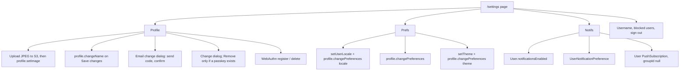

# Design Document

## Overview

Rebuild `/settings` so it matches Spliit Cloud’s account settings page: one column of inset cards, divided rows, explicit save only for the display name, and immediate save for everything else.

The reference implementation is `apps/web/src/app/account/` in `antonio-ivanovski/spliit-cloud`:

- `settings.tsx` — page order and the profile form
- `settings-ui.tsx` — shared chrome
- `account-email-settings.tsx`, `account-password-settings.tsx`, `account-passkey-settings.tsx`
- `account-preferences.tsx`
- `notifications-preferences.tsx`, `notification-category-metadata.ts`

Knots keeps its own stack. Do not port TanStack Router, better-auth, anonymous accounts, or Spliit’s mascot, AI, webhook, export, or connected-app modules.

### What Knots already has

- `/settings` server page loads `profile.getProfile` and renders email (read-only), name, username, password form, preferences grid, blocked users, and sign out. Layout is `src/app/settings/layout.tsx` (`max-w-[var(--breakpoint-md)]`).
- `profile.changeName`, `changeUsername`, `changePassword`, `changePreferences` (`timezone`, `preferredCurrency`). Password rules live in `src/lib/auth/password-validation.ts`. `passwordHash` is required today.
- Locale is a `NEXT_LOCALE` cookie (`src/lib/locale.ts` + `LocaleSwitcher`). Theme is `next-themes` local only (`ThemeToggle` in the preferences grid and the user menu).
- Email sending and rate limits already exist (`src/lib/auth/email-service.ts`, `src/lib/auth/rate-limiter.ts`). `TokenType` is `EMAIL_VERIFICATION | PASSWORD_RESET` and has no payload column, so an email-change challenge needs its own model.
- Push is Web Push with VAPID, but `PushSubscription` is per group (`groupId` required) and filters `CREATE_EXPENSE`, `UPDATE_EXPENSE`, `DELETE_EXPENSE`, `UPDATE_GROUP`. The group popover (`notification-settings-popover.tsx`) stays as the per-group filter.
- Expense documents use S3 only when `NEXT_PUBLIC_ENABLE_EXPENSE_DOCUMENTS` is set (`src/lib/env.ts`). Profile photos reuse that bucket when it is configured.
- There is no passkey table, no user image, no account-level notification channels, and no `input-otp` component.

### Adaptations (do not “fix” these back to Spliit)

| Spliit                                       | Knots                                                                                                   |
| -------------------------------------------- | ------------------------------------------------------------------------------------------------------- |
| Route `/account/settings`                    | Stay on `/settings`                                                                                     |
| Anonymous users, add-email, magic link       | No anonymous users. Email row is change-only                                                            |
| Set password when the account has none       | Every user has a password until they remove it after adding a passkey                                   |
| Re-auth by signing out                       | Confirm current password in a dialog when the session is older than 5 minutes                           |
| Mascot, AI, webhooks, export, connected apps | Omitted                                                                                                 |
| “Spliit Cloud news”                          | “Knots news”, Coming soon                                                                               |
| Per-account push subscription                | Add a user-level subscription for This device. Leave group subscriptions in place for the group popover |

## Architecture



### Key decisions

1. **Chrome is local to settings.** Add `src/app/settings/settings-ui.tsx`. Do not change the global `Card`, `Button`, `Select`, or `Switch` primitives. Copy the structure of Spliit’s `settings-ui.tsx` (section, group, list, row, field row, badge, saving, skeleton) onto Knots `Card` and `cn`.

2. **One profile form, credentials outside it.** The `<form id="account-profile-form">` wraps photo and name only and uses `className="contents"` so the rows stay in the divided list. Save changes uses `form="account-profile-form"`. Email, password, and passkey dialogs are siblings, not descendants of that form.

3. **Photo is immediate. Name is explicit.** Choose photo prepares a JPEG (max edge 512, quality ~0.86), presigns, PUTs, then `profile.setImage`. Remove calls `profile.removeImage`. Name stays dirty-local until Save changes, reusing `profile.changeName` and the existing 1–100 server trim, tightened on the client to 2–50 to match the reference.

4. **Email change is a hashed one-time code, not a link token.** `EmailChangeChallenge` stores `userId`, normalized `newEmail`, `codeHash`, `expiresAt`, `attempts`. Send generates 6 digits, emails them with the existing Resend helper, and replaces any previous challenge for that user. Confirm compares the hash, checks expiry and attempt count, then updates `User.email` and `emailVerified` inside a transaction that also rejects a unique collision.

5. **Password removal is gated on a passkey.** `passwordHash` becomes optional. Change keeps `profile.changePassword`. Remove is a new mutation that requires the current password and `count(passkeys) >= 1`, then sets `passwordHash` to null. Sign-in already goes through credentials; it must reject a null hash with the normal invalid-credentials error so passkey sign-in is the other path.

6. **Passkeys use `@simplewebauthn/server` and `@simplewebauthn/browser`.** Registration and authentication ceremonies are tRPC mutations plus a short-lived challenge on the session or a `PasskeyChallenge` row. The add dialog’s nickname is applied after `verifyRegistration` via an update. Knots does not sign the user out to refresh the session; a password confirmation dialog gates add when `session.createdAt` is older than 5 minutes.

7. **Preferences persist on `User` and still write the cookie / theme locally.** `changePreferences` gains optional `locale` and `theme`. Language still calls `setUserLocale` so the next render is immediate. Theme still calls `setTheme`. On load, the root layout applies `user.locale` and `user.theme` when they are set, so a second device follows the account. Currency and timezone stay on the columns they already use.

8. **Notification channels are account-level and sit in front of group filters.** A new `UserNotificationPreference` row is `(userId, category) -> email enabled, push enabled`. Dispatch, when it sends email or push for an activity, checks the account preference first. The group membership flags (`notifyOnCreate`, member filters, `emailNotificationsEnabled`) still apply inside a group. Categories Knots does not emit (budget, comment, product news, weekly summary) are stored and rendered; weekly summary and Knots news render as Coming soon with no selector. Do not add budget, comment, or news features.

9. **This device is a user-scoped push subscription.** Make `PushSubscription.groupId` optional. A null `groupId` means “this browser, all groups”, unique on `endpoint` where `groupId` is null. The existing per-group rows stay. Enable/disable on This device registers or deletes that null-group row and the browser `PushSubscription`. Group popover subscriptions are unchanged.

## Data model

```prisma
model User {
  // existing columns…
  image                 String?
  locale                String?
  theme                 String?   // "light" | "dark" | "system"
  notificationsEnabled  Boolean   @default(true)
  passwordHash          String?   // null only after Remove password
  passkeys              Passkey[]
  emailChangeChallenges EmailChangeChallenge[]
  notificationPreferences UserNotificationPreference[]
}

model Passkey {
  id           String   @id @default(cuid())
  userId       String
  user         User     @relation(fields: [userId], references: [id], onDelete: Cascade)
  credentialId String   @unique
  publicKey    Bytes
  counter      Int
  deviceType   String   // "singleDevice" | "multiDevice"
  backedUp     Boolean  @default(false)
  name         String
  createdAt    DateTime @default(now())

  @@index([userId])
}

model EmailChangeChallenge {
  id        String   @id @default(cuid())
  userId    String
  user      User     @relation(fields: [userId], references: [id], onDelete: Cascade)
  newEmail  String
  codeHash  String
  expiresAt DateTime
  attempts  Int      @default(0)
  createdAt DateTime @default(now())

  @@index([userId])
}

model UserNotificationPreference {
  id        String   @id @default(cuid())
  userId    String
  user      User     @relation(fields: [userId], references: [id], onDelete: Cascade)
  category  String
  email     Boolean  @default(false)
  push      Boolean  @default(false)

  @@unique([userId, category])
}
```

`PushSubscription.groupId` becomes `String?`. The unique key `(endpoint, groupId)` cannot include nulls the same way in PostgreSQL; use a partial unique index on `endpoint` where `groupId` is null, and keep `@@unique([endpoint, groupId])` for group rows.

Default channels when no row exists: Email + Push for added-to-group, friend ledger, new expense, and new comment; Email for recurring expense; Off is not the default for those. Budget alerts default to Email + Push but nothing emits them yet. Coming-soon categories have no row.

## Components and interfaces

### `src/app/settings/settings-ui.tsx`

Presentational only. Match Spliit’s class structure:

- `SettingsSection` — `Card`, header `px-4 py-4 sm:px-6`, icon `size-4 text-muted-foreground`, optional `status`, optional `footer` with `border-t` and `items-end`.
- `SettingsGroup` — tinted band `bg-muted/30`, 4px `bg-primary/60` bar, `h3`.
- `SettingsList` — `divide-y divide-border/70`.
- `SettingsRow` / `SettingsFieldRow` — `flex-col` then `sm:flex-row sm:items-center sm:justify-between`. Field row sets `htmlFor={id + "-control"}`.
- `SettingsBadge` — `rounded-full bg-muted` uppercase 10px.
- `SettingsSaving` — `output` with spinner and `sr-only` label.
- `SettingsSectionSkeleton` — same header, skeleton rows.

### Profile section

`src/app/settings/page.tsx` stays a server component that loads the profile, including `image`, `locale`, `theme`, `notificationsEnabled`, `hasPassword`, and passkey count is loaded on the client.

Client body `src/app/settings/settings-page.tsx`:

- Header icons: `UserRound`, `SlidersHorizontal`, `Bell`.
- Photo row id `profile-photo`. Hidden file input `accept="image/*,.heic,.heif"`.
- Name input id `account-settings-name-control`.
- Footer: alert then Save changes, disabled when `trim(name) === savedName` or the mutation is pending.
- `AccountEmailSettings`, `AccountPasswordSettings`, `AccountPasskeySettings` render as further `SettingsRow`s inside the same `SettingsList`, outside the form.

### Email dialog

Use the existing `Dialog` on `sm` and up and `Drawer` below `sm` if a responsive dialog already exists; otherwise `Dialog` at all sizes. Do not add a new dialog primitive unless the drawer path is already a one-line composition.

Steps: `email` | `otp`. Resend cooldown is local state, 60 seconds. Errors map from server codes: `EMAIL_IN_USE`, `INVALID_EMAIL`, `SAME_EMAIL`, `INVALID_OTP`, `OTP_EXPIRED`, `RATE_LIMITED`, `EMAIL_SEND_FAILED`.

tRPC:

- `profile.requestEmailChange({ email })`
- `profile.confirmEmailChange({ email, code })`

### Password dialogs

Extract the current `PasswordChangeForm` fields into a dialog opened by the row. Keep `validatePassword` and the mismatch alert. Remove dialog is separate, destructive confirm, current password only, plus a link to `/forgot-password` (the existing reset route).

tRPC:

- `profile.changePassword` unchanged
- `profile.removePassword({ currentPassword })` — fails with `NO_ALTERNATIVE_SIGN_IN` when the user has zero passkeys

### Passkeys

`src/lib/passkey/` holds challenge creation, `verifyRegistrationResponse`, `verifyAuthenticationResponse`, and the list/rename/delete queries. UI lives in `src/app/settings/account-passkey-settings.tsx`.

Add flow:

1. If `now - session.createdAt > 5 minutes`, open the password dialog and call a `profile.confirmRecentPassword` mutation that checks the hash and touches the session timestamp.
2. `passkey.generateRegistrationOptions` returns the public options. Client calls `startRegistration`.
3. `passkey.verifyRegistration({ response, name })` stores the credential. Name falls back to the display name.

Delete opens a confirm dialog with a destructive warning. Last-method protection is server-side.

Sign-in page gains a “Use a passkey” button that calls `passkey.generateAuthenticationOptions` (discoverable, no email required) and `passkey.verifyAuthentication`, then creates a Knots session the same way a successful credentials login does. That button is part of this feature because a passkey that cannot sign in is not the row the reference describes.

### Preferences

`AccountPreferences` client component. Optimistic local values, then:

- locale: `setUserLocale` and `changePreferences({ locale })`
- currency / timezone: existing mutation, no success toast on every keystroke-equivalent change (a toast per select is enough, matching today’s currency select)
- theme: `setTheme` and `changePreferences({ theme })`

Header `SettingsSaving` while any of those mutations are pending.

Root layout: after the session user is known, if `user.locale` differs from the cookie, call `setUserLocale`. If `user.theme` is set, call `setTheme` once on mount. Do this in a small client `AccountPreferencesSync` so the server render does not loop.

### Notifications

`src/app/settings/notification-category-metadata.ts` lists the rows and which are `comingSoon`.

`NotificationsPreferences` loads `profile.notificationPreferences`. Draft state mirrors Spliit: initialize from the server, toggle locally, save one category, roll back on error.

`ChannelSelector` is a local component in that file. Desktop: `Popover` + a check list. Mobile (`max-width: 767px`): `Drawer` with Done. Reuse `Button`, `Popover`, `Drawer`. Do not add `cmdk` if it is not already a dependency; a plain list of buttons is enough.

Master switch patches `notificationsEnabled`.

This device group uses `usePushNotificationSubscription` extended so it can target `groupId: null`. The enable button’s copy comes from `ProfileSettings.notifications`.

Dispatch change, in `src/lib/push/dispatch-notifications.ts` and the email digest path:

- If `user.notificationsEnabled` is false, skip that user.
- If the category’s push flag is false, skip push for that user.
- If the category’s email flag is false, skip email for that user.
- Group membership filters still run for group events.

Category map for events Knots emits today:

| Category id                         | Knots event                                                              |
| ----------------------------------- | ------------------------------------------------------------------------ |
| `added-to-group`                    | invitation / membership created                                          |
| `friend-added`                      | friend link created                                                      |
| `expense-created`                   | `ActivityType.CREATE_EXPENSE`                                            |
| `recurring-expense-created`         | creation through `RecurringExpenseLink`, when that path already notifies |
| `expense-changed`                   | `UPDATE_EXPENSE` and `DELETE_EXPENSE`                                    |
| `budget-alert`, `expense-comment`   | stored only                                                              |
| `weekly-summary`, `product-updates` | not stored; UI badge only                                                |

## i18n

Add keys under `ProfileSettings` in `messages/en-US.json` and `messages/pt-PT.json`. English copy follows the reference screenshots, with “Knots” where Spliit names itself. Portuguese is a direct translation of those strings, not a copy of Spliit’s `pt` catalog (that catalog is not the Knots voice and includes the omitted sections).

Keep existing `ProfileSettings` keys that username, blocked users, and sign out already use.

## Tests

Behavior tests, not Tailwind snapshots.

- Email challenge: wrong code increments attempts, expired code fails, consumed code cannot be reused, in-use email fails. Property test on the pure normalize-and-validate email helper.
- Password row: remove is offered only when `passkeyCount > 0`. Remove mutation refuses the last method. Property test on that predicate.
- Channel draft: toggling a channel is its own inverse; Off is the empty set; the closed label is a pure function of the set. Property test.
- Passkey last-method: delete is rejected when it is the only credential and `passwordHash` is null.
- Page test: one `h1`, `h2` order Profile / App preferences / Notifications / Username / Blocked users / Account, Save changes disabled when the name is clean.

## Security

- Hash email codes with the same hashing approach as other auth tokens. Never log the code.
- Rate-limit email send and confirm per user.
- Passkey challenges are single-use and short-lived.
- `confirmRecentPassword` and `removePassword` compare the current hash and do not reveal whether the account has a password beyond the generic mismatch error.
- Profile image URLs must be keys produced by this app’s presign, not an arbitrary external URL.
- Registration and authentication verification must check origin and rpID against the app URL.
