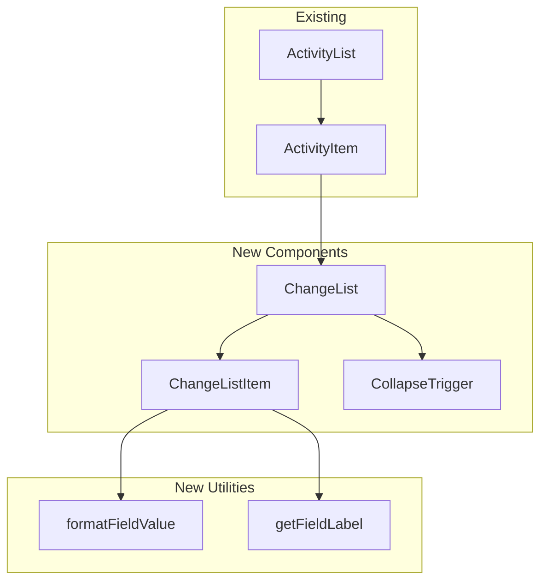

# Design Document: Activity Changes UI

## Overview

This feature adds a visual representation of field-level changes (diffs) to the activity feed. Each `ActivityItem` already displays a summary string (e.g., "Alice updated expense 'Dinner'"). This design introduces a `ChangeList` sub-component that renders individual field changes below the summary, showing what was modified with human-readable labels and formatted values.

The backend already computes and stores changes via the `ActivityChange` Prisma model (with `field`, `oldValue`, `newValue` columns) and includes them in the activity query response via `include: { changes: true }`.

## Architecture



The feature follows the existing component architecture:

- **No new pages or routes** — changes render inline within the existing `ActivityItem`.
- **Co-located components** — new components live in the same `activity/` directory.
- **Shared utilities** — formatting logic is extracted into a pure utility module for testability.

## Components and Interfaces

### ChangeList Component

**File:** `src/app/groups/[groupId]/activity/change-list.tsx`

```typescript
interface ChangeListProps {
  changes: Array<{
    field: string
    oldValue: string | null
    newValue: string | null
  }>
  groupCurrency: Currency
  participants: Array<{ id: string; name: string }>
  categories: Array<{ id: number; grouping: string; name: string }>
}
```

Responsibilities:

- Filters out changes where both `oldValue` and `newValue` are null
- Manages collapsed/expanded state via `useState`
- Renders a semantic `<ul>` with `aria-label` indicating total change count
- Delegates each change to `ChangeListItem`
- Renders a collapse toggle `<button>` when changes exceed the threshold (3)
- Calls `event.stopPropagation()` on the toggle to prevent the parent `ActivityItem` click-to-navigate behavior

### ChangeListItem Component

**File:** Defined within `change-list.tsx` (not exported)

```typescript
interface ChangeListItemProps {
  field: string
  oldValue: string | null
  newValue: string | null
  groupCurrency: Currency
  participants: Array<{ id: string; name: string }>
  categories: Array<{ id: number; grouping: string; name: string }>
}
```

Responsibilities:

- Resolves the field label via `getFieldLabel()`
- Formats old/new values via `formatFieldValue()`
- Renders a single `<li>` with the pattern: `Label: oldFormatted → newFormatted`
- Includes visually hidden "from" / "to" text for screen readers
- Handles null values (addition: shows only new; removal: shows only old)

### Integration with ActivityItem

The existing `ActivityItem` component will be modified to:

1. Accept `changes` from the activity data (already available in the `Activity` type)
2. Accept `categories` as a prop (fetched once in `ActivityList` and passed down)
3. Render `<ChangeList>` below the summary `<div>` when changes exist

The `ActivityList` component will:

1. Fetch categories via `trpc.categories.list.useQuery()` (one query, cached by React Query)
2. Pass `categories` to each `ActivityItem`

### Value Formatting Utility

**File:** `src/app/groups/[groupId]/activity/format-change-value.ts`

```typescript
export function formatFieldValue(
  field: string,
  value: string | null,
  context: {
    currency: Currency
    locale: string
    participants: Array<{ id: string; name: string }>
    categories: Array<{ id: number; grouping: string; name: string }>
    t: (key: string) => string // translation function for booleans
  },
): string | null

export function getFieldLabel(field: string, t: (key: string) => string): string
```

**Formatting rules by field type:**

| Field             | Format Strategy                                                                      |
| ----------------- | ------------------------------------------------------------------------------------ |
| `amount`          | Parse as integer (minor units), format with `formatCurrency()` from `@/lib/utils`    |
| `expenseDate`     | Parse as ISO string, format with `formatDate()` using locale's `dateStyle: 'medium'` |
| `isReimbursement` | Map `"true"` → translated "Yes", `"false"` → translated "No"                         |
| `paidBy`          | Look up participant ID in group participants list, return name                       |
| `paidFor`         | Parse JSON array of IDs, resolve each to participant name, join with ", "            |
| `category`        | Parse as integer ID, look up in categories list, return localized `"grouping/name"`  |
| `participants`    | Display the comma-separated string as-is (already stored as names)                   |
| All others        | Return the raw string value unchanged                                                |

## Data Models

### Existing Data (no changes needed)

The `Activity` type from the tRPC router already includes the `changes` relation:

```typescript
// From AppRouterOutput['groups']['activities']['list']['activities'][number]
type Activity = {
  id: string
  groupId: string
  time: Date
  activityType: ActivityType
  participantId: string | null
  expenseId: string | null
  data: string | null
  changes: Array<{
    id: string
    activityId: string
    field: string
    oldValue: string | null
    newValue: string | null
  }>
  expense?: Expense
}
```

### Category Data

Categories are fetched via `trpc.categories.list` which returns the Prisma `Category` model:

```typescript
type Category = {
  id: number
  grouping: string
  name: string
}
```

### Constants

```typescript
const COLLAPSE_THRESHOLD = 3
```

## Correctness Properties

_A property is a characteristic or behavior that should hold true across all valid executions of a system — essentially, a formal statement about what the system should do. Properties serve as the bridge between human-readable specifications and machine-verifiable correctness guarantees._

### Property 1: Change rendering preserves order and structure

_For any_ array of FieldChange records (with at least one non-both-null entry), the rendered ChangeList SHALL display items in the same order as the input array, and each rendered item SHALL contain the field label, and the formatted old and/or new value.

**Validates: Requirements 1.3, 2.4**

### Property 2: Both-null changes are filtered from output

_For any_ array of FieldChange records, the number of rendered list items SHALL equal the number of input records where at least one of oldValue or newValue is non-null.

**Validates: Requirements 1.6**

### Property 3: Unknown field names display as-is

_For any_ field name string that is not in the set of known field mappings (title, amount, expenseDate, category, paidBy, splitMode, isReimbursement, notes, recurrenceRule, paidFor, name, information, currency, participants), the getFieldLabel function SHALL return that string unmodified.

**Validates: Requirements 2.3**

### Property 4: Value formatting correctness by field type

_For any_ valid field-value pair, the formatFieldValue function SHALL produce the correctly formatted output: amounts as currency strings, dates as localized date strings, participant IDs as resolved names, category IDs as resolved category names, booleans as localized Yes/No labels, and all other fields as the raw string value unchanged.

**Validates: Requirements 3.1, 3.2, 3.3, 3.4, 3.5, 3.6, 6.3**

### Property 5: Collapse behavior for lists exceeding threshold

_For any_ array of N valid FieldChange records where N > 3, the ChangeList in its default (collapsed) state SHALL render exactly 3 visible items, and the toggle control text SHALL indicate (N - 3) hidden changes.

**Validates: Requirements 4.1, 4.2**

### Property 6: No toggle for lists at or below threshold

_For any_ array of N valid FieldChange records where 1 ≤ N ≤ 3, the ChangeList SHALL render all N items and SHALL NOT render a toggle control.

**Validates: Requirements 4.6**

### Property 7: Accessible change count in aria-label

_For any_ array of N valid FieldChange records (after filtering both-null entries), the ChangeList container SHALL have an aria-label attribute containing the number N.

**Validates: Requirements 7.3**

## Error Handling

| Scenario                                 | Handling                                               |
| ---------------------------------------- | ------------------------------------------------------ |
| Participant ID not found in group list   | Display the raw ID string as fallback                  |
| Category ID not found in categories list | Display the raw ID string as fallback                  |
| Invalid date string in `expenseDate`     | Display the raw string value                           |
| Invalid JSON in `paidFor` value          | Display the raw string value                           |
| Categories query still loading           | Render change values as raw strings until data arrives |
| Empty `changes` array                    | Do not render ChangeList at all (requirement 1.2)      |

All error handling is graceful degradation — the component never throws. Invalid data falls back to displaying raw values, which is still informative.

## Testing Strategy

### Property-Based Tests

**Library:** `fast-check` (already in devDependencies)
**Runner:** Jest (already configured)
**Minimum iterations:** 100 per property

Property-based tests will target the pure utility functions (`formatFieldValue`, `getFieldLabel`) and the filtering/collapsing logic, which are the core logic of this feature.

Each property test will be tagged with:

```
Feature: activity-changes-ui, Property {number}: {property_text}
```

**Test file:** `src/app/groups/[groupId]/activity/__tests__/format-change-value.test.ts`

Tests:

- Property 1: Order preservation (generate random FieldChange arrays, verify output order)
- Property 2: Both-null filtering (generate arrays with mixed null patterns, verify count)
- Property 3: Unknown field fallback (generate random non-known field strings, verify identity)
- Property 4: Value formatting (generate valid amounts/dates/IDs, verify correct formatting)
- Property 5: Collapse threshold (generate arrays of size 4+, verify visible count = 3 and hidden count = N - 3)
- Property 6: No toggle below threshold (generate arrays of size 1-3, verify all visible)
- Property 7: aria-label count (generate arrays, verify count in label)

### Unit Tests (Example-Based)

**Test file:** `src/app/groups/[groupId]/activity/__tests__/change-list.test.tsx`

Using React Testing Library:

- Renders nothing when changes array is empty
- Renders Change_List with correct semantic HTML structure (ul > li)
- Displays arrow separator (→) between old and new values
- Shows only new value when oldValue is null (addition case)
- Shows only old value when newValue is null (removal case)
- Toggle click does not trigger parent navigation (stopPropagation)
- Toggle updates aria-expanded attribute
- Visually hidden "from"/"to" text is present for screen readers
- Boolean field shows "Yes"/"No" labels
- All 14 field labels have translations defined

### Integration Considerations

- Categories are fetched once in `ActivityList` and passed down — no additional network requests per item
- The `useCurrentGroup` hook provides participants and currency — no new context needed
- The feature is purely additive — no changes to existing data fetching or routing
