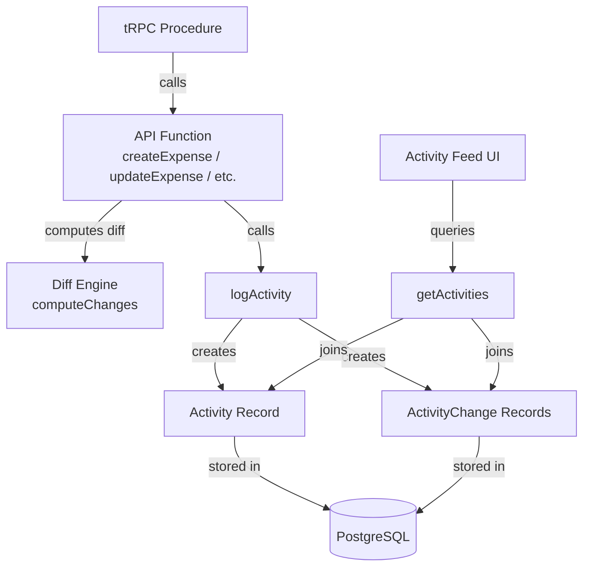
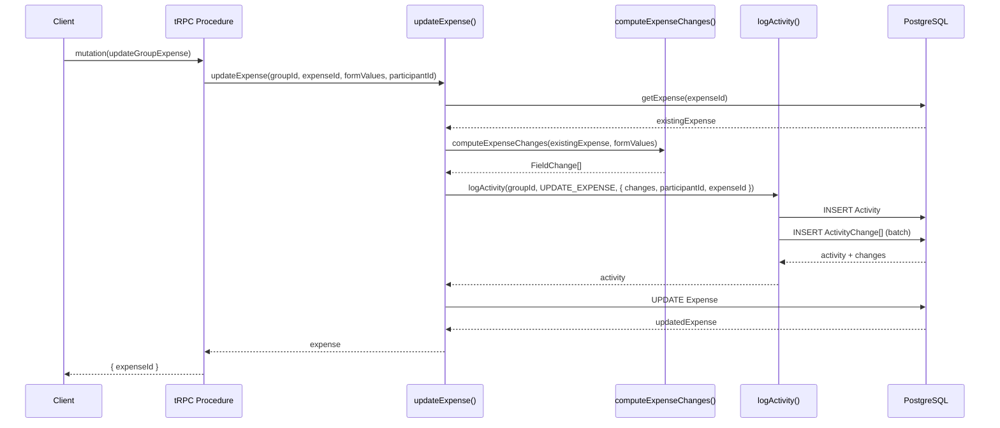
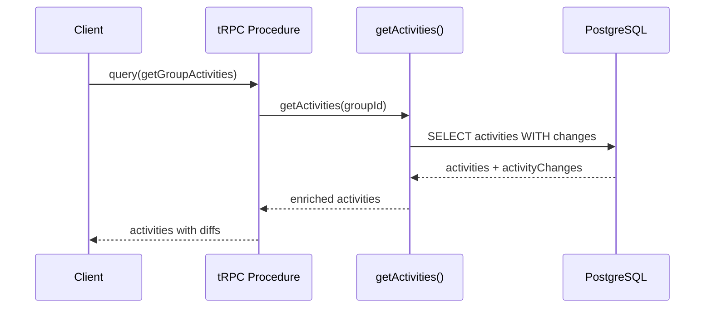

# Design Document: Activity Diff Changelog

## Overview

The Activity Diff Changelog feature enhances the existing Activity system to capture granular field-level changes (diffs) whenever an expense or group is modified. Currently, activities only record that an action occurred (e.g., UPDATE_EXPENSE). With this feature, each activity will also store a structured changelog describing which fields changed, their old and new values, who made the change, and when it happened.

This enables users to see a detailed history of modifications — for example, "Alice changed the amount from $50.00 to $75.00" — rather than just "Expense updated." The implementation extends the existing Prisma schema with a new `ActivityChange` model and modifies the `logActivity` function to accept and persist diff data.

## Architecture



## Sequence Diagrams

### Update Expense Flow



### Query Activities with Changes



## Components and Interfaces

### Component 1: Diff Engine (`src/lib/activity-diff.ts`)

**Purpose**: Computes field-level differences between the old state and new state of an entity.

**Interface**:

```typescript
interface FieldChange {
  field: string
  oldValue: string | null
  newValue: string | null
}

function computeExpenseChanges(
  existing: ExistingExpense,
  updated: ExpenseFormValues,
): FieldChange[]

function computeGroupChanges(
  existing: ExistingGroup,
  updated: GroupFormValues,
): FieldChange[]
```

**Responsibilities**:

- Compare old and new values for tracked fields
- Serialize complex values (arrays, objects) to human-readable strings
- Skip fields that haven't changed
- Handle null/undefined values gracefully

### Component 2: Enhanced `logActivity` (`src/lib/api.ts`)

**Purpose**: Extended to accept and persist field-level changes alongside the activity record.

**Interface**:

```typescript
function logActivity(
  groupId: string,
  activityType: ActivityType,
  extra?: {
    participantId?: string
    expenseId?: string
    data?: string
    changes?: FieldChange[]
  },
): Promise<Activity>
```

**Responsibilities**:

- Create the Activity record (existing behavior)
- Create associated ActivityChange records in a batch if `changes` is provided
- Maintain backward compatibility (changes is optional)

### Component 3: Enhanced `getActivities` (`src/lib/api.ts`)

**Purpose**: Extended to include change records when querying activities.

**Interface**:

```typescript
function getActivities(
  groupId: string,
  options?: { offset?: number; length?: number },
): Promise<ActivityWithChanges[]>
```

**Responsibilities**:

- Query activities with their associated changes
- Return enriched activity objects including the diff data

## Data Models

### New Model: ActivityChange

```typescript
// Prisma schema addition
model ActivityChange {
  id         String   @id @default(cuid())
  activity   Activity @relation(fields: [activityId], references: [id], onDelete: Cascade)
  activityId String
  field      String   // e.g., "title", "amount", "paidBy"
  oldValue   String?  // serialized previous value
  newValue   String?  // serialized new value

  @@index([activityId])
}
```

**Validation Rules**:

- `field` must be a non-empty string
- At least one of `oldValue` or `newValue` must be non-null (a change must have a before or after)
- `activityId` must reference an existing Activity

### Updated Model: Activity

```typescript
model Activity {
  id            String           @id
  group         Group            @relation(fields: [groupId], references: [id])
  groupId       String
  time          DateTime         @default(now())
  activityType  ActivityType
  participantId String?
  expenseId     String?
  data          String?
  changes       ActivityChange[] // NEW: one-to-many relation
}
```

### TypeScript Types

```typescript
type ExistingExpense = NonNullable<Awaited<ReturnType<typeof getExpense>>>

type ExistingGroup = NonNullable<Awaited<ReturnType<typeof getGroup>>>

interface ActivityWithChanges {
  id: string
  groupId: string
  time: Date
  activityType: ActivityType
  participantId: string | null
  expenseId: string | null
  data: string | null
  changes: FieldChange[]
  expense?: Expense
}
```

## Algorithmic Pseudocode

### Expense Diff Computation

```typescript
function computeExpenseChanges(
  existing: ExistingExpense,
  updated: ExpenseFormValues,
): FieldChange[] {
  const changes: FieldChange[] = []

  // Track scalar fields
  const trackedFields: Array<{
    field: string
    oldVal: unknown
    newVal: unknown
    format?: (v: unknown) => string
  }> = [
    { field: 'title', oldVal: existing.title, newVal: updated.title },
    {
      field: 'amount',
      oldVal: existing.amount,
      newVal: updated.amount,
      format: formatCurrency,
    },
    {
      field: 'expenseDate',
      oldVal: existing.expenseDate,
      newVal: updated.expenseDate,
      format: formatDate,
    },
    {
      field: 'category',
      oldVal: existing.categoryId,
      newVal: updated.category,
    },
    { field: 'paidBy', oldVal: existing.paidById, newVal: updated.paidBy },
    {
      field: 'splitMode',
      oldVal: existing.splitMode,
      newVal: updated.splitMode,
    },
    {
      field: 'isReimbursement',
      oldVal: existing.isReimbursement,
      newVal: updated.isReimbursement,
    },
    {
      field: 'notes',
      oldVal: existing.notes ?? null,
      newVal: updated.notes ?? null,
    },
    {
      field: 'recurrenceRule',
      oldVal: existing.recurrenceRule,
      newVal: updated.recurrenceRule,
    },
  ]

  for (const { field, oldVal, newVal, format } of trackedFields) {
    if (String(oldVal) !== String(newVal)) {
      changes.push({
        field,
        oldValue:
          oldVal != null ? (format ? format(oldVal) : String(oldVal)) : null,
        newValue:
          newVal != null ? (format ? format(newVal) : String(newVal)) : null,
      })
    }
  }

  // Track paidFor changes (participants involved in split)
  const oldPaidFor = existing.paidFor.map((p) => p.participantId).sort()
  const newPaidFor = updated.paidFor.map((p) => p.participant).sort()
  if (JSON.stringify(oldPaidFor) !== JSON.stringify(newPaidFor)) {
    changes.push({
      field: 'paidFor',
      oldValue: JSON.stringify(oldPaidFor),
      newValue: JSON.stringify(newPaidFor),
    })
  }

  return changes
}
```

**Preconditions:**

- `existing` is a valid, non-null expense record from the database
- `updated` is a validated `ExpenseFormValues` object

**Postconditions:**

- Returns an array of `FieldChange` objects, one per changed field
- Array is empty if no fields changed
- No side effects on input parameters

### Group Diff Computation

```typescript
function computeGroupChanges(
  existing: ExistingGroup,
  updated: GroupFormValues,
): FieldChange[] {
  const changes: FieldChange[] = []

  if (existing.name !== updated.name) {
    changes.push({
      field: 'name',
      oldValue: existing.name,
      newValue: updated.name,
    })
  }

  if ((existing.information ?? '') !== (updated.information ?? '')) {
    changes.push({
      field: 'information',
      oldValue: existing.information ?? null,
      newValue: updated.information ?? null,
    })
  }

  if (existing.currency !== updated.currency) {
    changes.push({
      field: 'currency',
      oldValue: existing.currency,
      newValue: updated.currency,
    })
  }

  // Track participant additions and removals
  const existingNames = existing.participants.map((p) => p.name).sort()
  const updatedNames = updated.participants.map((p) => p.name).sort()
  if (JSON.stringify(existingNames) !== JSON.stringify(updatedNames)) {
    changes.push({
      field: 'participants',
      oldValue: existingNames.join(', '),
      newValue: updatedNames.join(', '),
    })
  }

  return changes
}
```

**Preconditions:**

- `existing` is a valid, non-null group record with participants included
- `updated` is a validated `GroupFormValues` object

**Postconditions:**

- Returns an array of `FieldChange` objects for changed group fields
- Empty array if nothing changed
- No mutations to input parameters

### Enhanced logActivity

```typescript
async function logActivity(
  groupId: string,
  activityType: ActivityType,
  extra?: {
    participantId?: string
    expenseId?: string
    data?: string
    changes?: FieldChange[]
  },
): Promise<Activity> {
  const { changes, ...activityExtra } = extra ?? {}

  const activity = await prisma.activity.create({
    data: {
      id: randomId(),
      groupId,
      activityType,
      ...activityExtra,
      ...(changes && changes.length > 0
        ? {
            changes: {
              createMany: {
                data: changes.map((change) => ({
                  field: change.field,
                  oldValue: change.oldValue,
                  newValue: change.newValue,
                })),
              },
            },
          }
        : {}),
    },
    include: { changes: true },
  })

  return activity
}
```

**Preconditions:**

- `groupId` references an existing group
- `activityType` is a valid enum value
- If `changes` is provided, each entry has a non-empty `field`

**Postconditions:**

- Activity record is created in the database
- If changes were provided, corresponding ActivityChange records are created
- All records share the same transaction (Prisma nested create)
- Returns the created activity with its changes

## Key Functions with Formal Specifications

### Function: computeExpenseChanges()

```typescript
function computeExpenseChanges(
  existing: ExistingExpense,
  updated: ExpenseFormValues,
): FieldChange[]
```

**Preconditions:**

- `existing` is non-null and contains all tracked fields
- `updated` has passed Zod schema validation

**Postconditions:**

- Returns `FieldChange[]` where each entry represents exactly one field that differs
- `changes.length === 0` if and only if no tracked fields differ
- For each change: `change.field` is a known tracked field name
- No database calls or side effects

**Loop Invariants:**

- All previously processed fields have been correctly compared
- `changes` array contains only verified differences

### Function: logActivity()

```typescript
function logActivity(
  groupId: string,
  activityType: ActivityType,
  extra?: {
    participantId?: string
    expenseId?: string
    data?: string
    changes?: FieldChange[]
  },
): Promise<Activity>
```

**Preconditions:**

- `groupId` exists in the database
- `activityType` is a valid `ActivityType` enum value

**Postconditions:**

- Exactly one Activity record is created
- If `changes` is non-empty, exactly `changes.length` ActivityChange records are created
- All ActivityChange records reference the created Activity's id
- If `changes` is undefined or empty, no ActivityChange records are created (backward compatible)

## Example Usage

```typescript
// In updateExpense function:
const existingExpense = await getExpense(groupId, expenseId)
const changes = computeExpenseChanges(existingExpense, expenseFormValues)

await logActivity(groupId, ActivityType.UPDATE_EXPENSE, {
  participantId,
  expenseId,
  data: expenseFormValues.title,
  changes,
})

// In updateGroup function:
const existingGroup = await getGroup(groupId)
const changes = computeGroupChanges(existingGroup, groupFormValues)

await logActivity(groupId, ActivityType.UPDATE_GROUP, {
  participantId,
  changes,
})

// Querying activities with changes:
const activities = await getActivities(groupId)
// Each activity now includes:
// activity.changes = [{ field: "amount", oldValue: "5000", newValue: "7500" }, ...]

// For CREATE_EXPENSE, capture initial values:
const changes: FieldChange[] = [
  { field: 'title', oldValue: null, newValue: expenseFormValues.title },
  {
    field: 'amount',
    oldValue: null,
    newValue: String(expenseFormValues.amount),
  },
  { field: 'paidBy', oldValue: null, newValue: expenseFormValues.paidBy },
]

await logActivity(groupId, ActivityType.CREATE_EXPENSE, {
  participantId,
  expenseId,
  data: expenseFormValues.title,
  changes,
})

// For DELETE_EXPENSE, capture final values:
const changes: FieldChange[] = [
  { field: 'title', oldValue: existingExpense.title, newValue: null },
  { field: 'amount', oldValue: String(existingExpense.amount), newValue: null },
]

await logActivity(groupId, ActivityType.DELETE_EXPENSE, {
  participantId,
  expenseId,
  data: existingExpense.title,
  changes,
})
```

## Correctness Properties

1. **Diff completeness**: For every tracked field where `oldValue !== newValue`, exactly one `FieldChange` entry exists in the result.
2. **Diff soundness**: Every `FieldChange` in the result corresponds to a field where the old and new values genuinely differ.
3. **Backward compatibility**: Calling `logActivity` without `changes` produces the same behavior as before (no ActivityChange records created).
4. **Referential integrity**: Every `ActivityChange.activityId` references a valid `Activity.id` (enforced by Prisma relation + cascade delete).
5. **Idempotent comparison**: `computeExpenseChanges(expense, toFormValues(expense))` returns an empty array (no false positives when nothing changed).
6. **Cascade deletion**: When an Activity is deleted, all associated ActivityChange records are also deleted.
7. **Atomicity**: Activity and its changes are created in a single Prisma nested write (no partial state).

## Error Handling

### Error Scenario 1: Expense Not Found During Diff

**Condition**: `getExpense` returns null when computing changes
**Response**: Throw an error before attempting diff computation (existing behavior)
**Recovery**: The update operation is aborted; no activity or changes are logged

### Error Scenario 2: Database Write Failure

**Condition**: Prisma fails to create Activity + ActivityChange records
**Response**: The nested create is atomic — either all records are created or none
**Recovery**: Error propagates to the tRPC procedure, which returns an error to the client

### Error Scenario 3: Serialization of Complex Values

**Condition**: A field value cannot be meaningfully serialized to a string
**Response**: Use `JSON.stringify` as fallback for complex objects; use `null` for undefined values
**Recovery**: The change is still recorded, though the display may be less human-readable

## Testing Strategy

### Unit Testing Approach

- Test `computeExpenseChanges` with known before/after states
- Verify that unchanged fields produce no entries
- Verify that each changed field produces exactly one entry
- Test edge cases: null → value, value → null, same value different type

### Property-Based Testing Approach

**Property Test Library**: fast-check

- **Roundtrip property**: For any expense, `computeExpenseChanges(expense, expense)` returns `[]`
- **Change detection property**: For any expense with one field modified, the result contains exactly one entry for that field
- **No phantom changes**: The number of changes never exceeds the number of tracked fields

### Integration Testing Approach

- Test that `logActivity` with changes creates the correct number of `ActivityChange` records
- Test that `getActivities` returns activities with their associated changes
- Test cascade deletion: deleting an Activity removes its changes

## Performance Considerations

- **Batch inserts**: ActivityChange records are created via `createMany` in a single query, not individual inserts
- **Index on activityId**: The `@@index([activityId])` ensures efficient joins when querying activities with changes
- **Minimal overhead for unchanged fields**: The diff computation is O(n) where n is the number of tracked fields (small constant ~10)
- **No additional queries**: Diff computation uses the already-fetched existing record (no extra DB round-trip)
- **Storage**: Each ActivityChange row is small (field name + two nullable strings). For a typical update touching 2-3 fields, this adds ~3 rows per activity

## Security Considerations

- **No sensitive data in diffs**: The system stores field values as strings. If sensitive fields are added in the future, they should be excluded from tracking or redacted
- **Access control**: Activity changes inherit the same access model as activities (group-scoped). No additional authorization is needed
- **Input validation**: All values pass through Zod validation before reaching the diff engine

## Dependencies

- **Prisma**: Schema migration for new `ActivityChange` model and updated `Activity` relation
- **No new external libraries**: The diff engine is a pure function using standard TypeScript comparisons
- **Existing infrastructure**: PostgreSQL, tRPC, Next.js — no changes to the stack
