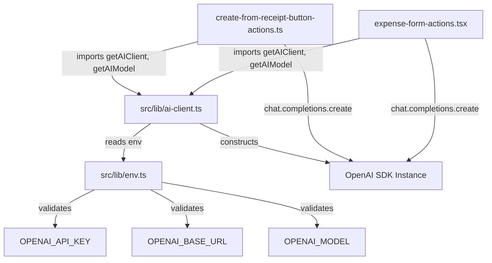

# Design Document: BYO OpenAI Endpoint

## Overview

This feature introduces two optional environment variables — `OPENAI_BASE_URL` and `OPENAI_MODEL` — that allow self-hosters to route AI requests (receipt scanning, category auto-assignment) to any OpenAI-compatible endpoint (Ollama, LM Studio, OpenRouter, etc.) and choose a specific model.

The implementation consolidates the currently duplicated OpenAI client initialization (found in both `create-from-receipt-button-actions.ts` and `expense-form-actions.tsx`) into a single shared module. This shared module reads the new environment variables and passes them to the OpenAI SDK constructor. Each extractor then delegates model selection to a helper that reads `OPENAI_MODEL` with a per-feature default fallback.

**Key design decisions:**

- The new variables are entirely optional — no change in behavior for existing deployments.
- Empty strings for `OPENAI_BASE_URL` and `OPENAI_MODEL` are preprocessed to `undefined` (treated as absent), avoiding spurious validation errors from Docker/compose environments that set vars to empty.
- `OPENAI_BASE_URL` uses Zod `.url()` validation with an additional http/https scheme check to catch misconfigurations at startup (only applied to non-empty values after preprocessing).
- `OPENAI_MODEL` applies globally to both extractors when set; each extractor retains its own default when unset (receipt: `gpt-4-turbo`, category: `gpt-3.5-turbo`). Documentation warns that receipt scanning requires a vision-capable model.
- The shared AI client is a lazily-initialized singleton to avoid creating connections before they're needed.
- `OPENAI_API_KEY` remains required when AI flags are on, even with providers that don't need a real key — a dummy value (e.g. `ollama`) may be used.

## Architecture



The architecture is intentionally minimal: a single new module (`src/lib/ai-client.ts`) acts as the centralized factory. Both existing server action files replace their local `getOpenAI()` helpers with imports from this module.

## Components and Interfaces

### New File: `src/lib/ai-client.ts`

```typescript
import { env } from '@/lib/env'
import OpenAI from 'openai'

/** Default models per feature when OPENAI_MODEL is not set */
export const AI_DEFAULT_MODELS = {
  receiptExtract: 'gpt-4-turbo',
  categoryExtract: 'gpt-3.5-turbo',
} as const

type AIFeature = keyof typeof AI_DEFAULT_MODELS

let _client: OpenAI | null = null

/**
 * Returns the shared OpenAI SDK instance configured from environment variables.
 * Throws if OPENAI_API_KEY is not set.
 */
export function getAIClient(): OpenAI {
  if (!env.OPENAI_API_KEY) {
    throw new Error(
      'OpenAI API key is not configured. Set OPENAI_API_KEY to use AI features.',
    )
  }

  if (!_client) {
    _client = new OpenAI({
      apiKey: env.OPENAI_API_KEY,
      ...(env.OPENAI_BASE_URL ? { baseURL: env.OPENAI_BASE_URL } : {}),
    })
  }

  return _client
}

/**
 * Returns the model identifier for a given AI feature.
 * Uses OPENAI_MODEL env var when set, otherwise falls back to the feature-specific default.
 */
export function getAIModel(feature: AIFeature): string {
  return env.OPENAI_MODEL ?? AI_DEFAULT_MODELS[feature]
}
```

### Modified File: `src/lib/env.ts`

Add two new fields to the schema object. Both use a `preprocess` step to convert empty strings to `undefined`, so Docker/compose environments that set variables to `""` don't trigger validation errors:

```typescript
// New fields in the .object({...}) definition:
OPENAI_BASE_URL: z.preprocess(
  (val) => (typeof val === 'string' && val.trim() === '' ? undefined : val),
  z
    .string()
    .url()
    .refine(
      (url) => url.startsWith('http://') || url.startsWith('https://'),
      { message: 'OPENAI_BASE_URL must use http or https scheme' },
    )
    .optional(),
),
OPENAI_MODEL: z.preprocess(
  (val) => {
    if (typeof val !== 'string') return val
    const trimmed = val.trim()
    return trimmed === '' ? undefined : trimmed
  },
  z
    .string()
    .max(128, 'OPENAI_MODEL must be at most 128 characters')
    .optional(),
),
```

The existing `OPENAI_API_KEY: z.string().optional()` and the `superRefine` block that enforces the API key when AI feature flags are enabled remain unchanged. `OPENAI_BASE_URL` and `OPENAI_MODEL` remain optional regardless of feature flags.

### Modified File: `src/app/groups/[groupId]/expenses/create-from-receipt-button-actions.ts`

Remove the local `getOpenAI()` function and `OpenAI` import. Replace with:

```typescript
import { getAIClient, getAIModel } from '@/lib/ai-client'

// In extractExpenseInformationFromImage:
const body: ChatCompletionCreateParamsNonStreaming = {
  model: getAIModel('receiptExtract'),
  messages: [
    /* unchanged */
  ],
}
const openai = getAIClient()
const completion = await openai.chat.completions.create(body)
```

### Modified File: `src/components/expense-form-actions.tsx`

Remove the local `getOpenAI()` function and `OpenAI` import. Replace with:

```typescript
import { getAIClient, getAIModel } from '@/lib/ai-client'

// In extractCategoryFromTitle:
const body: ChatCompletionCreateParamsNonStreaming = {
  model: getAIModel('categoryExtract'),
  temperature: 0.1,
  max_tokens: 1,
  messages: [
    /* unchanged */
  ],
}
const completion = await getAIClient().chat.completions.create(body)
```

The early-return guard `if (!env.OPENAI_API_KEY) return { categoryId: 0 }` is retained as a fast-path; `getAIClient()` also throws if the key is missing, so this provides a graceful fallback for the category extractor.

## Data Models

No database schema changes. The feature is purely configuration-driven via environment variables.

**Environment variable additions:**

| Variable          | Type                    | Required | Default                                       | Description                            |
| ----------------- | ----------------------- | -------- | --------------------------------------------- | -------------------------------------- |
| `OPENAI_BASE_URL` | URL string (http/https) | No       | SDK default (`https://api.openai.com/v1`)     | Base URL for the OpenAI-compatible API |
| `OPENAI_MODEL`    | String (1–128 chars)    | No       | Per-feature (`gpt-4-turbo` / `gpt-3.5-turbo`) | Model identifier for chat completions  |

## Correctness Properties

_A property is a characteristic or behavior that should hold true across all valid executions of a system — essentially, a formal statement about what the system should do. Properties serve as the bridge between human-readable specifications and machine-verifiable correctness guarantees._

### Property 1: AI client factory configuration passthrough

_For any_ valid environment configuration containing a non-empty `OPENAI_API_KEY` and a valid `OPENAI_BASE_URL`, the AI client factory SHALL construct the OpenAI SDK instance with that exact `apiKey` and `baseURL`, so that all downstream completion calls target the configured endpoint.

**Validates: Requirements 1.1, 4.2**

### Property 2: Env schema URL validation

_For any_ string value assigned to `OPENAI_BASE_URL`, the env schema SHALL preprocess empty strings to `undefined` (accepted as absent), and for non-empty strings accept if and only if the value is a syntactically valid URL with an `http` or `https` scheme; all other non-empty strings (`ftp://` URLs, malformed input) SHALL be rejected with a validation error.

**Validates: Requirements 1.3, 1.4, 6.1, 6.2, 6.3**

### Property 3: Env schema model string validation

_For any_ string value assigned to `OPENAI_MODEL`, the env schema SHALL preprocess by trimming whitespace and converting to `undefined` if the result is empty (accepted as absent); for non-empty trimmed results it SHALL accept if and only if the trimmed length does not exceed 128 characters.

**Validates: Requirements 2.5**

### Property 4: Model override flows to completion calls

_For any_ non-empty `OPENAI_MODEL` value in the environment, both the receipt extractor and category extractor SHALL use that exact model identifier in their `chat.completions.create` call, overriding the built-in defaults.

**Validates: Requirements 2.1, 2.2**

## Error Handling

| Scenario                                         | Behavior                                                                                                                                                                  |
| ------------------------------------------------ | ------------------------------------------------------------------------------------------------------------------------------------------------------------------------- |
| `OPENAI_BASE_URL` set to invalid non-empty URL   | Zod validation fails at startup; app does not start. Error message identifies `OPENAI_BASE_URL`.                                                                          |
| `OPENAI_BASE_URL` set to empty string            | Preprocessed to `undefined`; treated as absent. App starts normally using SDK default.                                                                                    |
| `OPENAI_MODEL` set to empty or whitespace-only   | Preprocessed (trim → empty → `undefined`); treated as absent. Per-feature defaults apply.                                                                                 |
| `OPENAI_MODEL` > 128 characters                  | Zod `.max(128)` rejects; startup failure.                                                                                                                                 |
| AI feature flag enabled without `OPENAI_API_KEY` | Existing `superRefine` rejects; startup failure (unchanged behavior).                                                                                                     |
| `getAIClient()` called without `OPENAI_API_KEY`  | Throws `Error('OpenAI API key is not configured...')`. Category extractor catches this and returns `{ categoryId: 0 }`. Receipt extractor propagates the error to the UI. |
| Custom endpoint unreachable at runtime           | OpenAI SDK throws a network error. Existing try/catch in category extractor returns fallback. Receipt extractor propagates to caller (existing behavior).                 |

## Testing Strategy

### Unit Tests (MVP — mandatory)

All unit tests live in `src/lib/ai-client.test.ts`:

- **Default model values:** Verify `getAIModel('receiptExtract')` returns `'gpt-4-turbo'` and `getAIModel('categoryExtract')` returns `'gpt-3.5-turbo'` when `OPENAI_MODEL` is unset (Req 2.3, 2.4).
- **Factory throws without API key:** Verify `getAIClient()` throws when the key is absent (Req 4.4).
- **No baseURL when not set:** Verify the OpenAI constructor is called without `baseURL` option when `OPENAI_BASE_URL` is unset (Req 1.2).
- **baseURL passthrough:** Verify the OpenAI constructor receives `baseURL` when `OPENAI_BASE_URL` is set (Req 1.1).
- **Model override:** Verify `getAIModel('receiptExtract')` returns the configured value when `OPENAI_MODEL` is set (Req 2.1, 2.2).

### Property-Based Tests (post-MVP — optional)

If added later, they live in `src/lib/ai-client.property.test.ts`. Using `fast-check` + Jest:

- **Property 1** — AI client factory configuration passthrough (Req 1.1, 4.2)
- **Property 2** — Env schema URL validation with empty-string preprocessing (Req 1.3, 6.1–6.3)
- **Property 3** — Env schema model string validation with trim preprocessing (Req 2.5)
- **Property 4** — Model override flows to completion calls (Req 2.1, 2.2)

These are deferred from the MVP due to low ROI (validating Zod primitives and mocking extractors end-to-end). They can be added when the feature matures.

### Documentation Updates (Manual Verification)

- `.env.example` contains `OPENAI_BASE_URL` and `OPENAI_MODEL` with comments, plus a note about dummy `OPENAI_API_KEY` for keyless providers (Req 5.1, 5.4).
- README "Opt-in features" section documents both variables with examples, model tradeoff warning, and dummy key guidance (Req 5.2, 5.3, 5.4, 5.5).

## File Change Summary

| File                                                                      | Action                | Description                                                                              |
| ------------------------------------------------------------------------- | --------------------- | ---------------------------------------------------------------------------------------- |
| `src/lib/ai-client.ts`                                                    | **Create**            | Shared AI client factory + model helper                                                  |
| `src/lib/env.ts`                                                          | Modify                | Add `OPENAI_BASE_URL` and `OPENAI_MODEL` to Zod schema (with empty→undefined preprocess) |
| `src/app/groups/[groupId]/expenses/create-from-receipt-button-actions.ts` | Modify                | Replace local `getOpenAI()` with shared `getAIClient()` + `getAIModel()`                 |
| `src/components/expense-form-actions.tsx`                                 | Modify                | Replace local `getOpenAI()` with shared `getAIClient()` + `getAIModel()`                 |
| `.env.example`                                                            | Modify                | Add documented entries for new variables (incl. dummy API key note)                      |
| `README.md`                                                               | Modify                | Update "Opt-in features" section with BYO endpoint docs, model tradeoff, dummy key       |
| `src/lib/ai-client.test.ts`                                               | **Create**            | Unit tests for the shared module (MVP)                                                   |
| `src/lib/ai-client.property.test.ts`                                      | **Create** (post-MVP) | Property-based tests (deferred)                                                          |
