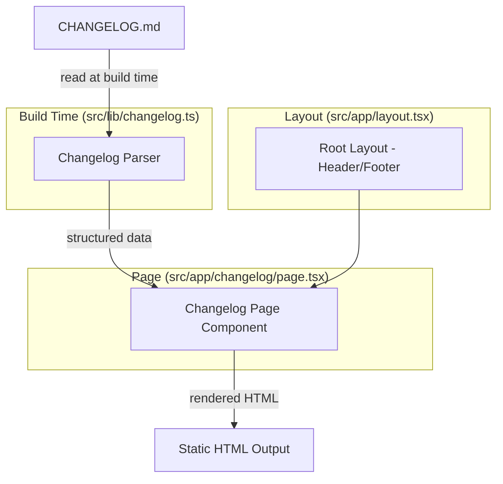

# Design Document: Changelog Page

## Overview

The changelog page is a statically generated Next.js page at `/changelog` that reads the project's `CHANGELOG.md` file at build time, parses it into structured data, and renders it as well-formatted HTML. The implementation is split into two concerns: a **parser module** that transforms conventional-changelog markdown into a typed data structure, and a **page component** that renders that structure using Tailwind Typography styling within the existing app layout.

The page requires no authentication, no client-side JavaScript for core functionality, and no runtime data fetching — it's pure static content derived from a file already in the repository.

## Architecture



**Key architectural decisions:**

1. **Parser as a pure function**: The parser is a standalone module (`src/lib/changelog.ts`) with no side effects beyond file reading. The parsing logic itself is a pure function that takes a string and returns structured data, making it highly testable.

2. **Static generation**: The page uses Next.js static generation (default behavior for server components with no dynamic data). The `CHANGELOG.md` is read once at build time via `fs.readFileSync`, and the parsed content is embedded in the static HTML output.

3. **No external dependencies for parsing**: The conventional-changelog format is simple enough (headings + lists + links) that a custom parser is more appropriate than pulling in a full markdown-to-AST library. This keeps the bundle lean and the parsing logic transparent.

4. **Reuse of root layout**: The page is a direct child of the root layout (`src/app/layout.tsx`), inheriting the shared header, footer, theme provider, and internationalization context without any additional layout nesting.

## Components and Interfaces

### Changelog Parser (`src/lib/changelog.ts`)

```typescript
/** A single change item within a category */
export interface ChangeItem {
  /** The description text of the change */
  description: string
  /** Optional links found in the change item (commit hashes, issue refs) */
  links: Array<{ text: string; url: string }>
}

/** A category of changes (e.g., "Features", "Bug Fixes") */
export interface ChangeCategory {
  /** The category name */
  title: string
  /** The list of changes in this category */
  items: ChangeItem[]
}

/** A single release entry */
export interface ReleaseEntry {
  /** The version string (e.g., "1.22.1") */
  version: string
  /** The release date string (e.g., "2026-05-30") */
  date: string
  /** Optional URL linking to the comparison/release */
  url: string | null
  /** The categorized changes in this release */
  categories: ChangeCategory[]
}

/**
 * Parses a conventional-changelog formatted markdown string into structured data.
 * Skips malformed lines and continues parsing valid content.
 */
export function parseChangelog(markdown: string): ReleaseEntry[]

/**
 * Reads and parses the CHANGELOG.md file from the project root.
 * Returns an empty array if the file is missing or unreadable.
 */
export function getChangelogEntries(): ReleaseEntry[]
```

### Changelog Page (`src/app/changelog/page.tsx`)

```typescript
/**
 * Static changelog page component.
 * Reads CHANGELOG.md at build time and renders structured content.
 */
export default function ChangelogPage(): JSX.Element

/**
 * Page metadata for SEO.
 */
export const metadata: Metadata
```

### Changelog Content Component (`src/app/changelog/_components/changelog-content.tsx`)

```typescript
interface ChangelogContentProps {
  entries: ReleaseEntry[]
}

/**
 * Renders the list of release entries with proper heading hierarchy,
 * category grouping, and link attributes.
 */
export function ChangelogContent({
  entries,
}: ChangelogContentProps): JSX.Element
```

## Data Models

### Parsed Changelog Structure

The parser transforms the flat markdown text into a three-level hierarchy:

```
ReleaseEntry[]
├── version: string (e.g., "1.22.1")
├── date: string (e.g., "2026-05-30")
├── url: string | null (comparison URL)
└── categories: ChangeCategory[]
    ├── title: string (e.g., "Bug Fixes")
    └── items: ChangeItem[]
        ├── description: string
        └── links: Array<{ text, url }>
```

### Markdown Format (Input)

The parser expects conventional-changelog format:

```markdown
## [version](url) (date)

### Category Name

- change description ([link-text](url))
```

The parser handles both `##` and `#` for version headings (the CHANGELOG.md uses both), `###` for categories, and `*` or `-` for list items.

### Parsing Rules

| Markdown Pattern               | Parsed As                              |
| ------------------------------ | -------------------------------------- |
| `## [1.2.3](url) (2024-01-01)` | ReleaseEntry with version, url, date   |
| `# [1.2.3](url) (2024-01-01)`  | ReleaseEntry (alternate heading level) |
| `### Features`                 | ChangeCategory with title "Features"   |
| `* description ([hash](url))`  | ChangeItem with description and link   |
| `- description`                | ChangeItem with description, no links  |
| Blank lines                    | Ignored                                |
| Unrecognized lines             | Skipped silently                       |

## Correctness Properties

_A property is a characteristic or behavior that should hold true across all valid executions of a system — essentially, a formal statement about what the system should do. Properties serve as the bridge between human-readable specifications and machine-verifiable correctness guarantees._

### Property 1: Parser structural round-trip

_For any_ valid changelog structure (a list of release entries with versions, dates, categories, and items), serializing it to conventional-changelog markdown format and then parsing it back with `parseChangelog` should produce an equivalent structure — same number of releases, same versions, same dates, same category names, same number of items per category, and same link URLs.

**Validates: Requirements 2.3, 3.1, 3.2, 3.3**

### Property 2: Parser resilience to malformed input

_For any_ valid conventional-changelog markdown string with arbitrary non-conforming lines (random text, partial headings, malformed links) inserted at random positions between valid entries, the parser should extract the same set of valid release entries as it would from the clean markdown without the malformed lines.

**Validates: Requirements 2.4**

### Property 3: Link attribute correctness

_For any_ parsed ChangeItem containing one or more links, when rendered by the ChangelogContent component, every `<a>` element in the output should have `target="_blank"` and `rel="noopener noreferrer"` attributes set.

**Validates: Requirements 3.4**

## Error Handling

| Scenario                                     | Behavior                                                                                   |
| -------------------------------------------- | ------------------------------------------------------------------------------------------ |
| `CHANGELOG.md` file missing                  | `getChangelogEntries()` returns `[]`; page renders "changelog could not be loaded" message |
| `CHANGELOG.md` file unreadable (permissions) | Same as missing — caught by try/catch, returns `[]`                                        |
| Malformed markdown lines                     | Skipped silently; valid entries still parsed                                               |
| Empty `CHANGELOG.md` file                    | Returns `[]`; page renders empty state message                                             |
| Version heading without date                 | Parsed with empty date string                                                              |
| Category with no items                       | Category included with empty items array                                                   |
| Release with no categories                   | Release included with empty categories array                                               |

The error handling strategy is "graceful degradation" — the parser never throws. The page component checks for an empty entries array and displays an appropriate message.

## Testing Strategy

### Unit Tests (Jest)

- **Parser function**: Test with known markdown snippets to verify correct extraction of versions, dates, categories, and items
- **Edge cases**: Empty file, missing file, malformed lines, releases without categories, items without links
- **Metadata**: Verify the exported metadata object contains required SEO fields
- **Component rendering**: Render ChangelogContent with sample data and verify HTML structure (h2 for versions, h3 for categories, ul/li for items, prose classes applied)

### Property-Based Tests (fast-check)

The project already uses `fast-check` (see `devDependencies` and existing property tests in `src/lib/activity-diff.property.test.ts`).

**Configuration:**

- Minimum 100 iterations per property test (using `{ numRuns: 100 }`)
- Each test tagged with feature and property reference

**Properties to implement:**

1. **Parser structural round-trip** — Generate random `ReleaseEntry[]` structures, serialize to markdown, parse back, verify structural equivalence
2. **Parser resilience** — Generate valid markdown, insert random garbage lines, verify same valid entries are extracted
3. **Link attributes** — Generate ChangeItems with random links, render, verify all anchors have correct attributes

**Tag format:** `Feature: changelog-page, Property {N}: {description}`

### Integration Tests

- Verify the page builds successfully with the real `CHANGELOG.md`
- Verify the page is accessible at `/changelog` without authentication (manual/E2E)

### What is NOT property-tested

- SEO metadata (static values, tested with examples)
- Layout/CSS concerns (visual, tested with examples or manual review)
- Performance (tested with Lighthouse)
- Static generation behavior (architectural, verified by build process)
