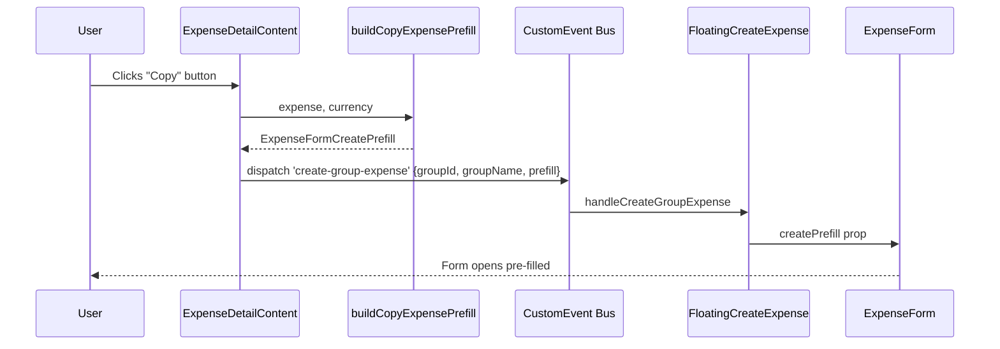

# Design Document: copy-expense

## Overview

The copy-expense feature adds a "Copy" action to expense detail views and (optionally) expense list cards. When activated, it opens the existing create-expense dialog pre-filled with the source expense's data — but with today's date, no documents, and no recurrence rule. The resulting expense is fully independent from the original.

The implementation leverages the existing `create-group-expense` custom event + `ExpenseFormCreatePrefill` pattern already used by receipt extraction and settlement flows. A pure helper function (`buildCopyExpensePrefill`) extracts the relevant fields, and the UI components dispatch the event with the prefill payload.

## Architecture



For direct (friend) expenses, the flow is similar but dispatches the event with friend context data, triggering the FloatingCreateExpense to open in friend mode.

### Design Decisions

1. **Custom event over URL params**: The app already uses `create-group-expense` custom events with a `prefill` payload (see receipt extraction and settlement recording). Reusing this pattern avoids new state management infrastructure and keeps the approach consistent.

2. **Pure helper function**: The field extraction logic lives in a pure, testable function (`buildCopyExpensePrefill`) separate from UI. This enables property-based testing of the mapping invariants.

3. **Extend `ExpenseFormCreatePrefill` with `notes`**: The current type omits `notes`. Adding it (optional) lets the copy flow forward notes from the source, while the form's default branch already handles `notes: ''` when not provided.

4. **No new tRPC procedures**: The expense data needed for copying is already loaded in both `GroupExpenseDetailLoader` and `DirectExpenseDetailLoader`. No additional server round-trip is needed.

## Components and Interfaces

### New: `buildCopyExpensePrefill` (pure function)

**Location:** `src/lib/expense-copy.ts`

```typescript
import type { ExpenseFormCreatePrefill } from '@/app/groups/[groupId]/expenses/expense-form'
import type { Currency } from '@/lib/currency'
import { amountAsDecimal } from '@/lib/utils'
import type { SplitMode } from '@prisma/client'

export type CopyableExpense = {
  title: string
  amount: number // minor units (cents)
  categoryId: number | null
  paidById: string
  splitMode: SplitMode
  isReimbursement: boolean
  notes: string | null
  paidFor: Array<{ userId: string; shares: number }>
}

export function buildCopyExpensePrefill(
  expense: CopyableExpense,
  currency: Currency,
): ExpenseFormCreatePrefill {
  const amount = amountAsDecimal(expense.amount, currency)

  return {
    title: expense.title,
    expenseDate: new Date(), // today
    amount,
    category: expense.categoryId ?? 0,
    paidBy: expense.paidById,
    splitMode: expense.splitMode,
    isReimbursement: expense.isReimbursement,
    notes: expense.notes ?? '',
    paidFor: expense.paidFor.map(({ userId, shares }) => ({
      participant: userId,
      shares:
        expense.splitMode === 'BY_AMOUNT'
          ? amountAsDecimal(shares, currency)
          : shares / 100,
    })),
    // Explicitly excluded: documents, recurrenceRule
  }
}
```

### New: `openCopyGroupExpense` / `openCopyDirectExpense` (event dispatchers)

**Location:** `src/lib/expense-dialog-events.ts` (extend existing file)

```typescript
import type { ExpenseFormCreatePrefill } from '@/app/groups/[groupId]/expenses/expense-form'

export function openCopyGroupExpense(
  groupId: string,
  groupName: string,
  prefill: ExpenseFormCreatePrefill,
) {
  window.dispatchEvent(
    new CustomEvent('create-group-expense', {
      detail: { groupId, groupName, prefill },
    }),
  )
}

export function openCopyDirectExpense(
  friendId: string,
  prefill: ExpenseFormCreatePrefill,
) {
  window.dispatchEvent(
    new CustomEvent('create-direct-expense', {
      detail: { friendId, prefill },
    }),
  )
}
```

### Modified: `ExpenseFormCreatePrefill` type

**Location:** `src/app/groups/[groupId]/expenses/expense-form.tsx`

Add `notes?: string` field to the existing type:

```typescript
export type ExpenseFormCreatePrefill = {
  title?: string
  expenseDate?: Date
  amount?: number
  category?: number
  documents?: ExpenseFormValues['documents']
  isReimbursement?: boolean
  paidBy?: string
  paidFor?: ExpenseFormValues['paidFor']
  splitMode?: ExpenseFormValues['splitMode']
  notes?: string // <-- NEW
}
```

And update the `createPrefill` default values branch to use `notes`:

```typescript
notes: createPrefill.notes ?? '',
```

### Modified: `ExpenseDetailContent` component

**Location:** `src/components/expense-detail/expense-detail.tsx`

Add a "Copy" button in the action bar (between delete and edit), gated on `!isLocked`. The button calls a new `onCopy` callback prop.

The loaders (`GroupExpenseDetailLoader`, `DirectExpenseDetailLoader`) pass an `onCopy` that:

1. Calls `buildCopyExpensePrefill(expense, currency)`
2. Dispatches the appropriate custom event

### Modified: `ExpenseCard` component (optional enhancement)

**Location:** `src/app/groups/[groupId]/expenses/expense-card.tsx`

Add a context menu (long-press / right-click) or a small action dropdown with a "Copy" option. This mirrors the detail view's copy action for faster access from the list.

### Modified: i18n catalogs

**Location:** `messages/*.json`

Add under `"ExpenseDetail"`:

```json
"copy": "Copy"
```

## Data Models

No database schema changes are required. The feature operates entirely on client-side data that is already loaded by existing tRPC queries.

**Data flow summary:**

| Source (from tRPC response) | Target (`ExpenseFormCreatePrefill`) | Transformation                                                        |
| --------------------------- | ----------------------------------- | --------------------------------------------------------------------- |
| `expense.title`             | `prefill.title`                     | Identity                                                              |
| `expense.amount`            | `prefill.amount`                    | `amountAsDecimal(amount, currency)`                                   |
| `expense.categoryId`        | `prefill.category`                  | Fallback to `0` if null                                               |
| `expense.paidById`          | `prefill.paidBy`                    | Identity                                                              |
| `expense.splitMode`         | `prefill.splitMode`                 | Identity                                                              |
| `expense.isReimbursement`   | `prefill.isReimbursement`           | Identity                                                              |
| `expense.notes`             | `prefill.notes`                     | Fallback to `''` if null                                              |
| `expense.paidFor[].userId`  | `prefill.paidFor[].participant`     | Identity                                                              |
| `expense.paidFor[].shares`  | `prefill.paidFor[].shares`          | BY_AMOUNT: `amountAsDecimal`; BY_PERCENTAGE/BY_SHARES: `shares / 100` |
| —                           | `prefill.expenseDate`               | Always `new Date()` (today)                                           |
| `expense.documents`         | —                                   | **NOT copied** (excluded)                                             |
| `expense.recurrenceRule`    | —                                   | **NOT copied** (form defaults to NONE)                                |

## Correctness Properties

_A property is a characteristic or behavior that should hold true across all valid executions of a system — essentially, a formal statement about what the system should do. Properties serve as the bridge between human-readable specifications and machine-verifiable correctness guarantees._

### Property 1: Copy prefill preserves identity fields

_For any_ valid expense object, `buildCopyExpensePrefill(expense, currency)` SHALL produce a prefill where `title === expense.title`, `category === (expense.categoryId ?? 0)`, `paidBy === expense.paidById`, `splitMode === expense.splitMode`, `isReimbursement === expense.isReimbursement`, and `notes === (expense.notes ?? '')`.

**Validates: Requirements 2.1, 2.3, 2.4, 2.5, 2.7, 2.8**

### Property 2: Copy prefill correctly converts monetary values

_For any_ valid expense and currency, `buildCopyExpensePrefill(expense, currency).amount` SHALL equal `amountAsDecimal(expense.amount, currency)`, and each `paidFor[i].shares` SHALL equal the source share converted according to the split mode (BY_AMOUNT → `amountAsDecimal`, BY_PERCENTAGE/BY_SHARES → `shares / 100`).

**Validates: Requirements 2.2, 2.6**

### Property 3: Copy prefill resets transient fields

_For any_ valid expense (including those with documents and recurrence rules), `buildCopyExpensePrefill(expense, currency)` SHALL produce a prefill where `expenseDate` is today's date, and the prefill does NOT contain a `documents` array or `recurrenceRule` field (or they are empty/undefined).

**Validates: Requirements 3.1, 5.1, 5.2, 5.3**

### Property 4: Copy action visibility matches non-locked status

_For any_ expense object, the copy action SHALL be visible if and only if `isConsolidatedPayment(expense)` is `false`. This holds regardless of whether the expense is a reimbursement.

**Validates: Requirements 1.3, 1.4**

## Error Handling

This feature has minimal error surface since it operates on already-loaded data:

| Scenario                                                     | Handling                                                                                                                        |
| ------------------------------------------------------------ | ------------------------------------------------------------------------------------------------------------------------------- |
| Expense data not yet loaded when copy is clicked             | Button is only rendered after data loads (existing pattern via `useSpinDelay`)                                                  |
| Group participants changed between copy and save             | The form already handles participant drift via `useEffect` reconciliation                                                       |
| Currency mismatch (expense in different currency than group) | `buildCopyExpensePrefill` uses the group currency for conversion; the form's currency selector remains editable                 |
| Direct expense with no friend context                        | The existing `FloatingCreateExpense` handles friend selection; for direct copy, the friend is pre-selected via the custom event |

No new error toasts or error boundaries are needed.

## Testing Strategy

### Unit Tests (example-based)

- Render `ExpenseDetailContent` with `isLocked=false` → copy button present
- Render `ExpenseDetailContent` with `isLocked=true` → copy button absent
- Verify i18n key `ExpenseDetail.copy` exists in `en-US.json`
- Verify form opens with prefill when copy event is dispatched

### Property-Based Tests (fast-check)

Use `fast-check` (already available or easily added) to validate the `buildCopyExpensePrefill` function:

- **Property 1**: Generate random expense objects (random title strings, amounts as positive integers, categoryIds, userIds, split modes, boolean isReimbursement, nullable notes). Verify identity fields are preserved.
  - Tag: **Feature: copy-expense, Property 1: Copy prefill preserves identity fields**
  - Minimum 100 iterations

- **Property 2**: Generate random expenses with varying amounts, split modes, and paidFor arrays. Verify monetary conversion is correct.
  - Tag: **Feature: copy-expense, Property 2: Copy prefill correctly converts monetary values**
  - Minimum 100 iterations

- **Property 3**: Generate random expenses with documents arrays and recurrence rules. Verify the output always resets date to today and excludes documents/recurrence.
  - Tag: **Feature: copy-expense, Property 3: Copy prefill resets transient fields**
  - Minimum 100 iterations

- **Property 4**: Generate random expense objects with varying `creationMethod` and `bundleId`. Verify visibility predicate matches `!isConsolidatedPayment`.
  - Tag: **Feature: copy-expense, Property 4: Copy action visibility matches non-locked status**
  - Minimum 100 iterations

### Integration Tests

- End-to-end: click copy on a group expense → form opens with correct data → save → new expense exists, original unchanged

## File Change Summary

| File                                                 | Change                                                                                                                                             |
| ---------------------------------------------------- | -------------------------------------------------------------------------------------------------------------------------------------------------- |
| `src/lib/expense-copy.ts`                            | **NEW** — `buildCopyExpensePrefill` pure function + `CopyableExpense` type                                                                         |
| `src/lib/expense-copy.test.ts`                       | **NEW** — Property-based tests for `buildCopyExpensePrefill`                                                                                       |
| `src/lib/expense-dialog-events.ts`                   | **MODIFY** — Add `openCopyGroupExpense` and `openCopyDirectExpense` helpers                                                                        |
| `src/app/groups/[groupId]/expenses/expense-form.tsx` | **MODIFY** — Add `notes?: string` to `ExpenseFormCreatePrefill`; use `createPrefill.notes` in defaults                                             |
| `src/components/expense-detail/expense-detail.tsx`   | **MODIFY** — Add copy button to `ExpenseDetailContent`; add `onCopy` prop; implement in `GroupExpenseDetailLoader` and `DirectExpenseDetailLoader` |
| `src/app/groups/[groupId]/expenses/expense-card.tsx` | **MODIFY** — Add copy action to card (context menu or dropdown)                                                                                    |
| `messages/en-US.json`                                | **MODIFY** — Add `"copy": "Copy"` under `ExpenseDetail`                                                                                            |
| `messages/*.json` (all locales)                      | **MODIFY** — Add `"copy"` key (English fallback applies for untranslated locales)                                                                  |
