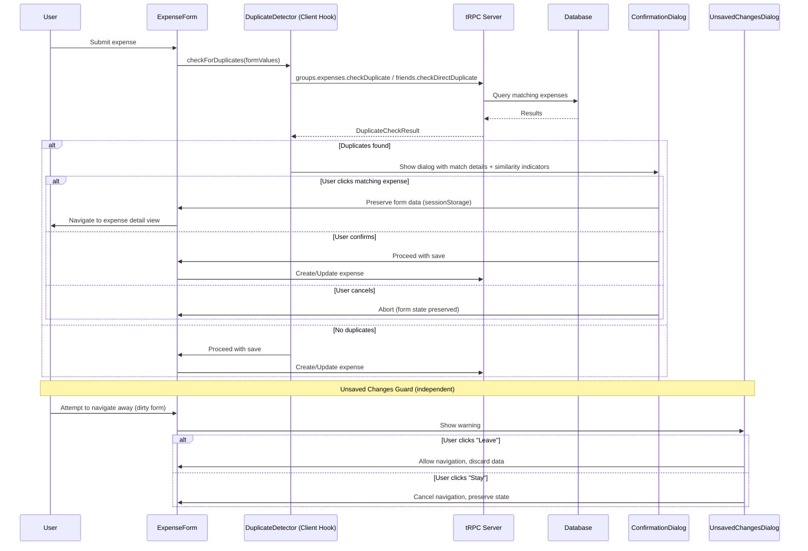

# Design Document: Duplicate Expense Detection

## Overview

This feature intercepts the expense save flow (both create and edit) to check for potentially duplicate expenses before persistence. When the user submits an expense form, a server-side tRPC procedure queries existing expenses in the same context (group or direct friend) for matches on title (case-insensitive, trimmed) and amount. If a match is found, a confirmation dialog is shown with details of the existing expense, including visual similarity indicators highlighting which fields match. Date proximity (7-day window) is used as a reinforcement signal in the dialog but is not required for flagging.

Additionally, the confirmation dialog allows the user to click on the matching expense to navigate to its detail view for comparison, while preserving the current form data. An unsaved changes warning guards against accidental data loss when navigating away from a dirty form.

The feature integrates into both `ExpenseForm` and `PaymentForm` components by intercepting the submit handler before calling the existing `onSubmit` prop. The detection logic lives server-side as a tRPC query procedure, and the confirmation UI uses the existing `AlertDialog` component from `@base-ui/react/alert-dialog`. The unsaved changes guard leverages the existing `PreventNavigation` component pattern already present in the codebase.

## Architecture



### Design Decisions

1. **Server-side detection**: The duplicate check runs as a server-side tRPC procedure rather than a client-side filter to avoid stale data and ensure accuracy.
2. **Non-blocking on failure**: If the duplicate check fails (network error, timeout), the save proceeds normally to avoid degrading UX. This non-blocking principle only suppresses the duplicate dialog — other dialogs (e.g., unsaved changes) remain unaffected.
3. **Title normalization**: Comparison uses `trim().toLowerCase()` to handle case and whitespace variations.
4. **Amount stored in minor units**: The comparison uses the integer `amount` field (cents) directly, avoiding floating-point issues. Zero-amount expenses are treated identically to any other amount.
5. **Date as reinforcement only**: Date proximity enriches the dialog via a "close in date" similarity indicator but does not gate the duplicate flag.
6. **Similarity indicators computed from input**: Indicators ("similar title", "same amount", "close in date") are derived by comparing the new expense fields against each match. Since title and amount must match for detection to fire, at least two indicators will always appear.
7. **Form data preservation via sessionStorage**: When navigating to view a duplicate expense, form data is serialized to `sessionStorage` keyed by a stable form instance key. If serialization fails, navigation is blocked.
8. **Reuse of PreventNavigation pattern**: The unsaved changes warning reuses the existing `PreventNavigation` component (already in the codebase), which handles `beforeunload`, link click interception, and `popstate` events. The dialog text is customized with "Leave" and "Stay" actions per requirements.

## Components and Interfaces

### New tRPC Procedures

#### `groups.expenses.checkDuplicate`

```typescript
// Input
z.object({
  groupId: z.string().min(1),
  title: z.string(),
  amount: z.number().int(), // minor units
  expenseDate: z.date(),
  excludeExpenseId: z.string().optional(), // for edit mode
})

// Output
type DuplicateCheckResult = {
  hasDuplicates: boolean
  matches: Array<{
    id: string
    title: string
    amount: number // minor units
    expenseDate: Date
    isDateProximate: boolean // within 7-day window
    groupId: string | null // needed for navigation URL construction
  }>
}
```

#### `friends.checkDirectDuplicate`

```typescript
// Input
z.object({
  friendId: z.string().min(1),
  title: z.string(),
  amount: z.number().int(), // minor units
  expenseDate: z.date(),
  excludeExpenseId: z.string().optional(),
})

// Output: same DuplicateCheckResult shape
```

### New React Hook: `useDuplicateCheck`

```typescript
function useDuplicateCheck(options: {
  context: { type: 'group'; groupId: string } | { type: 'friend'; friendId: string }
}) => {
  checkForDuplicates: (params: {
    title: string
    amount: number
    expenseDate: Date
    excludeExpenseId?: string
  }) => Promise<DuplicateCheckResult>
  isChecking: boolean
}
```

This hook encapsulates the tRPC query call and exposes a loading state for the submit button. On any error, it returns `{ hasDuplicates: false, matches: [] }` to maintain non-blocking behavior.

### New Utility: `computeSimilarityIndicators`

```typescript
type SimilarityIndicator = 'similar-title' | 'same-amount' | 'close-in-date'

function computeSimilarityIndicators(
  newExpense: { title: string; amount: number; expenseDate: Date },
  existingExpense: {
    title: string
    amount: number
    expenseDate: Date
    isDateProximate: boolean
  },
): SimilarityIndicator[] {
  const indicators: SimilarityIndicator[] = []
  if (
    normalizeExpenseTitle(newExpense.title) ===
    normalizeExpenseTitle(existingExpense.title)
  ) {
    indicators.push('similar-title')
  }
  if (newExpense.amount === existingExpense.amount) {
    indicators.push('same-amount')
  }
  if (existingExpense.isDateProximate) {
    indicators.push('close-in-date')
  }
  return indicators
}
```

This is a pure function that takes the new expense fields and a matched expense, returning which indicators apply. It is designed to be testable independently of the UI.

### New Utility: `useFormPersistence`

```typescript
type UseFormPersistenceOptions = {
  key: string // unique key per form instance (e.g., `duplicate-check-${groupId}-${expenseId || 'new'}`)
}

function useFormPersistence<T>({ key }: UseFormPersistenceOptions) => {
  save: (data: T) => boolean       // returns true on success, false on failure
  restore: () => T | null           // returns saved data or null
  clear: () => void                 // clears saved data
}
```

Uses `sessionStorage` for persistence. The `save` method wraps serialization in a try/catch: if it throws (e.g., due to circular references or quota exceeded), it returns `false`, which signals the caller to block navigation.

### Updated Component: `DuplicateExpenseDialog`

```typescript
type DuplicateExpenseDialogProps = {
  open: boolean
  matches: DuplicateCheckResult['matches']
  newExpense: { title: string; amount: number; expenseDate: Date }
  onConfirm: () => void
  onCancel: () => void
  onMatchClick: (matchId: string) => void
  currency: Currency
  locale: Locale
}
```

Changes from existing implementation:

- **New prop `newExpense`**: Provides the submitted expense fields for indicator computation.
- **New prop `onMatchClick`**: Callback when a user clicks on a matched expense item.
- **Similarity indicator badges**: Each match item displays `Badge` components for applicable indicators.
- **Clickable match items**: Each match is rendered as a clickable element (button or anchor) that calls `onMatchClick(match.id)`.

Built using the existing `AlertDialog` component pattern and shadcn `Badge` component.

### Updated Component: `PreventNavigation` (Unsaved Changes)

The existing `PreventNavigation` component already handles:

- `beforeunload` event for tab/window close
- Link click interception for same-origin navigation
- Browser back button via `popstate`

For Requirement 9, the component is integrated into `ExpenseForm` and `PaymentForm` with:

- `isDirty` sourced from React Hook Form's `formState.isDirty`
- Custom dialog text: "You have unsaved changes. If you leave, your data will be lost."
- Actions labeled "Leave" (confirm) and "Stay" (cancel)

No changes to the `PreventNavigation` component itself are needed — it already accepts `title` and `description` props and uses the `LeavingDialog` component. The button labels ("No"/"Yes") in `LeavingDialog` will be updated to "Stay"/"Leave" respectively for this context.

### Integration Points

- **`ExpenseForm`**: The `submit` function is wrapped to call `checkForDuplicates` before proceeding. If duplicates are found, form submission is paused and the dialog is shown. The `PreventNavigation` component is rendered with `isDirty={formState.isDirty}`.
- **`PaymentForm`**: Same pattern applied to the `submit` function within `PaymentForm`.
- **`floating-create-expense`**: The duplicate check is performed client-side before calling the tRPC mutation. `PreventNavigation` is also integrated here.
- **Navigation to detail view**: Uses `getGroupExpenseDetailPath(groupId, expenseId)` for group expenses and `getFriendExpenseDetailPath(username, expenseId)` for friend expenses.

## Data Models

### Database Query

The duplicate check query uses Prisma's `findMany` with the following filters:

```typescript
// For group expenses
prisma.expense.findMany({
  where: {
    groupId: groupId,
    title: { equals: normalizedTitle, mode: 'insensitive' },
    amount: amount,
    id: excludeExpenseId ? { not: excludeExpenseId } : undefined,
  },
  select: {
    id: true,
    title: true,
    amount: true,
    expenseDate: true,
    groupId: true,
  },
})

// For direct friend expenses
prisma.expense.findMany({
  where: {
    groupId: null,
    title: { equals: normalizedTitle, mode: 'insensitive' },
    amount: amount,
    id: excludeExpenseId ? { not: excludeExpenseId } : undefined,
    AND: [
      {
        OR: [
          { paidById: currentUserId },
          { paidFor: { some: { userId: currentUserId } } },
        ],
      },
      {
        OR: [
          { paidById: friendUserId },
          { paidFor: { some: { userId: friendUserId } } },
        ],
      },
    ],
  },
  select: {
    id: true,
    title: true,
    amount: true,
    expenseDate: true,
    groupId: true,
  },
})
```

### Title Normalization Function

```typescript
function normalizeExpenseTitle(title: string): string {
  return title.trim().toLowerCase()
}
```

### Date Proximity Function

```typescript
function isDateProximate(
  dateA: Date,
  dateB: Date,
  windowDays: number = 7,
): boolean {
  const diffMs = Math.abs(dateA.getTime() - dateB.getTime())
  const diffDays = diffMs / (1000 * 60 * 60 * 24)
  return diffDays <= windowDays
}
```

### Form Persistence Schema (sessionStorage)

```typescript
// Key format: `knots:duplicate-form:{groupId|friendId}:{expenseId|new}`
// Value: JSON-serialized ExpenseFormValues
type PersistedFormData = {
  values: ExpenseFormValues
  timestamp: number // for stale data cleanup
}
```

## Correctness Properties

_A property is a characteristic or behavior that should hold true across all valid executions of a system — essentially, a formal statement about what the system should do. Properties serve as the bridge between human-readable specifications and machine-verifiable correctness guarantees._

### Property 1: Title and Amount Matching

_For any_ pool of existing expenses and any submission input, the Duplicate Detector SHALL return as matches exactly those expenses that share the same normalized title and the same amount as the input, within the same context.

**Validates: Requirements 1.1, 1.3, 2.3**

### Property 2: Self-Exclusion During Edit

_For any_ expense being edited, the Duplicate Detector SHALL never return that expense's own ID in the match results, even when its title and amount match.

**Validates: Requirements 1.2**

### Property 3: Title Normalization Equivalence

_For any_ two strings `a` and `b` that differ only in leading/trailing whitespace and/or letter casing, `normalizeExpenseTitle(a) === normalizeExpenseTitle(b)` SHALL hold true. Furthermore, normalization SHALL be idempotent: `normalizeExpenseTitle(normalizeExpenseTitle(x)) === normalizeExpenseTitle(x)` for all strings `x`.

**Validates: Requirements 1.4**

### Property 4: Date Proximity Symmetry and Correctness

_For any_ two dates `dateA` and `dateB` and a window size `w > 0`, `isDateProximate(dateA, dateB, w)` SHALL equal `isDateProximate(dateB, dateA, w)` (symmetry). Furthermore, the result SHALL be `true` if and only if the absolute difference in days between the dates is ≤ `w`.

**Validates: Requirements 2.1**

### Property 5: Context Scope Isolation

_For any_ expense context (group or direct friend relationship), the Duplicate Detector SHALL only return matches from expenses belonging to that same context — never from a different group or a different friend relationship.

**Validates: Requirements 5.1, 5.2**

### Property 6: Dialog Payload Completeness

_For any_ matched expense returned by the Duplicate Detector, the dialog payload SHALL include the expense's title, amount, and expenseDate fields, all with non-null values.

**Validates: Requirements 3.2**

### Property 7: Cancel Preserves Form State

_For any_ set of valid form field values present when the Confirmation Dialog is shown, clicking "Cancel" SHALL result in identical form field values afterwards (no mutation).

**Validates: Requirements 3.4, 3.6**

### Property 8: Similarity Indicators Correctly Computed

_For any_ new expense and matched existing expense pair, `computeSimilarityIndicators` SHALL return "similar-title" if and only if the normalized titles are equal, "same-amount" if and only if the amounts are equal, and "close-in-date" if and only if `isDateProximate` returns true for their dates.

**Validates: Requirements 7.1, 7.2, 7.3, 7.4**

### Property 9: Form Data Preservation Round-Trip

_For any_ valid `ExpenseFormValues` object, serializing it to sessionStorage via `useFormPersistence.save` and then restoring it via `useFormPersistence.restore` SHALL produce an object deeply equal to the original (round-trip property).

**Validates: Requirements 8.3**

## Error Handling

| Scenario                                             | Behavior                                                               |
| ---------------------------------------------------- | ---------------------------------------------------------------------- |
| Duplicate check tRPC call fails (network error, 500) | Log error, proceed with save without showing dialog                    |
| Duplicate check times out (>500ms network)           | Proceed with save (treat as no duplicates found)                       |
| Database query error within the procedure            | Return `{ hasDuplicates: false, matches: [] }` and log server-side     |
| Invalid form data reaches duplicate check            | Should not happen (Zod validation runs first), but return empty result |
| Dialog render error                                  | ErrorBoundary catches, save proceeds                                   |
| Form data serialization to sessionStorage fails      | Block navigation to duplicate detail view, show toast informing user   |
| sessionStorage quota exceeded                        | Same as serialization failure — block navigation                       |
| Restored form data is corrupt or schema-invalid      | Discard restored data, start with fresh form state                     |

The guiding principle is **non-blocking**: the duplicate detection is a convenience feature and must never prevent a user from saving their expense. On any error in the detection flow, the system always proceeds with saving. However, for form data preservation (Req 8), if preservation fails, the system blocks the navigation rather than risk data loss.

## Testing Strategy

### Property-Based Tests (fast-check)

The following pure functions are tested with property-based testing using [fast-check](https://github.com/dubzzz/fast-check), configured with a minimum of 100 iterations per property:

- **`normalizeExpenseTitle`** — Idempotence, case/whitespace equivalence (Property 3)
- **`isDateProximate`** — Symmetry, boundary correctness (Property 4)
- **`findDuplicateMatches` (core logic as pure function)** — Matching, self-exclusion, scope isolation (Properties 1, 2, 5)
- **`computeSimilarityIndicators`** — Correct indicator derivation (Property 8)
- **Dialog payload construction** — Completeness (Property 6)
- **Form state preservation on cancel** — Identity (Property 7)
- **Form data serialization round-trip** — Preservation via sessionStorage mock (Property 9)

Each test is tagged: `Feature: duplicate-expense-detection, Property {N}: {title}`

### Unit Tests (vitest)

- Confirmation dialog renders with correct content (title, amount, date)
- Similarity indicator badges render for each matching field
- Confirm button triggers onConfirm callback
- Cancel button closes dialog without saving
- Clickable expense item triggers onMatchClick with correct ID
- Loading state shows on submit button during check
- Error fallback: save proceeds when check fails
- Zero-amount expenses are detected as duplicates (edge case for Req 1.5)
- Dialog still renders when no individual indicators apply (edge case for Req 7.6)
- Navigation blocked when form data preservation fails (Req 8.4)
- Unsaved changes dialog shows "Leave" and "Stay" actions
- "Stay" action preserves form state, "Leave" allows navigation

### Integration Tests

- tRPC procedure returns correct matches for group expenses
- tRPC procedure returns correct matches for direct friend expenses
- End-to-end flow: submit → check → dialog → confirm → persist
- End-to-end flow: submit → check → dialog → click match → navigate to detail
- Unsaved changes: modify form → navigate away → dialog appears
- Performance: duplicate check completes within 500ms with realistic data volume

### Test Configuration

```typescript
// Property test example structure
import fc from 'fast-check'
import { describe, it, expect } from 'vitest'
import { computeSimilarityIndicators } from '@/lib/duplicate-expense-detection'

describe('Duplicate Expense Detection Properties', () => {
  // Feature: duplicate-expense-detection, Property 8: Similarity Indicators Correctly Computed
  it('Property 8: Similarity indicators correctly computed', () => {
    fc.assert(
      fc.property(
        fc.record({
          title: fc.string({ minLength: 1 }),
          amount: fc.integer({ min: 0, max: 1_000_000_00 }),
          expenseDate: fc.date({
            min: new Date('2020-01-01'),
            max: new Date('2030-01-01'),
          }),
        }),
        fc.record({
          title: fc.string({ minLength: 1 }),
          amount: fc.integer({ min: 0, max: 1_000_000_00 }),
          expenseDate: fc.date({
            min: new Date('2020-01-01'),
            max: new Date('2030-01-01'),
          }),
          isDateProximate: fc.boolean(),
        }),
        (newExpense, existingExpense) => {
          const indicators = computeSimilarityIndicators(
            newExpense,
            existingExpense,
          )
          const titleMatch =
            normalizeExpenseTitle(newExpense.title) ===
            normalizeExpenseTitle(existingExpense.title)
          const amountMatch = newExpense.amount === existingExpense.amount

          expect(indicators.includes('similar-title')).toBe(titleMatch)
          expect(indicators.includes('same-amount')).toBe(amountMatch)
          expect(indicators.includes('close-in-date')).toBe(
            existingExpense.isDateProximate,
          )
        },
      ),
      { numRuns: 100 },
    )
  })
})
```
