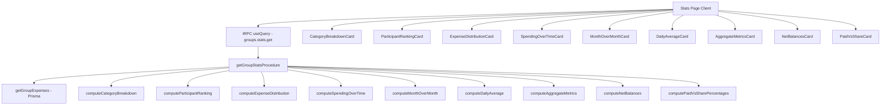

# Design Document: Enhanced Stats Dashboard

## Overview

This design extends the existing Stats tab (`/groups/[groupId]/stats`) from its current three-metric display (total group spending, user's spending, user's share) into a comprehensive analytics dashboard. The enhancement adds category breakdowns, participant rankings, expense distribution charts, time-based trends, aggregate metrics, and net balance information.

The implementation follows the existing architecture: a single tRPC procedure computes all statistics server-side, and the client renders sections using shadcn/ui Cards with Recharts-based charts (via the existing `chart.tsx` wrapper). All text uses `next-intl` translation keys, and monetary values are formatted through the existing `formatCurrency` utility.

### Key Design Decisions

1. **Single procedure expansion vs. multiple procedures**: We expand the existing `getGroupStatsProcedure` rather than creating many small procedures. This avoids multiple round-trips for a single page load and keeps the stats router simple. The procedure already fetches all expenses; computing additional aggregations in the same pass is efficient.

2. **Server-side computation**: All aggregation, sorting, and percentage calculations happen in the tRPC procedure. The client receives pre-computed, ready-to-render data. This keeps components thin and makes the computation logic unit-testable without React.

3. **Recharts with shadcn ChartContainer**: The project already has `recharts` v3 and a `chart.tsx` shadcn component. We use `BarChart` for category breakdown, spending over time, and expense distribution. No new charting dependencies needed.

4. **Incremental rendering with existing skeleton pattern**: The current stats page already uses `Skeleton` components during loading. We extend this pattern to all new sections.

## Architecture



### Data Flow

1. The client calls `trpc.groups.stats.get.useQuery({ groupId, participantId })`.
2. The procedure fetches all expenses for the group via `getGroupExpenses(groupId)`.
3. Pure computation functions process the expense array into each stats section's data.
4. The procedure returns a single response object containing all computed stats.
5. The client destructures the response and passes data to individual card components.

## Components and Interfaces

### tRPC Procedure (Enhanced)

**File**: `src/trpc/routers/groups/stats/get.procedure.ts`

The existing procedure is extended to return additional computed fields:

```typescript
// Input remains the same
z.object({
  groupId: z.string().min(1),
  participantId: z.string().optional(),
})

// Output shape (expanded)
{
  // Existing
  totalGroupSpendings: number
  totalParticipantSpendings?: number
  totalParticipantShare?: number

  // New sections
  categoryBreakdown: CategoryBreakdownItem[]
  participantRanking: ParticipantRankingItem[]
  expenseDistribution: ExpenseDistributionItem[]
  spendingOverTime: MonthlySpendingItem[]
  monthOverMonth: MonthOverMonthData | null
  dailyAverage: number | null
  aggregateMetrics: AggregateMetricsData
  netBalances: NetBalanceItem[]
  paidVsSharePercentages: PaidVsShareItem[]
}
```

### Computation Module

**File**: `src/lib/stats.ts`

A new module containing pure functions for all stats computations. Each function takes the expenses array (and optionally participants) and returns computed data. This separation enables unit testing and property-based testing without tRPC or database dependencies.

```typescript
// Core computation functions
export function computeCategoryBreakdown(
  expenses: Expense[],
): CategoryBreakdownItem[]
export function computeParticipantRanking(
  expenses: Expense[],
  participants: Participant[],
): ParticipantRankingItem[]
export function computeExpenseDistribution(
  expenses: Expense[],
  participants: Participant[],
): ExpenseDistributionItem[]
export function computeSpendingOverTime(
  expenses: Expense[],
): MonthlySpendingItem[]
export function computeMonthOverMonth(
  monthlyData: MonthlySpendingItem[],
): MonthOverMonthData | null
export function computeDailyAverage(expenses: Expense[]): number | null
export function computeAggregateMetrics(
  expenses: Expense[],
): AggregateMetricsData
export function computeNetBalances(
  expenses: Expense[],
  participants: Participant[],
): NetBalanceItem[]
export function computePaidVsSharePercentages(
  expenses: Expense[],
  participants: Participant[],
): PaidVsShareItem[]
```

### Client Components

**File structure** under `src/app/groups/[groupId]/stats/`:

| Component                  | Purpose                                                |
| -------------------------- | ------------------------------------------------------ |
| `page.client.tsx`          | Orchestrates all stats cards (enhanced)                |
| `category-breakdown.tsx`   | Bar/pie chart of spending by category                  |
| `participant-ranking.tsx`  | Ranked list of participants by payment                 |
| `expense-distribution.tsx` | Bar chart comparing paid vs share                      |
| `spending-over-time.tsx`   | Bar chart of monthly spending                          |
| `month-over-month.tsx`     | Comparison indicator card                              |
| `daily-average.tsx`        | Single metric display                                  |
| `aggregate-metrics.tsx`    | Summary card with count, average, largest, most recent |
| `net-balances.tsx`         | Color-coded balance list                               |
| `paid-vs-share.tsx`        | Side-by-side percentage comparison                     |

Each component receives its data as props from the parent `page.client.tsx` and handles its own empty/null state rendering.

## Data Models

### Type Definitions

```typescript
// src/lib/stats.ts

export interface CategoryBreakdownItem {
  categoryId: number
  categoryName: string // "Uncategorized" for id=0
  categoryGrouping: string
  amount: number // in minor units (cents)
  percentage: number // 0-100, one decimal place
}

export interface ParticipantRankingItem {
  participantId: string
  participantName: string
  totalPaid: number // in minor units
  percentage: number // of total group spending, one decimal
}

export interface ExpenseDistributionItem {
  participantId: string
  participantName: string
  totalPaid: number // in minor units
  totalShare: number // in minor units
  difference: number // paid - share (positive = overpaid)
}

export interface MonthlySpendingItem {
  year: number
  month: number // 0-indexed (JS Date convention)
  amount: number // in minor units
}

export interface MonthOverMonthData {
  currentMonth: { year: number; month: number; amount: number }
  previousMonth: { year: number; month: number; amount: number }
  absoluteDifference: number // current - previous (can be negative)
  percentageChange: number // ((current - previous) / previous) * 100
}

export interface AggregateMetricsData {
  totalCount: number
  averageAmount: number | null // null if no expenses
  largestExpense: {
    title: string
    amount: number
    date: Date
  } | null
  mostRecentExpense: {
    title: string
    amount: number
    date: Date
  } | null
}

export interface NetBalanceItem {
  participantId: string
  participantName: string
  totalPaid: number
  totalShare: number
  netBalance: number // paid - share
}

export interface PaidVsShareItem {
  participantId: string
  participantName: string
  paidPercentage: number // one decimal place
  sharePercentage: number // one decimal place
}
```

### Input Type (from existing `getGroupExpenses`)

The computation functions operate on the return type of `getGroupExpenses`:

```typescript
type Expense = {
  id: string
  amount: number
  category: { id: number; grouping: string; name: string } | null
  createdAt: Date
  expenseDate: Date
  isReimbursement: boolean
  paidBy: { id: string; name: string }
  paidFor: Array<{
    participant: { id: string; name: string }
    shares: number
  }>
  splitMode: 'EVENLY' | 'BY_SHARES' | 'BY_PERCENTAGE' | 'BY_AMOUNT'
  title: string
}
```

### Participant Type (from group)

```typescript
type Participant = {
  id: string
  name: string
}
```

## Correctness Properties

_A property is a characteristic or behavior that should hold true across all valid executions of a system — essentially, a formal statement about what the system should do. Properties serve as the bridge between human-readable specifications and machine-verifiable correctness guarantees._

### Property 1: Category aggregation correctness

_For any_ set of expenses (with varying categories, amounts, and reimbursement flags), the `computeCategoryBreakdown` function SHALL produce category items where: (a) the sum of all category amounts equals the total non-reimbursement spending, and (b) each category's percentage equals its amount divided by the total, rounded to one decimal place.

**Validates: Requirements 1.1, 1.5**

### Property 2: Category descending sort

_For any_ set of expenses producing two or more categories, the `computeCategoryBreakdown` function SHALL return categories sorted by amount in strictly non-increasing order.

**Validates: Requirements 1.4**

### Property 3: Conservation of money (net balances sum to zero)

_For any_ set of non-reimbursement expenses and participants, the sum of all `netBalance` values returned by `computeNetBalances` SHALL equal zero (within floating-point tolerance).

**Validates: Requirements 3.1, 8.1**

### Property 4: Participant ranking sort with tiebreaker

_For any_ set of expenses and participants, the `computeParticipantRanking` function SHALL return participants sorted by `totalPaid` in non-increasing order, and for participants with equal `totalPaid`, sorted alphabetically by name.

**Validates: Requirements 2.2, 2.3**

### Property 5: Expense distribution imbalance sort

_For any_ set of expenses and participants, the `computeExpenseDistribution` function SHALL return participants sorted by the absolute value of `difference` (paid - share) in non-increasing order.

**Validates: Requirements 3.4**

### Property 6: Monthly aggregation conservation

_For any_ set of non-reimbursement expenses, the sum of all `amount` values in the `computeSpendingOverTime` result SHALL equal the total non-reimbursement spending.

**Validates: Requirements 4.1**

### Property 7: Monthly chronological ordering

_For any_ set of expenses spanning multiple months, the `computeSpendingOverTime` function SHALL return items in strictly chronological order (earlier months before later months).

**Validates: Requirements 4.3**

### Property 8: Month-over-month computation correctness

_For any_ two consecutive months with known spending totals, the `computeMonthOverMonth` function SHALL return an `absoluteDifference` equal to (current - previous) and a `percentageChange` equal to ((current - previous) / previous) \* 100.

**Validates: Requirements 5.1**

### Property 9: Daily average computation correctness

_For any_ set of non-reimbursement expenses spanning one or more days, the `computeDailyAverage` function SHALL return a value equal to the total non-reimbursement spending divided by the number of days between the earliest and latest expense dates (inclusive).

**Validates: Requirements 6.1, 6.3**

### Property 10: Aggregate metrics correctness

_For any_ non-empty set of non-reimbursement expenses, the `computeAggregateMetrics` function SHALL return a `totalCount` equal to the number of non-reimbursement expenses and an `averageAmount` equal to total spending divided by that count.

**Validates: Requirements 7.1, 7.2**

### Property 11: Extreme expense identification

_For any_ non-empty set of non-reimbursement expenses, the `computeAggregateMetrics` function SHALL return a `largestExpense` whose amount is greater than or equal to all other expense amounts (with the most recent `createdAt` as tiebreaker), and a `mostRecentExpense` whose `createdAt` is greater than or equal to all other expenses' `createdAt`.

**Validates: Requirements 7.3, 7.4**

### Property 12: Net balance descending sort

_For any_ set of expenses and participants, the `computeNetBalances` function SHALL return participants sorted by `netBalance` in non-increasing order (most owed first).

**Validates: Requirements 8.4**

## Error Handling

| Scenario                                         | Handling                                                                                              |
| ------------------------------------------------ | ----------------------------------------------------------------------------------------------------- |
| Network/server error during fetch                | Display error card with retry button; use tRPC's `useQuery` error state                               |
| Group has no expenses                            | Return empty arrays / null values from procedure; client shows empty state message                    |
| Group has only reimbursements                    | Treated same as no expenses for stats purposes                                                        |
| Division by zero (e.g., percentage when total=0) | Procedure returns `null` for sections requiring division; client omits those sections                 |
| Participant with no expenses                     | Include in rankings with `totalPaid: 0` and `percentage: 0`                                           |
| Missing category (categoryId=0)                  | Map to "Uncategorized" label in computation                                                           |
| Floating-point rounding                          | Use `Math.round(value * 10) / 10` for one-decimal percentages; amounts stay as integers (minor units) |

## Testing Strategy

### Property-Based Tests

**Library**: `fast-check` (already in devDependencies)

**Configuration**: Minimum 100 iterations per property test.

Each correctness property from the design maps to a single property-based test in `src/lib/__tests__/stats.property.test.ts`. Tests generate random expense arrays using `fast-check` arbitraries and verify the universal properties hold.

**Generator strategy**:

- Generate arrays of expenses with random amounts (1–10,000,000 minor units), random categoryIds (0–30), random dates within a 2-year range, random participant assignments, and random split modes.
- Generate participant lists with 1–20 participants.
- Include edge cases naturally: expenses with categoryId=0, single-day ranges, equal amounts for tiebreaker testing, all-reimbursement sets.

**Tag format**: Each test is tagged with a comment:

```typescript
// Feature: enhanced-stats-dashboard, Property 1: Category aggregation correctness
```

### Unit Tests (Example-Based)

**File**: `src/lib/__tests__/stats.test.ts`

Cover specific scenarios:

- Empty expense list returns appropriate nulls/empty arrays
- Single expense produces correct breakdown
- Known multi-expense scenario with manually computed expected values
- Reimbursements are excluded from all computations
- Month gap filling (months with zero spending appear in output)
- Tiebreaker scenarios for largest expense and alphabetical participant ordering

### Component Tests

**File**: `src/app/groups/[groupId]/stats/__tests__/`

- Verify skeleton rendering during loading state
- Verify empty state message when no data
- Verify error state with retry button
- Verify charts render with correct data attributes
- Verify color coding for positive/negative balances
- Verify directional indicators for month-over-month

### Integration Considerations

- The tRPC procedure is tested indirectly through the computation functions (which receive the same data shape).
- No new database queries are introduced; we reuse `getGroupExpenses` which already fetches all needed fields.
- i18n coverage is verified by checking that all new translation keys exist in `en-US.json` and that components use `useTranslations` rather than hardcoded strings.
