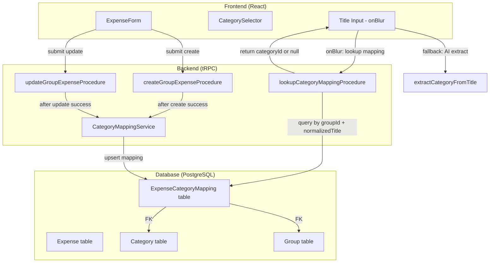

# Design Document: Expense Category Auto-Assign

## Overview

This feature implements a title-category association memory system for expenses within a group. When a user creates or edits an expense with a category, the system stores that association (normalized title → category) scoped per group. In future expense creations with the same title, the category is automatically filled in, taking priority over AI extraction.

### Design Decisions

1. **Group scope**: Mappings are shared among all participants in the same group, not per individual user. This allows the group to benefit collectively from associations.
2. **Title normalization**: Conversion to lowercase + trim + internal space collapse. Ensures consistent matching regardless of capitalization or spacing variations.
3. **Atomic upsert**: The save/update mapping operation uses upsert to avoid race conditions between create and update.
4. **Reimbursement exclusion**: Expenses marked as reimbursement do not affect mappings, preventing the "Payment" category from polluting common title associations.
5. **Priority over AI**: Manual mapping takes precedence over AI extraction, respecting the user's explicit preferences.

## Architecture



### Data Flow

1. **Expense create/edit**: After the main operation succeeds, `CategoryMappingService` upserts the mapping (if applicable).
2. **Form lookup**: When the title field loses focus, the frontend queries the backend to check if a mapping exists. If found, it fills the category; otherwise, it falls back to AI (if enabled) or the default category.
3. **Group deletion**: PostgreSQL cascade delete automatically removes associated mappings.

## Components and Interfaces

### 1. `CategoryMappingService` (Backend - `src/lib/category-mapping.ts`)

Module responsible for title-category mapping business logic.

```typescript
// src/lib/category-mapping.ts

/**
 * Normalizes the expense title for use as a lookup key.
 * - Converts to lowercase
 * - Trims leading and trailing whitespace
 * - Collapses consecutive internal whitespace to a single space
 */
export function normalizeTitle(title: string): string

/**
 * Creates or updates the title-category mapping for a group.
 * Does nothing if:
 * - The normalized title has fewer than 2 characters
 * - The expense is marked as reimbursement
 */
export async function upsertCategoryMapping(params: {
  groupId: string
  title: string
  categoryId: number
  isReimbursement: boolean
}): Promise<void>

/**
 * Looks up the title-category mapping for a group.
 * Returns the categoryId if a valid mapping exists, null otherwise.
 * Validates that the category still exists before returning.
 */
export async function lookupCategoryMapping(params: {
  groupId: string
  title: string
}): Promise<number | null>
```

### 2. tRPC Procedure - Lookup (`src/trpc/routers/groups/expenses/lookup-category.procedure.ts`)

```typescript
// New procedure for category lookup by title
export const lookupCategoryMappingProcedure = baseProcedure
  .input(
    z.object({
      groupId: z.string().min(1),
      title: z.string().min(1),
    }),
  )
  .query(async ({ input }) => {
    const categoryId = await lookupCategoryMapping({
      groupId: input.groupId,
      title: input.title,
    })
    return { categoryId }
  })
```

### 3. Integration in Existing Procedures

The `createGroupExpenseProcedure` and `updateGroupExpenseProcedure` procedures will be modified to call `upsertCategoryMapping` after the main operation succeeds.

### 4. Frontend - `ExpenseForm` (modification)

The title field's `onBlur` handler will be modified to:

1. First query the mapping via `lookupCategoryMappingProcedure`
2. If a valid mapping is found, fill the category
3. If not found, fall back to AI extraction (if enabled) or keep the default category

```typescript
// Modification in the title field onBlur
onBlur={async () => {
  field.onBlur()

  // 1. Try mapping lookup
  const { categoryId: mappedCategoryId } = await lookupCategoryMapping({
    groupId: group.id,
    title: field.value,
  })

  if (mappedCategoryId !== null) {
    form.setValue('category', mappedCategoryId)
    return
  }

  // 2. Fallback to AI (if enabled)
  if (runtimeFeatureFlags.enableCategoryExtract) {
    setCategoryLoading(true)
    const { categoryId } = await extractCategoryFromTitle(field.value)
    form.setValue('category', categoryId)
    setCategoryLoading(false)
  }
}}
```

## Data Models

### New Table: `ExpenseCategoryMapping`

```prisma
model ExpenseCategoryMapping {
  id              String   @id @default(cuid())
  groupId         String
  group           Group    @relation(fields: [groupId], references: [id], onDelete: Cascade)
  normalizedTitle String
  categoryId      Int
  category        Category @relation(fields: [categoryId], references: [id])
  updatedAt       DateTime @updatedAt
  createdAt       DateTime @default(now())

  @@unique([groupId, normalizedTitle])
  @@index([groupId, normalizedTitle])
}
```

### Changes to Existing Models

```prisma
model Group {
  // ... existing fields ...
  categoryMappings ExpenseCategoryMapping[]
}

model Category {
  // ... existing fields ...
  categoryMappings ExpenseCategoryMapping[]
}
```

### Migration

A new Prisma migration will be created to add the `ExpenseCategoryMapping` table with:

- Composite unique constraint `(groupId, normalizedTitle)` to ensure one mapping per title per group
- Cascade delete on `groupId` for automatic cleanup when a group is deleted
- Index on `(groupId, normalizedTitle)` for efficient lookups

## Correctness Properties

_A property is a characteristic or behavior that should hold true across all valid executions of a system — essentially, a formal statement about what the system should do. Properties serve as the bridge between human-readable specifications and machine-verifiable correctness guarantees._

### Property 1: Upsert last-write-wins

_For any_ sequence of upsert calls with the same groupId and normalizedTitle (≥2 chars) on non-reimbursement expenses, the stored mapping SHALL always reflect the categoryId of the most recent upsert call.

**Validates: Requirements 1.1, 1.2, 2.1, 6.4**

### Property 2: Title change preserves old mapping

_For any_ non-reimbursement expense edit where the title changes from A to B (both normalizing to ≥2 chars), the mapping for normalizedTitle(A) SHALL remain unchanged, and a mapping for normalizedTitle(B) SHALL be created or updated with the current category.

**Validates: Requirements 2.2, 2.3**

### Property 3: normalizeTitle idempotence and correctness

_For any_ string input, `normalizeTitle(normalizeTitle(input))` SHALL equal `normalizeTitle(input)` (idempotence), and the result SHALL contain only lowercase characters, no leading/trailing whitespace, and no consecutive internal spaces.

**Validates: Requirements 1.3**

### Property 4: Short title guard

_For any_ string whose normalized form has fewer than 2 characters, calling upsertCategoryMapping SHALL not create or update any mapping.

**Validates: Requirements 1.4**

### Property 5: Reimbursement guard

_For any_ expense marked as reimbursement (isReimbursement=true), regardless of title or category values, calling upsertCategoryMapping SHALL not create or update any mapping.

**Validates: Requirements 2.4, 6.1, 6.3**

### Property 6: Lookup round-trip with category validity

_For any_ valid mapping (groupId, normalizedTitle, categoryId) where the categoryId corresponds to an existing category, `lookupCategoryMapping(groupId, title)` SHALL return that categoryId. If the categoryId does not correspond to a valid category, lookup SHALL return null.

**Validates: Requirements 3.1, 3.4**

### Property 7: Group isolation

_For any_ two distinct groupIds and the same normalizedTitle, upserting a mapping in one group SHALL not affect the lookup result in the other group.

**Validates: Requirements 4.1, 4.2, 4.3**

## Error Handling

| Scenario                         | Behavior                                                          |
| -------------------------------- | ----------------------------------------------------------------- |
| Normalized title < 2 characters  | Silently ignored (no mapping created, no error returned)          |
| Expense marked as reimbursement  | Silently ignores upsert                                           |
| Mapped category no longer exists | Lookup returns `null`, frontend falls back                        |
| Mapping upsert operation fails   | Log error, do not block expense create/edit (secondary operation) |
| Mapping lookup fails             | Returns `null`, frontend falls back to AI or default category     |
| Group deleted                    | Cascade delete removes all mappings automatically                 |
| Upsert race condition            | Unique constraint + Prisma atomic upsert ensures consistency      |

### Error Design Principle

The mapping operation is **secondary** relative to expense create/edit. Mapping failures must never block or revert the main operation. The system should:

1. Execute the main operation (create/edit expense)
2. Attempt mapping upsert next
3. If upsert fails, log the error and continue normally

## Testing Strategy

### Property-Based Tests (fast-check)

The project already uses `fast-check` (v4.8.0) for property tests. Tests will follow the existing pattern in `src/lib/activity-diff.property.test.ts`.

**File**: `src/lib/category-mapping.property.test.ts`

Each property in this document will be implemented as an individual test with a minimum of 100 iterations (200 recommended, following the existing pattern).

**Tag format**: `Feature: expense-category-auto-assign, Property {number}: {property_text}`

**Property test focus**:

- `normalizeTitle` — pure function, ideal for PBT
- `upsertCategoryMapping` — business logic with guards (reimbursement, short title)
- `lookupCategoryMapping` — round-trip with category validation
- Group isolation

### Unit Tests (Jest)

**File**: `src/lib/category-mapping.test.ts`

Example tests for specific scenarios:

- Fallback to AI when no mapping exists (mock AI function)
- Mapping priority over AI (5.1)
- Behavior when AI fails (5.3)
- Default category when no mapping and no AI (5.4)
- Reimbursement toggle preserves existing mapping (6.2)

### Integration Tests

- Group cascade delete removes mappings (4.4)
- Unique constraint prevents duplicates
- Atomic upsert transaction

### Configuration

```typescript
// Example property test structure
fc.assert(
  fc.property(
    titleArb,
    categoryIdArb,
    groupIdArb,
    (title, categoryId, groupId) => {
      // ... property assertion
    },
  ),
  { numRuns: 200 },
)
```

### Mocking Strategy

For property tests of `upsertCategoryMapping` and `lookupCategoryMapping`, the Prisma client will need to be mocked. The recommended pattern is:

1. Extract decision logic (should upsert? what to upsert?) into testable pure functions
2. Test pure functions with PBT
3. Test Prisma integration via unit tests with mocks
