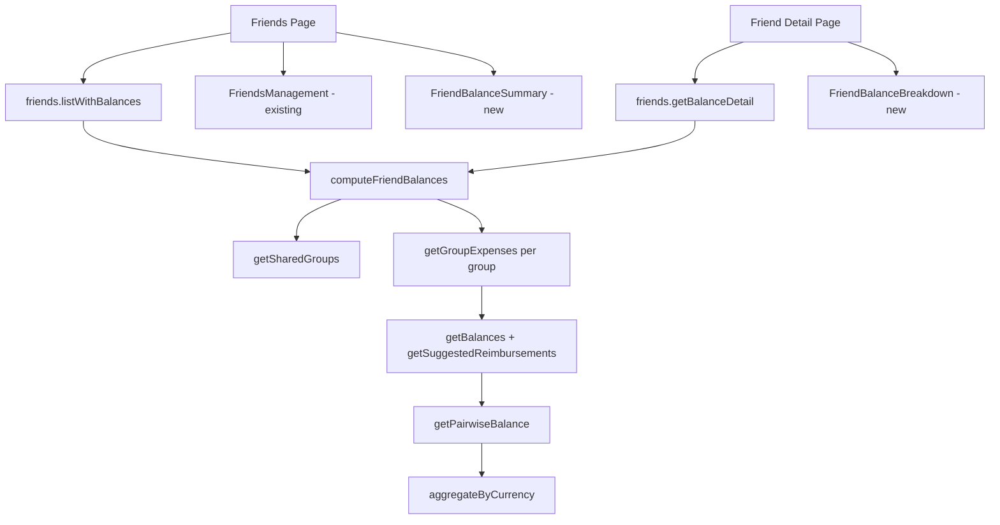

# Design Document: Friend Balances Across Groups

## Overview

This design adds aggregated balance tracking between connected friends across all shared groups. It reuses the existing balance engine (`getBalances` → `getSuggestedReimbursements`) and expense fetching (`getGroupExpenses`) without schema changes.

The feature extends the Friends page with a balance column and adds a detail page with per-group breakdown and links to group balance tabs.

### Key Design Decisions

1. **No schema changes**: Balances are derived at query time. This avoids stale data and reuses all existing expense/split/reimbursement logic.

2. **Pairwise balance via reimbursements**: Rather than reimplementing debt math, we extract the net flow between two users from `getSuggestedReimbursements()` output. This matches what users see on each group's Balances tab.

3. **Multi-currency by design**: Amounts are never converted. A friend might "owe you €15 and $8" — displayed as separate lines.

4. **Connected friends only**: Pending friends and friends without a Knots account (`friendUserId: null`) cannot have computed balances.

5. **Separate query for balances**: `friends.listWithBalances` is a dedicated query rather than bloating `friends.list`, so the friends list remains fast when balances are not needed elsewhere.

## Architecture



### Data Flow

1. Client calls `friends.listWithBalances.useQuery()`.
2. Server loads connected friends for the user.
3. For each friend, find Shared_Groups (both memberships active, not archived).
4. For each shared group, fetch expenses via `getGroupExpenses(groupId)`.
5. Compute reimbursements; extract pairwise balance between user and friend.
6. Aggregate by currency; return sorted list.
7. Detail page calls `friends.getBalanceDetail({ friendId })` with the same engine scoped to one friend.

## Components and Interfaces

### Computation Module

**File**: `src/lib/friend-balances.ts` (new)

```typescript
import {
  getBalances,
  getSuggestedReimbursements,
  Reimbursement,
} from '@/lib/balances'
import type { getGroupExpenses } from '@/lib/api'

export type GroupBalanceBreakdown = {
  groupId: string
  groupName: string
  currency: ReturnType<typeof getCurrencyFromGroup> // or Currency type
  amount: number // minor units; positive = friend owes user
}

export type CurrencyBalance = {
  currency: Currency
  totalAmount: number
  groups: GroupBalanceBreakdown[]
}

export type FriendBalanceSummary = {
  friendId: string
  friendUserId: string
  name: string
  balances: CurrencyBalance[] // empty if no shared groups or all zero
}

/** Net balance between two users from reimbursement suggestions. */
export function getPairwiseBalance(
  reimbursements: Reimbursement[],
  currentUserId: string,
  friendUserId: string,
): number

/** Compute balances for one friend across shared groups. */
export function computeFriendBalance(
  currentUserId: string,
  friendUserId: string,
  sharedGroups: Array<{
    id: string
    name: string
    currency: string
    currencyCode: string | null
    expenses: Awaited<ReturnType<typeof getGroupExpenses>>
  }>,
): CurrencyBalance[]

/** Sort: non-zero balances first, then alphabetical by name. */
export function sortFriendBalances(
  items: FriendBalanceSummary[],
): FriendBalanceSummary[]
```

**Pairwise balance algorithm**:

```typescript
export function getPairwiseBalance(
  reimbursements: Reimbursement[],
  currentUserId: string,
  friendUserId: string,
): number {
  return reimbursements.reduce((net, r) => {
    if (r.from === friendUserId && r.to === currentUserId) return net + r.amount
    if (r.from === currentUserId && r.to === friendUserId) return net - r.amount
    return net
  }, 0)
}
```

### Database Query Helper

**File**: `src/lib/friend-balances.ts` (same file or `src/lib/friend-balances-db.ts`)

```typescript
/** Returns groups where both users have active memberships. */
export async function getSharedGroupsForUsers(
  userId: string,
  friendUserId: string,
): Promise<
  Array<{
    id: string
    name: string
    currency: string
    currencyCode: string | null
  }>
>
```

Prisma query pattern:

```typescript
const memberships = await prisma.groupMembership.findMany({
  where: {
    userId: { in: [userId, friendUserId] },
    archivedAt: null,
  },
  select: {
    groupId: true,
    userId: true,
    group: {
      select: { id: true, name: true, currency: true, currencyCode: true },
    },
  },
})
// Group by groupId; keep only groups where both userIds appear
```

### tRPC Procedures

**File**: `src/trpc/routers/friends/index.ts` (extend existing router)

```typescript
listWithBalances: protectedProcedure.query(async ({ ctx }) => {
  // 1. listFriends(ctx.user.id) — filter connected + friendUserId
  // 2. For each, computeFriendBalance(...)
  // 3. return sortFriendBalances(summaries)
})

getBalanceDetail: protectedProcedure
  .input(z.object({ friendId: z.string().min(1) }))
  .query(async ({ ctx, input }) => {
    // 1. Verify Friend belongs to ctx.user.id
    // 2. Require connected + friendUserId
    // 3. Return single FriendBalanceSummary with full group breakdown
  })
```

**Response shape**:

```typescript
type ListWithBalancesResponse = FriendBalanceSummary[]

type GetBalanceDetailResponse = {
  friend: { id: string; name: string; email: string; friendUserId: string }
  balances: CurrencyBalance[]
  sharedGroupCount: number
}
```

### UI Components

**File**: `src/app/friends/friend-balance-summary.tsx` (new)

- Renders balance text per currency for a friend row
- Uses `Money` with `colored={true}`
- Uses `useTranslations('Friends.Balances')`

**File**: `src/app/friends/friends-management.tsx` (modify)

- Add balance column to friend list rows
- Call `trpc.friends.listWithBalances.useQuery()` alongside existing `friends.list`
- Match friends by `friendId` when merging data

**File**: `src/app/friends/[friendId]/balances/page.tsx` (new)

- Server component: auth check, pass `friendId` to client
- **File**: `src/app/friends/[friendId]/balances/friend-balance-detail.tsx` (new client component)
  - Card layout matching group Balances tab style
  - Group rows with link to `/groups/[groupId]/balances`
  - Back link to `/friends`

### Reused Components and Utilities

| Existing                                                            | Usage                                                                                                |
| ------------------------------------------------------------------- | ---------------------------------------------------------------------------------------------------- |
| `src/lib/balances.ts`                                               | `getBalances`, `getSuggestedReimbursements`, `getPairwiseBalance` (new, lives in friend-balances.ts) |
| `src/lib/api.ts`                                                    | `getGroupExpenses`                                                                                   |
| `src/components/money.tsx`                                          | Formatted colored amounts                                                                            |
| `src/lib/utils.ts`                                                  | `getCurrencyFromGroup`, `formatCurrency`                                                             |
| `src/app/groups/[groupId]/balances/balances-and-reimbursements.tsx` | Visual pattern for cards and loading                                                                 |

## Internationalization

### Locale files (ALL must be updated)

Every file in `messages/`:

| File         | Language                  |
| ------------ | ------------------------- |
| `en-US.json` | English (source of truth) |
| `pt-PT.json` | Portuguese (Portugal)     |
| `pt-BR.json` | Portuguese (Brazil)       |
| `es.json`    | Spanish                   |
| `ca.json`    | Catalan                   |
| `de-DE.json` | German                    |
| `fr-FR.json` | French                    |
| `it-IT.json` | Italian                   |
| `nl-NL.json` | Dutch                     |
| `pl-PL.json` | Polish                    |
| `cs-CZ.json` | Czech                     |
| `ro.json`    | Romanian                  |
| `ru-RU.json` | Russian                   |
| `ua-UA.json` | Ukrainian                 |
| `tr-TR.json` | Turkish                   |
| `fi.json`    | Finnish                   |
| `ja-JP.json` | Japanese                  |
| `zh-CN.json` | Chinese (Simplified)      |
| `zh-TW.json` | Chinese (Traditional)     |

> Note: `pt-BR.json` exists on disk but is not in `localeLabels` in `src/i18n.ts`. Still update it for consistency.

### New translation keys

Add under `Friends` in each locale file:

```json
"Balances": {
  "columnTitle": "Balance",
  "loading": "Loading balances…",
  "loadError": "Could not load balances.",
  "retry": "Retry",
  "settled": "All settled up",
  "noSharedGroups": "No shared groups",
  "friendOwesYou": "{name} owes you",
  "youOweFriend": "You owe {name}",
  "viewDetails": "View details",
  "summaryTitle": "Balances with friends",
  "summaryDescription": "Net amounts across all groups you share with each friend."
},
"BalanceDetail": {
  "title": "Balance with {name}",
  "description": "Breakdown by shared group.",
  "backToFriends": "Back to friends",
  "totalBalance": "Total balance",
  "groupBreakdown": "By group",
  "groupBalance": "Balance in this group",
  "viewGroupBalances": "View group balances",
  "emptyTitle": "No shared groups",
  "emptyDescription": "Balances appear when you and {name} are both members of the same group.",
  "notConnectedTitle": "Not connected",
  "notConnectedDescription": "Accept the connection request to see balances with this friend.",
  "loading": "Loading balance details…",
  "loadError": "Could not load balance details.",
  "retry": "Retry"
}
```

Full translations for all locales are in `i18n-translations.md` in this spec folder.

## Performance Considerations

- **N+1 queries**: For users with many friends and groups, fetching expenses per group per friend is expensive. Mitigation for MVP:
  - Batch shared group discovery with a single query per friend (not per group pair)
  - Cache expenses per groupId within a single request (Map) when multiple friends share the same group
- **Future optimization** (out of scope): materialized balance cache, background job, or SQL aggregation

## Out of Scope (Future Phases)

- **Dyad groups**: Auto-create 1-on-1 groups for direct friend expenses (`GroupType.DYAD`)
- **Cross-group reimbursement**: Single "settle up with friend" action spanning groups
- **Balance notifications**: Push when friend balance changes
- **Friends without accounts**: Email-only friends cannot have balances until they join Knots

## Security

- All endpoints require authentication
- Friend records scoped to `userId`
- Group membership verified before including group in calculations
- No exposure of group data the user is not a member of
