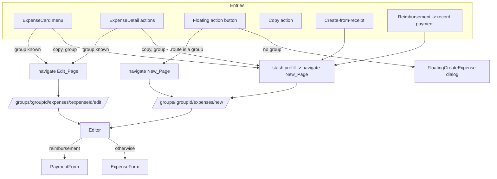

# Design Document

## Overview

Group expense create and edit move out of the floating dialog (`FloatingCreateExpense`) and onto real App Router pages:

- **New_Page** — `/groups/[groupId]/expenses/new`
- **Edit_Page** — `/groups/[groupId]/expenses/[expenseId]/edit`

Both pages render one shared **Editor** component that reuses the existing `ExpenseForm` (and `PaymentForm` for reimbursements) with no duplicated form logic. The group is taken from the route, so the participant control no longer offers group selection — it only adds friends who are outside that group. The read-only detail page (`/groups/[groupId]/expenses/[expenseId]`) is untouched. Friend-only (no group) expenses keep using `FloatingCreateExpense`.

The change is deliberately a **thin extraction**: the Editor lifts the group-expense branch of `FloatingCreateExpense`'s save/delete/decomposition logic into a page shell. The forms, the tRPC procedures, the decomposition toast, and the participant-picker component are reused as-is.

### Research findings

Investigation of the current code established the facts this design builds on:

- `ExpenseForm` (`src/app/groups/[groupId]/expenses/expense-form.tsx`) is already a self-contained, presentation-agnostic component. It takes `group`, `expense?`, `categories`, `createPrefill?`, `currentUserId?`, `preferredCurrency?`, `runtimeFeatureFlags`, `isDesktop?`, `scrollHeader?`, `singlePayerOnly?`, `onSubmit`, and `onDelete?`. It renders its own `DialogFooter` (save/delete) and a `PreventNavigation` guard. It contains the item-row layout, split modes, payer selector, and decomposition banner. Nothing in it is dialog-specific except the `DialogFooter` wrapper element (which renders fine on a page).
- `PaymentForm` (`src/app/groups/[groupId]/expenses/payment-form.tsx`) has the same shape minus `categories`/`runtimeFeatureFlags`/`isDesktop`/`singlePayerOnly`. It also renders its own footer and navigation guard. `PaymentForm` is selected when `expense.isReimbursement === true` or `createPrefill.isReimbursement === true`.
- `FloatingCreateExpense` (`src/components/floating-create-expense.tsx`) is mounted once in `src/app/layout.tsx`. It listens for four window `CustomEvent`s: `create-group-expense`, `create-direct-expense`, `edit-group-expense`, `edit-direct-expense`. Its `openForCreate` (FAB click) reads the route with `parseExpenseCreateContext(pathname)` and pre-selects a group or friend. Its `handleSubmit` handles group create, hybrid group+friends create (`createGlobalExpense`), direct create, direct/group update, direct payment, and multi-friend create. The **group** branches (`createGroupExpense`, `updateGroupExpense`, `deleteGroupExpense`, and the hybrid `createGlobalExpense`) plus the decomposition toast are what the Editor must reproduce.
- **Group_Edit_Entry** callers: `expense-detail.tsx` (`onEdit={() => openEditGroupExpense(groupId, expenseId)}`) and `expense-card.tsx` (menu item `openEditGroupExpense(groupId, expense.id)`), both from `src/lib/expense-dialog-events.ts`.
- **Group_Create_Entry** callers: the FAB in `FloatingCreateExpense` (when route context is a group), `expense-detail.tsx` and `expense-card.tsx` copy actions (`openCopyGroupExpense(groupId, name, prefill)`), `reimbursement-list.tsx` (`create-group-expense` with a payment prefill), and `create-from-receipt-button.tsx` (`create-group-expense` with a receipt prefill including `items`).
- `ExpenseFormCreatePrefill` carries `title?`, `expenseDate?: Date`, `amount?`, `category?`, `documents?`, `isReimbursement?`, `paidBy?`, `paidFor?`, `splitMode?`, `notes?`, `items?`. It contains a live `Date` and nested arrays, so it cannot be cleanly encoded as URL query params — prefill must be handed off through a transient client-side store, not the URL.
- The group detail context (`src/app/groups/[groupId]/current-group-context.tsx`) already exposes `{ groupId, group }` to every page under `/groups/[groupId]`, and `group.participants` is the exact shape `ExpenseForm`/`PaymentForm` expect for a group.
- Path helpers live in `src/lib/expense-detail-urls.ts` (`getGroupExpenseDetailPath`). Property-based tests in this repo use `fast-check` with `numRuns: 100` (a shared `PBT_NUM_RUNS` constant) under Jest.

## Architecture



### Key decisions

1. **One shared Editor, forms reused verbatim.** A single `ExpenseEditor` client component owns the group branch of the current `handleSubmit`/`handleDelete`/decomposition logic and chooses `ExpenseForm` vs `PaymentForm`. Both pages render `ExpenseEditor`; neither page imports `ExpenseForm`/`PaymentForm` directly. This satisfies R1.3 (no duplicated form) and R5.3 (behavior preserved) by construction.

2. **Group from the route, not from a picker.** The Editor reads `groupId` from route params and loads the group via the existing `useCurrentGroup()` context (already provided by the `/groups/[groupId]` layout) or `trpc.groups.get`. The `withWho`/group-selection portion of the participant control is dropped on these pages; only the "add outside friend" affordance remains (R3.1, R3.2).

3. **Prefill handed off via a transient client store, not the URL.** Because `ExpenseFormCreatePrefill` holds a `Date` and nested arrays (`documents`, `items`, `paidFor`), it is stashed in a small module-level store (`consumeExpensePrefill`/`stashExpensePrefill`) keyed by `groupId` before navigating to the New_Page. The New_Page consumes it once on mount. This mirrors the existing "prefill payload" pattern (previously the event `detail`) without inventing URL serialization. If no prefill was stashed (e.g. hard refresh, deep link), the New_Page opens empty — a safe, expected fallback.

4. **Entries navigate instead of dispatching events.** The group `open*` helpers in `expense-dialog-events.ts` are repointed to `router.push` (edit) or stash-then-push (copy). `create-from-receipt` and `reimbursement` dispatchers switch from `window.dispatchEvent('create-group-expense', …)` to the same stash-then-navigate path. `FloatingCreateExpense` stops listening for the two group events and its FAB navigates to the New_Page when the route is a group (R2, R4.3). The friend/direct events and the friend/direct save branches stay in `FloatingCreateExpense` (R4).

5. **Detail page stays read-only.** `/groups/[groupId]/expenses/[expenseId]/page.tsx` is unchanged; it renders `ExpenseDetail`, whose `onEdit` now navigates to the Edit_Page (R1.5, R2.1).

## Components and Interfaces

### New: `ExpenseEditor` (shared page body)

**Location:** `src/app/groups/[groupId]/expenses/expense-editor.tsx`

The single Editor used by both pages. It owns save/delete/decomposition wiring and picks the form.

```typescript
type ExpenseEditorProps = {
  groupId: string
  // Edit mode: the expense being edited; omit for create mode.
  expenseId?: string
  // Create-mode prefill (copy, receipt, payment). Ignored in edit mode.
  createPrefill?: ExpenseFormCreatePrefill
  runtimeFeatureFlags?: RuntimeFeatureFlags
}

export function ExpenseEditor(props: ExpenseEditorProps): React.ReactElement
```

Behavior:

- Loads the group (`useCurrentGroup()` / `trpc.groups.get`), profile, and categories. In edit mode, loads the expense via `trpc.groups.expenses.get({ groupId, expenseId })`. Locked/consolidated payments short-circuit with the existing locked-payment toast and navigate back to the detail page (matching current dialog guard).
- `isPaymentMode = editingExpense?.isReimbursement === true || createPrefill?.isReimbursement === true`.
- Builds the participant list: current user + group members + any **outside friends** added in this Editor session (R3.3, R3.4, R3.5). No group members are ever removed; outside friends are additive.
- Renders `ExpenseForm` (or `PaymentForm`) with `group`, `expense`, `createPrefill`, `currentUserId`, `onSubmit`, `onDelete` (edit only), and — for the hybrid case — `singlePayerOnly` when outside friends are present, exactly as the dialog does today.
- `onSubmit`/`onDelete` reproduce the **group** branches of the current `handleSubmit`/`handleDelete`, including the decomposition toast (R2.6), then navigate: finish/cancel on Edit → Detail_Page; finish/cancel on New → group expense list (R2.4, R2.5).

The Editor renders no `Dialog` shell. It renders the same inner content the dialog wraps (`scrollHeader` for the outside-friend control + the form, which supplies its own footer).

### New: `Outside_Participant_Control`

On these pages the participant control adds only outside friends. The existing `ExpenseParticipantPicker` supports friend add/remove already; the design reuses it with group selection disabled/hidden. The trigger shows added outside friends (not a group name to change). Friends whose id/`friendUserId` is already a group member are excluded from the "addable" list (R3.2, R3.3).

### New: New_Page and Edit_Page

```
src/app/groups/[groupId]/expenses/new/page.tsx          # server: title metadata, awaits params
src/app/groups/[groupId]/expenses/new/page.client.tsx   # consumes stashed prefill, renders ExpenseEditor
src/app/groups/[groupId]/expenses/[expenseId]/edit/page.tsx        # server: awaits params
src/app/groups/[groupId]/expenses/[expenseId]/edit/page.client.tsx # renders ExpenseEditor with expenseId
```

The New_Page client calls `consumeExpensePrefill(groupId)` once on mount and passes the result (or `undefined`) as `createPrefill`.

### New: prefill handoff + navigation helpers

**Location:** `src/lib/expense-editor-navigation.ts` (pure, testable)

```typescript
// Path builders
export function getGroupExpenseNewPath(groupId: string): string
export function getGroupExpenseEditPath(
  groupId: string,
  expenseId: string,
): string

// Where the Editor returns to when the user finishes or cancels.
export type EditorMode =
  | { kind: 'new'; groupId: string }
  | { kind: 'edit'; groupId: string; expenseId: string }

export function getEditorReturnPath(mode: EditorMode): string
// new  -> /groups/:groupId/expenses
// edit -> /groups/:groupId/expenses/:expenseId  (Detail_Page)

// Routing decision for the "Add expense" entry.
export type AddExpenseTarget =
  | { kind: 'navigate'; path: string } // route is a group
  | { kind: 'dialog' } // no group known
export function resolveAddExpenseTarget(pathname: string): AddExpenseTarget
```

**Location:** `src/lib/expense-prefill-store.ts` (transient client store)

```typescript
export function stashExpensePrefill(
  groupId: string,
  prefill: ExpenseFormCreatePrefill,
): void
export function consumeExpensePrefill(
  groupId: string,
): ExpenseFormCreatePrefill | undefined
```

`consume` returns the stash and clears it, so a subsequent mount/refresh does not re-apply stale prefill.

### Changed: `expense-dialog-events.ts`

`openEditGroupExpense` and `openCopyGroupExpense` become navigation-driven (accept a router or return a target the caller pushes). The friend/direct helpers are unchanged. The `edit-group-expense` / `create-group-expense` window events are removed from `FloatingCreateExpense`'s listeners.

### Changed callers

- `expense-detail.tsx`, `expense-card.tsx`: edit navigates to Edit_Page; copy stashes prefill then navigates to New_Page.
- `create-from-receipt-button.tsx`, `reimbursement-list.tsx`: stash prefill then navigate to New_Page instead of dispatching `create-group-expense`.
- `FloatingCreateExpense`: FAB uses `resolveAddExpenseTarget(pathname)` — navigate for a group route, open dialog otherwise; drops the two group event listeners; keeps all friend/direct behavior.

## Data Models

No database or tRPC schema changes. Existing procedures are reused: `groups.get`, `groups.expenses.get`, `groups.expenses.create`, `groups.expenses.update`, `groups.expenses.delete`, `friends.createGlobalExpense` (hybrid group+outside-friends), `categories.list`, `profile.getProfile`.

Reused types:

- `ExpenseFormValues` (`src/lib/schemas.ts`) — form submission payload.
- `ExpenseFormCreatePrefill` (`expense-form.tsx`) — create prefill; reused unchanged.
- `AppRouterOutput['groups']['get']['group']` — group with `participants`.

New in-memory types only: `EditorMode`, `AddExpenseTarget` (above). The prefill store holds a `Map<string, ExpenseFormCreatePrefill>` in module scope.

## Correctness Properties

_A property is a characteristic or behavior that should hold true across all valid executions of a system — essentially, a formal statement about what the system should do. Properties serve as the bridge between human-readable specifications and machine-verifiable correctness guarantees._

This feature is mostly UI rendering, navigation, and preservation of existing form/CRUD behavior — those criteria are covered by example and integration tests (see Testing Strategy). A meaningful minority of the work, however, is pure, input-varying logic: route path builders and their parse, the return-path mapping, the add-expense routing decision, the payment-mode predicate, the transient prefill handoff, and the participant/assignable derivation. Those are expressed as properties below.

Reflection removed redundancy: the several "navigate to the right page" criteria (1.1 route part, 1.2 path, 2.1, 2.2) collapse into one path round-trip property; the return-path criteria (2.4, 2.5) into one; the add-expense decision (4.2, 4.3) into one; the participant criteria (3.3, 3.4, 3.5, 5.2) into two complementary properties.

### Property 1: Editor route paths round-trip to their ids

_For all_ group ids `g` and expense ids `e`, parsing `getGroupExpenseNewPath(g)` recovers group `g` (via `parseExpenseCreateContext`), and parsing `getGroupExpenseEditPath(g, e)` recovers exactly `(g, e)`. The generated paths are well-formed absolute paths under `/groups/{g}/expenses/`.

**Validates: Requirements 1.1, 1.2, 2.1, 2.2**

### Property 2: Editor return path depends only on mode

_For all_ editor modes, `getEditorReturnPath` maps `{ kind: 'new', groupId: g }` to `/groups/{g}/expenses` and `{ kind: 'edit', groupId: g, expenseId: e }` to the Detail_Page path `getGroupExpenseDetailPath(g, e)`; the result never depends on anything outside the mode.

**Validates: Requirements 2.4, 2.5**

### Property 3: Add-expense routing follows the route

_For all_ pathnames, `resolveAddExpenseTarget(pathname)` returns `{ kind: 'navigate', path: getGroupExpenseNewPath(g) }` when and only when the pathname is a group route with group id `g`, and returns `{ kind: 'dialog' }` for every non-group route.

**Validates: Requirements 4.2, 4.3**

### Property 4: Payment mode iff either reimbursement flag is set

_For all_ combinations of `expense.isReimbursement` and `createPrefill.isReimbursement` (each `true`, `false`, or absent), the Editor selects `PaymentForm` (payment mode) if and only if at least one of the two flags is `true`, and otherwise selects `ExpenseForm`.

**Validates: Requirements 1.4**

### Property 5: Prefill handoff round-trips and is consumed once

_For all_ group ids `g` and prefills `p`, after `stashExpensePrefill(g, p)` the first `consumeExpensePrefill(g)` deep-equals `p`, and any immediately following `consumeExpensePrefill(g)` returns `undefined`. For any `g` with nothing stashed, `consumeExpensePrefill(g)` returns `undefined` (the New_Page opens empty).

**Validates: Requirements 1.1, 2.3**

### Property 6: Addable friends exclude current group members

_For all_ friends lists and group member lists, the friends offered by the Outside_Participant_Control are exactly those friends whose resolved id (`friendUserId ?? id`) is not already a group member — no member is ever offered, and every non-member friend is offered.

**Validates: Requirements 3.3**

### Property 7: Derived participants are members plus added outside friends only

_For all_ group member lists and sets of added outside friends, the Editor's derived participant set (used for item assignment and the paid-for list) equals the current user together with all group members and exactly the added outside friends (deduplicated by resolved id). It never drops a group member and never includes a friend who is neither a group member nor an added outside friend; when no outside friends are added it contains only the current user and group members.

**Validates: Requirements 3.4, 3.5, 5.2**

## Error Handling

The design preserves existing error paths and adds only navigation-related ones:

- **Missing or inaccessible expense/group on the Edit_Page**: the group and expense are loaded through the same tRPC queries the dialog uses. A missing group or expense triggers the existing `notFound()` behavior on the detail path and an equivalent not-found/redirect on the Edit_Page; a failed load surfaces the current "Failed to load expense details" toast, matching `FloatingCreateExpense`'s edit handler.
- **Locked / consolidated payments**: the Editor keeps the current guard — if the loaded expense is a consolidated payment, it shows the locked-payment toast and navigates back to the Detail_Page instead of editing.
- **Missing prefill on the New_Page**: if `consumeExpensePrefill(groupId)` returns `undefined` (hard refresh, deep link, or navigation without a stash), the New_Page opens an empty create form. This is a normal fallback, not an error.
- **Save / update / delete failures**: reuse the existing group-branch error toasts (`errorToast`, `updateErrorToast`, payment variants, delete failure) from the current `handleSubmit`/`handleDelete`. On success the Editor navigates via `getEditorReturnPath`; on failure it stays on the page with the form intact.
- **Unsaved-changes guard**: `ExpenseForm`/`PaymentForm` already render `PreventNavigation`, so leaving the page (back/cancel) with a dirty form prompts before discarding — this now also covers browser back, which the dialog could not.

## Testing Strategy

### Dual approach

- **Property tests** verify the pure logic above (path builders, return-path mapping, add-expense decision, payment-mode predicate, prefill store, participant/addable derivation).
- **Unit / example tests** cover structure and specific behaviors: shared-Editor usage (no duplicated form), detail page read-only, decomposition/success toasts, the "no dialog opens" negative assertions, and the Outside_Participant_Control hiding group selection.
- **Integration / component tests** (React Testing Library, mocked tRPC) verify the Edit_Page loads the right expense into the form, entries navigate to the correct pages, and save/update/delete call the same procedures with the same payloads as the dialog.

### Property-based testing

- Library: **`fast-check`** (already used across this repo), run under **Jest**.
- Each property test runs a **minimum of 100 iterations** (`{ numRuns: PBT_NUM_RUNS }`, matching existing tests).
- Each property test is tagged with a comment referencing its design property, in the form:
  `// Feature: group-expense-editor-pages, Property {number}: {property_text}`
- Each of Properties 1–7 is implemented by a **single** property-based test. Pure helpers (`expense-editor-navigation.ts`, `expense-prefill-store.ts`, the payment-mode predicate, and the participant-derivation helper) are extracted so they can be exercised directly without rendering.
- Suggested generators: arbitrary non-empty id strings for group/expense ids; arbitrary pathnames built from both group and non-group prefixes (with adversarial anchors like `/friends/x`, `/groups`, trailing slashes); arbitrary `ExpenseFormCreatePrefill` objects (including `Date`, `documents`, `items`, `paidFor`); arbitrary participant/friend lists with deliberate id overlap to exercise the member/non-member boundary.

### Example, unit, and integration tests

- **Structural (R1.3, R1.5)**: assert both New_Page and Edit_Page render `ExpenseEditor` and do not import `ExpenseForm`/`PaymentForm` directly; assert the Detail_Page renders `ExpenseDetail` and not the Editor.
- **Navigation (R2.1, R2.2, R4.3)**: with a mocked router, activating each Group_Edit_Entry / Group_Create_Entry pushes the expected path and does not dispatch the group events or open the dialog.
- **Prefill applied (R2.3)**: copy/receipt/payment entries stash a prefill; rendering the New_Page applies it to the form fields.
- **Decomposition & success (R2.6)**: a save whose result includes a decomposition fires the decomposition toast; a plain save fires the success toast.
- **Reimbursement selection (R1.4)**: a reimbursement expense/prefill renders `PaymentForm`; otherwise `ExpenseForm`.
- **Outside participant control (R3.2)**: on these pages the control offers friend-add but no group-selection affordance.
- **Layout preserved (R5.1)**: the reused `ExpenseForm` item row stacks below `md` and sits on one row (remove control last) from `md` up — asserted on the reused component, preserved by construction.
- **Form behavior preserved (R5.3), friend-only path (R4.1, R4.2)**: friend/direct create/edit still open `FloatingCreateExpense`; group save/update/delete through the Editor call the same procedures with the same payloads. Existing `ExpenseForm`/`PaymentForm` and procedure tests continue to cover validation and CRUD logic.
