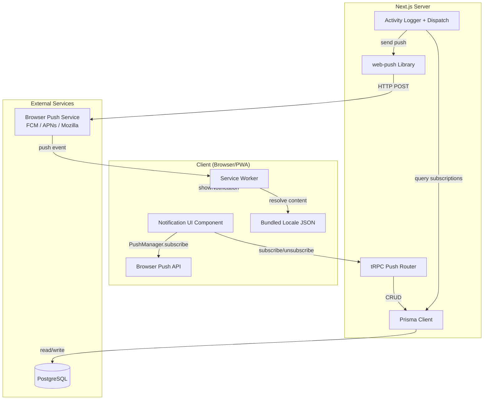
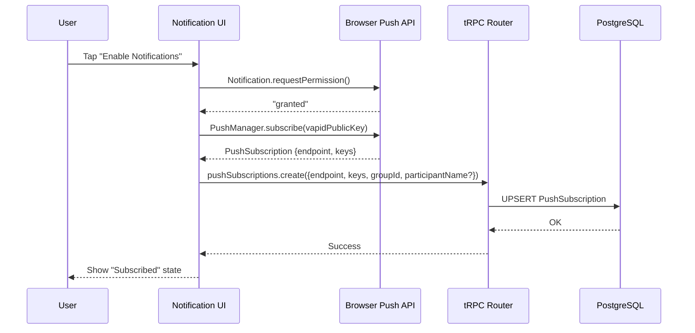
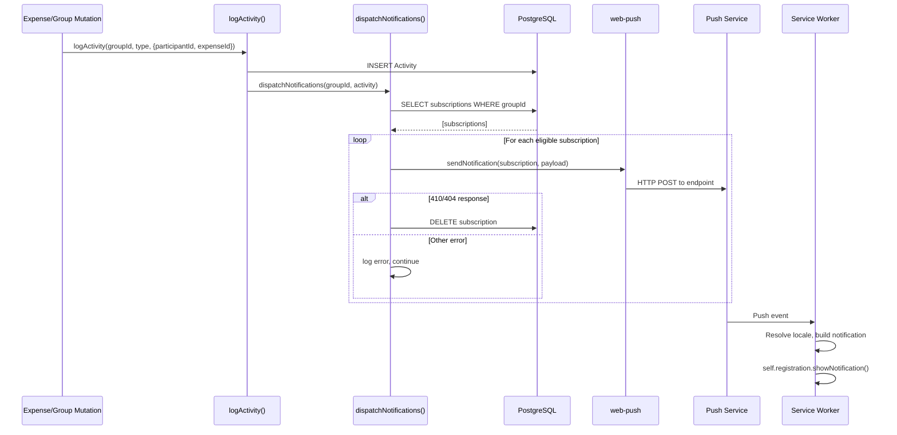

# Design Document: Group Push Notifications

## Overview

This design adds opt-in push notifications to Knots, enabling users to receive real-time alerts when changes occur in groups they subscribe to. Since Knots operates without authentication (anonymous access via URL), push subscriptions are tied to the device/browser endpoint rather than user accounts.

The system uses the Web Push API (RFC 8030) with VAPID authentication (RFC 8292) to deliver notifications through browser push services. A service worker handles push event reception and notification display, including locale-aware content resolution from bundled translation data.

Key design decisions:

- **Device-centric subscriptions**: The push endpoint URL uniquely identifies a device. Subscriptions are scoped to (endpoint, groupId) pairs.
- **Self-notification filtering**: Users can optionally associate a participant name to avoid receiving notifications for their own actions.
- **Localized at the edge**: Notification content is resolved on the device using bundled locale data, avoiding server-side locale tracking.
- **Fire-and-forget dispatch**: Notifications are sent synchronously during activity logging with no retry mechanism, keeping the system simple.
- **Feature-gated by VAPID keys**: The entire feature is disabled when VAPID environment variables are absent, allowing zero-config deployments to remain unaffected.

## Architecture



### Data Flow: Subscribe



### Data Flow: Notification Dispatch



## Components and Interfaces

### 1. Service Worker (`public/sw.js`)

A static JavaScript file registered at the root scope. Handles push events and notification clicks.

```typescript
// Push event handler interface
interface PushPayload {
  localeKey: string // e.g., "notifications.expenseCreated"
  params: Record<string, string> // e.g., { title: "Dinner", actor: "Alice" }
  url?: string // Deep link URL, e.g., "/groups/abc123/expenses"
}

// Notification click opens/focuses the target URL
// Falls back to /groups if no URL in payload
```

### 2. Service Worker Registration (`src/lib/push/register-sw.ts`)

Client-side module that registers the service worker and checks Push API support.

```typescript
export async function registerServiceWorker(): Promise<ServiceWorkerRegistration | null>
export function isPushSupported(): boolean
```

### 3. Push Subscription Hook (`src/lib/push/use-push-subscription.ts`)

React hook encapsulating subscription state and operations for a specific group.

```typescript
interface UsePushSubscriptionOptions {
  groupId: string
  participants: Array<{ id: string; name: string }>
}

interface UsePushSubscriptionReturn {
  isSupported: boolean // Push API available and VAPID key present
  isSubscribed: boolean // Currently subscribed to this group
  isLoading: boolean // Operation in progress
  participantName: string | null // Associated participant
  subscribe: (participantName?: string) => Promise<void>
  unsubscribe: () => Promise<void>
  updateParticipant: (participantName: string | null) => Promise<void>
}

export function usePushSubscription(
  options: UsePushSubscriptionOptions,
): UsePushSubscriptionReturn
```

### 4. Notification UI Component (`src/components/push-notification-toggle.tsx`)

A shadcn/UI-based component rendered on the group page, providing the subscribe/unsubscribe control and participant selector.

```typescript
interface PushNotificationToggleProps {
  groupId: string
  participants: Array<{ id: string; name: string }>
}
```

### 5. tRPC Push Subscriptions Router (`src/trpc/routers/push-subscriptions/index.ts`)

Server-side router exposing CRUD operations for push subscriptions.

```typescript
// Procedures:
// - pushSubscriptions.create: Upsert a subscription
// - pushSubscriptions.delete: Remove a subscription
// - pushSubscriptions.list: List subscriptions for an endpoint
```

### 6. Notification Dispatch Service (`src/lib/push/dispatch-notifications.ts`)

Server-side module that sends push notifications to all eligible subscriptions for a group.

```typescript
export async function dispatchNotifications(
  groupId: string,
  activityType: ActivityType,
  extra: { participantId?: string; expenseId?: string; data?: string },
): Promise<void>
```

### 7. Push Payload Builder (`src/lib/push/build-payload.ts`)

Pure function that constructs the push notification payload from activity data.

```typescript
interface PushNotificationPayload {
  localeKey: string
  params: Record<string, string>
  url: string
}

export function buildPushPayload(
  activityType: ActivityType,
  groupId: string,
  groupName: string,
  expenseTitle?: string,
): PushNotificationPayload
```

### 8. Locale Resolver (Service Worker) (`public/sw-locale-resolver.js`)

Bundled within the service worker, resolves localization keys to translated strings.

```typescript
// Embedded in sw.js
function resolveLocale(navigatorLanguage: string): string
function resolveNotificationContent(
  localeKey: string,
  params: Record<string, string>,
  locale: string,
): { title: string; body: string }
```

## Data Models

### New Prisma Model: PushSubscription

```prisma
model PushSubscription {
  id              String   @id @default(cuid())
  endpoint        String   @db.VarChar(2048)
  p256dh          String   @db.VarChar(256)
  auth            String   @db.VarChar(256)
  groupId         String
  group           Group    @relation(fields: [groupId], references: [id], onDelete: Cascade)
  participantName String?  @db.VarChar(200)
  createdAt       DateTime @default(now())
  updatedAt       DateTime @updatedAt

  @@unique([endpoint, groupId])
  @@index([groupId])
  @@index([endpoint])
}
```

### Updated Group Model

```prisma
model Group {
  // ... existing fields
  pushSubscriptions PushSubscription[]
}
```

### Environment Variables (additions to `src/lib/env.ts`)

```typescript
// New env vars added to the Zod schema:
NEXT_PUBLIC_VAPID_PUBLIC_KEY: z.string().regex(/^[A-Za-z0-9_-]+$/).optional(),
VAPID_PRIVATE_KEY: z.string().regex(/^[A-Za-z0-9_-]+$/).optional(),
```

Both are optional — when absent, the feature is disabled. When one is present, both must be present (enforced via superRefine).

### Push Notification Payload Schema

```typescript
// Sent to push service
const pushPayloadSchema = z.object({
  localeKey: z.string(),
  params: z.record(z.string()),
  url: z.string().optional(),
})

// Locale keys used:
// - "notifications.expenseCreated" → "{actor} added '{title}'"
// - "notifications.expenseUpdated" → "{actor} updated '{title}'"
// - "notifications.expenseDeleted" → "{actor} deleted '{title}'"
// - "notifications.groupUpdated"   → "{actor} updated the group '{group}'"
```

### Translation Keys (added to all 19 locale files)

```json
{
  "Notifications": {
    "subscribe": "Enable notifications",
    "unsubscribe": "Disable notifications",
    "selectParticipant": "Notify me about changes by others",
    "noParticipant": "All changes",
    "permissionDenied": "Notification permission was denied. Enable it in your browser settings.",
    "notSupported": "Push notifications are not supported on this device.",
    "error": "Could not enable notifications. Please try again.",
    "expenseCreated": "{actor} added \"{title}\"",
    "expenseUpdated": "{actor} updated \"{title}\"",
    "expenseDeleted": "{actor} deleted \"{title}\"",
    "groupUpdated": "{actor} updated the group \"{group}\"",
    "notificationTitle": "Knots – {group}",
    "defaultBody": "New activity in your group"
  }
}
```

## Correctness Properties

_A property is a characteristic or behavior that should hold true across all valid executions of a system — essentially, a formal statement about what the system should do. Properties serve as the bridge between human-readable specifications and machine-verifiable correctness guarantees._

### Property 1: Push event handler displays correct notification content

_For any_ valid push payload containing a `localeKey` and `params`, the service worker push event handler SHALL resolve the notification title and body using the device locale's translation strings and the provided parameters, displaying the resolved content via `showNotification`.

**Validates: Requirements 1.3, 1.4**

### Property 2: VAPID key validation accepts only valid base64url strings

_For any_ string value provided as a VAPID key environment variable, the Zod validation SHALL accept it if and only if it is a non-empty string composed exclusively of base64url characters (`[A-Za-z0-9_-]+`).

**Validates: Requirements 2.1**

### Property 3: Subscription creation persists with correct group reference

_For any_ valid subscription data (endpoint, keys, groupId where group exists), creating the subscription SHALL result in a persisted record where the stored groupId matches the input groupId.

**Validates: Requirements 3.2**

### Property 4: Non-existent group rejection

_For any_ groupId that does not exist in the database, attempting to create a subscription SHALL result in a rejection error without persisting any record.

**Validates: Requirements 3.3**

### Property 5: Subscription upsert idempotence

_For any_ subscription data, creating a subscription with the same (endpoint, groupId) pair multiple times SHALL result in exactly one database record, with the keys and participantName reflecting the most recent call.

**Validates: Requirements 3.4, 8.2**

### Property 6: Unique constraint allows multi-group and multi-device subscriptions

_For any_ endpoint subscribed to N distinct groups, all N subscription records SHALL coexist. Conversely, for any group with M distinct endpoint subscriptions, all M records SHALL coexist.

**Validates: Requirements 3.5, 3.6**

### Property 7: Participant-based notification filtering

_For any_ subscription and activity pair, the notification SHALL be sent if and only if the subscription has no associated participantName OR the subscription's associated participant ID differs from the activity's participantId.

**Validates: Requirements 5.2, 5.3**

### Property 8: Notification dispatch reaches all eligible subscriptions

_For any_ group with N active subscriptions and an activity logged with participantId P, the number of push messages sent SHALL equal the count of subscriptions whose associated participant ID is either null or different from P.

**Validates: Requirements 6.1**

### Property 9: Notification payload construction by activity type

_For any_ activity of type CREATE_EXPENSE, UPDATE_EXPENSE, or DELETE_EXPENSE, the push payload SHALL contain a localeKey corresponding to the activity type and params including the expense title. For any activity of type UPDATE_GROUP, the payload SHALL contain a localeKey for group update and params including the group name.

**Validates: Requirements 6.2, 6.3**

### Property 10: Subscription cleanup on HTTP 410/404 only

_For any_ push delivery attempt, the subscription SHALL be deleted from the database if and only if the push service responds with HTTP 410 or 404. For all other error responses (network errors, 5xx, 4xx other than 404), the subscription SHALL remain in the database.

**Validates: Requirements 6.4, 6.5**

### Property 11: tRPC input validation rejects invalid subscription data

_For any_ input to the create subscription procedure, the request SHALL be rejected if the endpoint exceeds 2048 characters, is not a valid URL, keys.p256dh or keys.auth are empty, or groupId is empty. Valid inputs SHALL be accepted.

**Validates: Requirements 8.1**

### Property 12: Idempotent delete

_For any_ (endpoint, groupId) pair that does not match an existing subscription, calling the delete procedure SHALL complete successfully without error and without modifying any database records.

**Validates: Requirements 8.4**

### Property 13: List subscriptions returns correct set for endpoint

_For any_ endpoint with subscriptions to groups G1, G2, ..., Gn, the list query SHALL return exactly those n records with their corresponding groupId and participantName values.

**Validates: Requirements 8.5**

### Property 14: Payload contains localization keys, not pre-rendered text

_For any_ activity that triggers notification dispatch, the push payload SHALL contain a `localeKey` string and a `params` object, and SHALL NOT contain pre-rendered `title` or `body` text fields.

**Validates: Requirements 9.1**

### Property 15: Locale resolution with fallback chain

_For any_ device locale and localization key, the service worker SHALL resolve content using: (1) the matched locale's translation if available, (2) en-US translation if the key is missing in the target locale or the locale is unsupported, (3) the raw localization key if the key is missing in both the target locale and en-US.

**Validates: Requirements 9.2, 9.3, 9.4, 9.5**

## Error Handling

| Scenario                                   | Handling Strategy                                                                                                                  |
| ------------------------------------------ | ---------------------------------------------------------------------------------------------------------------------------------- |
| Browser doesn't support Push API           | Hide all notification UI controls. No error shown.                                                                                 |
| VAPID keys not configured                  | Feature disabled entirely. No UI controls rendered.                                                                                |
| VAPID keys invalid format                  | Application startup fails with descriptive Zod error.                                                                              |
| User denies notification permission        | Show informational message. Revert toggle to off.                                                                                  |
| Push subscription creation fails (browser) | Show toast error. Revert toggle to off.                                                                                            |
| Server subscription save fails             | Show toast error. Unsubscribe from browser Push API. Revert toggle.                                                                |
| Push delivery returns 410/404              | Delete stale subscription silently.                                                                                                |
| Push delivery returns 5xx/network error    | Log error server-side. No retry. No user-facing impact.                                                                            |
| Group deleted (cascade)                    | All PushSubscription records for that group are deleted via `onDelete: Cascade`.                                                   |
| Participant deleted from group             | Subscription remains but participantName no longer matches any participant — treated as "no participant" (all notifications sent). |
| Service worker registration fails          | Log warning. Hide notification UI controls.                                                                                        |
| Locale key missing in target locale        | Fall back to en-US.                                                                                                                |
| Locale key missing in en-US                | Display raw locale key as notification text.                                                                                       |

## Testing Strategy

### Property-Based Tests (fast-check)

The project uses Jest as its test runner. Property-based tests will use **fast-check** (a JavaScript/TypeScript PBT library) with a minimum of 100 iterations per property.

Properties to implement as PBT:

- Property 1: Push event handler notification content resolution
- Property 2: VAPID key validation
- Property 5: Subscription upsert idempotence
- Property 7: Participant-based notification filtering
- Property 9: Notification payload construction
- Property 10: Subscription cleanup logic
- Property 11: tRPC input validation
- Property 14: Payload structure (localization keys only)
- Property 15: Locale resolution fallback chain

Each property test will be tagged with:

```
// Feature: group-push-notifications, Property {N}: {property_text}
```

### Unit Tests (Jest)

Example-based tests for:

- Feature detection (Push API support check)
- UI state transitions (subscribe/unsubscribe flow)
- Permission denial handling
- Notification click handler (URL navigation)
- Manifest validation (id field, display: standalone)

### Integration Tests

- tRPC procedure end-to-end with test database (create, update, delete, list)
- Activity logging triggers notification dispatch
- Cascade deletion when group is deleted

### Manual Testing

- iOS 16.4+ standalone PWA push notification flow
- Cross-browser testing (Chrome, Firefox, Safari, Edge)
- Notification appearance and deep-link navigation

### Test Configuration

```typescript
// fast-check configuration for property tests
import fc from 'fast-check'

// Minimum 100 iterations per property
const PBT_NUM_RUNS = 100

// Example test structure:
describe('Push Notification Properties', () => {
  it('Property 5: Subscription upsert idempotence', () => {
    fc.assert(
      fc.property(
        fc.record({
          /* generators */
        }),
        async (input) => {
          /* property assertion */
        },
      ),
      { numRuns: PBT_NUM_RUNS },
    )
  })
})
```

### Dependencies to Add

- `web-push`: Server-side Web Push protocol implementation (VAPID signing, payload encryption)
- `fast-check`: Property-based testing library (dev dependency)
