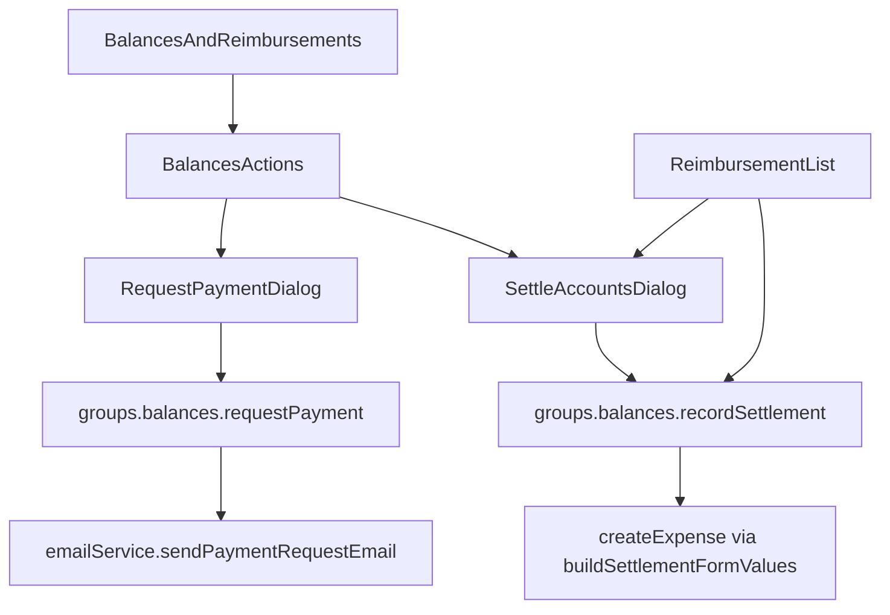

# Design Document: Group Settlements

## Overview

Add Splitwise-style **Request** and **Settle up** flows on the group Balances tab. Backend pieces are **partially implemented** on the working tree (not yet committed); this spec covers completing UI, i18n, and UX fixes.

### Reference UX (Splitwise)

- Header summary: "Ana owes you €740.92"
- Buttons: **Solicitar** | **Liquidar contas**
- Expense list shows per-line lent/borrowed (future enhancement — optional in this spec)

### Key Design Decisions

1. **Keep `isReimbursement` in DB** — settlements remain expenses internally; UI abstracts them as "liquidações".
2. **Server-side settlement recording** — `recordSettlement` wraps `createExpense(buildSettlementFormValues(...))` so users don't visit the expense form.
3. **Validate against live suggestions** — both mutations verify `(from, to, amount)` matches `getSuggestedReimbursements()` to prevent spam/incorrect emails.
4. **Session user identity** — use `trpc.profile.getProfile` / `ctx.user.id` for request/settle permissions (not `activeUser` localStorage).
5. **shadcn MCP first** — use `pnpm dlx shadcn@latest docs dialog`, `select`, `textarea`, `field` before writing custom markup.

## Architecture



## Already Implemented (working tree — verify & commit with feature)

| File                                                              | Status                           |
| ----------------------------------------------------------------- | -------------------------------- |
| `src/lib/settlements.ts`                                          | Done — helpers                   |
| `src/lib/settlements.test.ts`                                     | Done — unit tests                |
| `src/lib/auth/email-service.ts`                                   | Done — `sendPaymentRequestEmail` |
| `src/trpc/routers/groups/balances/request-payment.procedure.ts`   | Done                             |
| `src/trpc/routers/groups/balances/record-settlement.procedure.ts` | Done                             |
| `src/trpc/routers/groups/balances/index.ts`                       | Done — wires procedures          |

## To Implement

### UI Components

**File:** `src/app/groups/[groupId]/balances/balances-actions.tsx`

- Props: `groupId`, `reimbursements`, `participants`, `currency`, `currentUserId`
- Compute:
  - `owedToMe = reimbursements.filter(r => r.to === currentUserId)`
  - `iOwe = reimbursements.filter(r => r.from === currentUserId)`
- Render summary + two buttons (disabled when respective list empty)
- Use shadcn `Button` with icons (`HandCoins` or `Mail` for request, `Banknote` for settle)

**File:** `src/app/groups/[groupId]/balances/request-payment-dialog.tsx`

- Controlled `Dialog` with `open` / `onOpenChange`
- `Select` or `RadioGroup` of debtors from `owedToMe` (show name + amount)
- Optional `Textarea` for message
- `trpc.groups.balances.requestPayment.useMutation`
- `toast.success` / `toast.error` from `sonner`

**File:** `src/app/groups/[groupId]/balances/settle-accounts-dialog.tsx`

- Controlled `Dialog`
- Pick creditor from `iOwe` list
- Confirm copy: `t('confirmSettle', { amount, name })`
- `trpc.groups.balances.recordSettlement.useMutation`
- On success: `utils.groups.balances.invalidate()`, `utils.groups.expenses.invalidate()`

**Update:** `src/app/groups/[groupId]/balances/balances-and-reimbursements.tsx`

- Import `BalancesActions` above the cards
- Pass `profile?.id` from `trpc.profile.getProfile.useQuery()`

**Update:** `src/app/groups/[groupId]/reimbursement-list.tsx`

- Add **Liquidar** button calling `recordSettlement` (or open `SettleAccountsDialog` pre-selected)
- Keep or remove "Mark as paid" link — prefer replacing with Liquidar

### Expense Form Fix

**File:** `src/app/groups/[groupId]/expenses/expense-form.tsx` (~line 238)

Change reimbursement URL prefill:

```typescript
paidFor: searchParams.get('to')
  ? [{
      participant: searchParams.get('to')!,
      shares: amountAsDecimal(Number(searchParams.get('amount')) || 0, groupCurrency),
    }]
  : [],
isReimbursement: true,
splitMode: 'BY_AMOUNT',
```

Remove `isReimbursement` checkbox block (~lines 817–837) from the form UI.

### Settlement Title i18n

`buildSettlementFormValues` currently uses hardcoded `'Settlement'`. Pass localized title from procedure OR use a fixed i18n key on display only. For activity log, use `messages` key `Balances.settlementTitle` — procedure can accept optional `title` or use English "Settlement" until server-side i18n exists (acceptable for v1).

### tRPC Types

After adding procedures, AppRouter types update automatically. Client usage:

```typescript
trpc.groups.balances.requestPayment.useMutation()
trpc.groups.balances.recordSettlement.useMutation()
```

## shadcn MCP Instructions (MANDATORY)

1. Read project skill: `~/.claude/skills/shadcn/SKILL.md` (or Cursor shadcn skill).
2. Run `pnpm dlx shadcn@latest info --json` to confirm installed components.
3. For each UI piece, run `pnpm dlx shadcn@latest docs dialog` (and `select`, `textarea`, `field`, `button`) for correct API (`render` prop vs `asChild` — this project uses **base-vega** style per `components.json`).
4. Do NOT add new shadcn components unless missing from `src/components/ui/`.
5. Use `flex flex-col gap-*` for layout; `cn()` for conditional classes.

## i18n

See `i18n-translations.md` in this folder. Keys live under:

```json
"Balances": {
  "Actions": { ... },
  "Reimbursements": {
    "settle": "Settle up",  // rename markAsPaid
    ...
  }
}
```

Add keys to **all 19 files**: `en-US`, `pt-PT`, `pt-BR`, `es`, `ca`, `de-DE`, `fr-FR`, `it-IT`, `nl-NL`, `pl-PL`, `cs-CZ`, `ro`, `ru-RU`, `ua-UA`, `tr-TR`, `fi`, `ja-JP`, `zh-CN`, `zh-TW`.

## Testing

```bash
pnpm test src/lib/settlements.test.ts
pnpm check-types
```

Manual test:

1. Two users, one expense split 50/50.
2. Creditor clicks Solicitar → email received (or Resend dev).
3. Debtor clicks Liquidar → balances zero.
4. Verify settlement expense has only creditor in `paidFor`.
