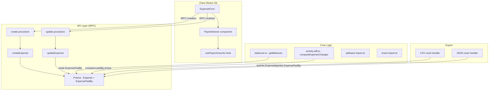
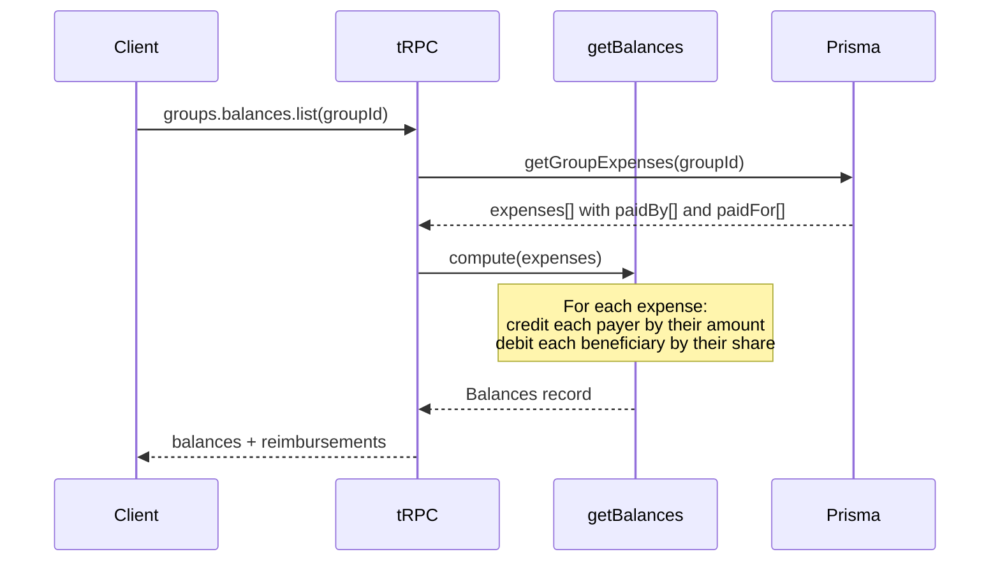

# Design Document: Multi-Payer Expenses

## Overview

This design introduces support for expenses funded by multiple payers. Currently, every expense has a single `paidById` foreign key pointing to one user. This feature replaces that with a join table (`ExpensePaidBy`) that records one or more payers per expense, each with their contributed amount in minor currency units.

The change touches the full vertical: database schema, balance computation, expense form UI, tRPC procedures, activity log diffing, import/export, and data migration. The design prioritizes backward compatibility — a single-payer expense is simply a multi-payer expense with one entry.

### Key Design Decisions

1. **New join table over array column** — A normalized `ExpensePaidBy` table (composite PK `expenseId + userId`) mirrors the existing `ExpensePaidFor` pattern, enabling referential integrity and efficient queries.
2. **Retain `paidById` during transition** — The column is kept (deprecated) until all downstream consumers are migrated, enabling zero-downtime rollback.
3. **Sum invariant enforced at API layer** — The sum of `ExpensePaidBy.amount` values must equal `Expense.amount`. This is validated in the tRPC procedure (not a DB constraint) to allow atomic creation.
4. **Schema is always-array** — `expenseFormSchema.paidBy` is `Array<{participant, amount}>` (no union string|array). Reimbursements send a single-element array. This simplifies both client and server code.
5. **Balance computation is additive** — Each payer's credit is summed independently; the `paidFor` (debit) side is unchanged.
6. **Group expenses only (MVP)** — Multi-payer is only available for group expenses. Direct (friend) expenses remain single-payer in the MVP.
7. **Payer amounts in group currency** — `ExpensePaidBy.amount` is always in group currency (minor units). When combined with currency conversion, conversion happens first (producing the group-currency total), then that total is distributed among payers.
8. **Relation name: `payers`** — The Prisma relation on Expense is named `payers` (not `paidByMulti`) for readability. The table remains `ExpensePaidBy`.
9. **"Split evenly" button** — When the expense total changes and payer amounts no longer match, a "Split evenly" button redistributes equally rather than auto-redistributing silently.

---

## Architecture



### Data Flow for Balance Computation



---

## Components and Interfaces

### 1. PayerSelector Component

A new React component replacing the single "Paid by" `<Select>` dropdown.

```typescript
// src/components/payer-selector.tsx

interface PayerEntry {
  participantId: string
  amount: number | string // supports math expressions
}

interface PayerSelectorProps {
  participants: Array<{ id: string; name: string }>
  value: PayerEntry[]
  onChange: (payers: PayerEntry[]) => void
  expenseTotal: number
  currency: Currency
  locale: Locale
  disabled?: boolean
  isReimbursement?: boolean
}
```

**Behavior:**

- Renders one row per payer with a participant dropdown + amount input.
- "Add payer" button appends a row (disabled when all participants used or `isReimbursement`).
- Remove button on each row (disabled when only one payer remains).
- Running total displayed with mismatch indicator (red when ≠ expense total).
- Single-payer mode auto-fills amount to match expense total.
- Supports arithmetic expressions in amount inputs via existing `CurrencyAmountInput`.

### 2. Updated Form Schema

```typescript
// Addition to src/lib/schemas.ts

const paidByEntrySchema = z.object({
  participant: z.string().min(1),
  amount: z
    .union([z.number(), z.string().transform(expressionToNumber)])
    .refine((a) => a > 0, 'paidByAmountPositive'),
})

// expenseFormSchema changes:
// paidBy: z.string() → paidBy: z.array(paidByEntrySchema).min(1)
// Always an array — no union with string. Reimbursements send [{participant, amount}].
```

### 3. Updated tRPC Procedures

**create.procedure.ts** and **update.procedure.ts** changes:

- Accept `paidBy` as `Array<{participant, amount}>`.
- Validate: all participant IDs are group members.
- Validate: sum of amounts equals expense total.
- Create/update `ExpensePaidBy` rows in the same transaction.
- Continue writing the deprecated `paidById` column (set to first payer's ID).

### 4. Balance Calculator Interface

```typescript
// Updated getBalances signature (input type change)
// expenses[].paidBy changes from { id: string; name: string }
// to Array<{ user: { id: string; name: string }; amount: number }>
```

### 5. Activity Diff Interface

```typescript
// New field tracked in computeExpenseChanges:
// field: 'paidBy'
// oldValue: JSON.stringify([{userId, amount}, ...])
// newValue: JSON.stringify([{userId, amount}, ...])
```

---

## Data Models

### New Model: ExpensePaidBy

```prisma
model ExpensePaidBy {
  expense   Expense @relation("ExpensesPaidByMulti", fields: [expenseId], references: [id], onDelete: Cascade)
  user      User    @relation("UserExpensesPaidBy", fields: [userId], references: [id], onDelete: Cascade)
  expenseId String
  userId    String
  amount    Int     // minor currency units

  @@id([expenseId, userId])
}
```

### Schema Changes to Expense Model

```prisma
model Expense {
  // ... existing fields ...

  // DEPRECATED — kept for rollback; set to first payer's ID
  paidBy           User              @relation("ExpensesPaidBy", fields: [paidById], references: [id])
  paidById         String

  // NEW — one or more payers with amounts
  payers           ExpensePaidBy[]   @relation("ExpensesPaidByMulti")

  // ... rest unchanged ...
}
```

### Schema Changes to User Model

```prisma
model User {
  // ... existing fields ...
  expensesPaidBy    Expense[]         @relation("ExpensesPaidBy") // legacy
  paidByExpenses    ExpensePaidBy[]   @relation("UserExpensesPaidBy") // new
  // ...
}
```

### Migration Strategy

1. **Step 1: Add `ExpensePaidBy` table** — Standard Prisma migration adding the new table with composite PK.
2. **Step 2: Data migration script** — For each existing expense, insert one `ExpensePaidBy` row with `userId = paidById` and `amount = expense.amount`. This is idempotent (upsert on composite key).
3. **Step 3: Application code deploys** — Code reads from `ExpensePaidBy`; writes to both `ExpensePaidBy` and `paidById`.
4. **Step 4 (future): Drop `paidById`** — After confirming stability, a follow-up migration removes the deprecated column.

```sql
-- Idempotent data migration (Step 2)
INSERT INTO "ExpensePaidBy" ("expenseId", "userId", "amount")
SELECT e."id", e."paidById", e."amount"
FROM "Expense" e
WHERE NOT EXISTS (
  SELECT 1 FROM "ExpensePaidBy" epb WHERE epb."expenseId" = e."id"
)
ON CONFLICT ("expenseId", "userId") DO NOTHING;
```

### Query Changes

The `getGroupExpenses` select and `getExpense` include must add:

```typescript
payers: {
  select: { userId: true, amount: true, user: { select: { id: true, name: true } } }
}
```

---

## Correctness Properties

_A property is a characteristic or behavior that should hold true across all valid executions of a system — essentially, a formal statement about what the system should do. Properties serve as the bridge between human-readable specifications and machine-verifiable correctness guarantees._

### Property 1: Payer Amount Sum Invariant

_For any_ valid expense with one or more payers, the sum of all `ExpensePaidBy.amount` values SHALL equal the `Expense.amount` (the expense total). Any expense submission where the sum diverges from the total SHALL be rejected with a validation error indicating the exact difference.

**Validates: Requirements 1.4, 3.3, 2.7, 11.2, 11.3**

### Property 2: Per-Payer Credit Accumulation

_For any_ expense with N payers, the balance calculator SHALL credit each payer's `paid` total by exactly their `ExpensePaidBy.amount`. The sum of all payer credits across the group SHALL equal the sum of expense totals.

**Validates: Requirements 3.1, 1.3**

### Property 3: PaidFor Independence from Payer Distribution

_For any_ expense, the `paidFor` (debit) amounts computed for each beneficiary SHALL be identical regardless of how the expense total is distributed among payers. Only the `paidBy` credit side is affected by the payer distribution.

**Validates: Requirements 3.2**

### Property 4: Single-Payer Backward Compatibility

_For any_ expense with exactly one payer whose amount equals the expense total, the balance calculator SHALL produce identical `paid`, `paidFor`, and `total` values to the current single-payer computation.

**Validates: Requirements 3.4**

### Property 5: Activity Diff Payer Change Detection

_For any_ two payer states (old and new), the activity diff SHALL record a `paidBy` field change if and only if the sets of (userId, amount) pairs differ. The serialized values SHALL be parseable JSON arrays of `{userId, amount}` objects that round-trip back to the original payer states.

**Validates: Requirements 5.1, 5.2, 5.4**

### Property 6: Migration Correctness and Idempotence

_For any_ set of existing expenses, the data migration SHALL create exactly one `ExpensePaidBy` row per expense (with `userId = paidById` and `amount = expense.amount`), and running the migration N times SHALL produce the same database state as running it once (no duplicate rows).

**Validates: Requirements 6.1, 6.3**

### Property 7: Migration Balance Preservation

_For any_ group, the net balance (paid − paidFor) for every participant SHALL be identical before and after the data migration.

**Validates: Requirements 6.4**

### Property 8: Splitwise Multi-Payer Import

_For any_ Splitwise CSV row with K positive user-column values (K ≥ 1), the importer SHALL produce exactly K payer entries whose amounts equal the corresponding positive column values (converted to minor units) and whose sum equals the row's cost exactly (with rounding remainder assigned to the last payer).

**Validates: Requirements 7.1, 7.3, 7.4**

### Property 9: Knots JSON Multi-Payer Import

_For any_ Knots JSON export expense containing a `paidBy` array with M entries, the importer SHALL create exactly M `ExpensePaidBy` rows with matching userIds and amounts.

**Validates: Requirements 8.1**

### Property 10: Payer UserId Validation

_For any_ expense creation or update request, if any payer's `userId` is not a member of the target group, the system SHALL reject the request with a BAD_REQUEST error. This applies uniformly to form submission, Knots import, and Splitwise import.

**Validates: Requirements 1.6, 8.3, 11.4, 11.5**

### Property 11: CSV Export Per-Participant Values

_For any_ expense with multiple payers, the CSV export SHALL output per-participant column values where each payer's column equals their credit (positive) minus their beneficiary debit (if any), and each non-payer beneficiary's column equals their negative debit. The sum of all participant columns SHALL equal zero.

**Validates: Requirements 9.1, 9.2**

### Property 12: CSV Export Single-Payer Backward Compatibility

_For any_ single-payer expense, the CSV export produced by the multi-payer code SHALL be byte-identical to the output of the current single-payer export logic.

**Validates: Requirements 9.3**

### Property 13: JSON Export PaidBy Array Presence

_For any_ exported expense (regardless of payer count), the JSON export SHALL include a `paidBy` array containing objects with `userId` and `amount` fields, with one entry per payer.

**Validates: Requirements 10.1, 10.2**

### Property 14: JSON Export Legacy PaidById Field

_For any_ exported expense, the `paidById` field in the JSON export SHALL equal the `userId` of the first entry in the `paidBy` array.

**Validates: Requirements 10.3**

### Property 15: Per-Payer Amount Positivity Validation

_For any_ per-payer amount that is zero or negative, the system SHALL reject the expense submission with an inline validation error on that specific payer's input.

**Validates: Requirements 11.1**

### Property 16: Recurring Expense PaidBy Propagation

_For any_ recurring expense with N payers, each materialized instance SHALL contain exactly N `ExpensePaidBy` rows with the same userIds and amounts as the source expense at the time of materialization.

**Validates: Requirements 12.1, 12.2**

### Property 17: No Duplicate Payer Participants

_For any_ expense, no two `ExpensePaidBy` rows SHALL reference the same `userId`. The form and API SHALL reject submissions containing duplicate payer participants.

**Validates: Requirements 2.5**

---

## Error Handling

### Client-Side Validation Errors

| Condition                            | Error Display                                  | Behavior           |
| ------------------------------------ | ---------------------------------------------- | ------------------ |
| Payer amount ≤ 0                     | Inline error on that payer's amount input      | Prevent submission |
| Sum of payer amounts > expense total | Banner: "Overpayment by {diff}"                | Prevent submission |
| Sum of payer amounts < expense total | Banner: "Underpayment by {diff}"               | Prevent submission |
| Duplicate participant selected       | Participant excluded from dropdown             | Prevented by UI    |
| Second payer added to reimbursement  | Toast: "Reimbursements support only one payer" | Button disabled    |

### Server-Side Validation Errors

| Condition                             | tRPC Error Code | Message                                        |
| ------------------------------------- | --------------- | ---------------------------------------------- |
| Payer userId not a group member       | `BAD_REQUEST`   | `"User {userId} is not a group member"`        |
| Sum of payer amounts ≠ expense amount | `BAD_REQUEST`   | `"Payer amounts must sum to expense total"`    |
| Empty paidBy array                    | `BAD_REQUEST`   | `"At least one payer is required"`             |
| Reimbursement with >1 payer           | `BAD_REQUEST`   | `"Reimbursements support only a single payer"` |
| Duplicate userId in paidBy            | `BAD_REQUEST`   | `"Duplicate payer: {userId}"`                  |

### Import Error Handling

| Condition                                        | Behavior                                     |
| ------------------------------------------------ | -------------------------------------------- |
| Splitwise CSV: rounding mismatch                 | Auto-adjust last payer's amount silently     |
| Knots JSON: paidBy entry references unknown user | Reject entire expense with descriptive error |
| Knots JSON: legacy format (no paidBy array)      | Fall back to single-payer creation           |
| Migration: duplicate row attempt                 | `ON CONFLICT DO NOTHING` (idempotent)        |

### Graceful Degradation

- If `ExpensePaidBy` rows are somehow missing for an expense (data corruption), the balance calculator falls back to reading the deprecated `paidById` column and treats it as a single-payer expense with the full amount.
- The JSON exporter includes a `paidById` legacy field so older Knots importers continue working without modification.

---

## Testing Strategy

### Property-Based Testing (fast-check)

This feature is highly suitable for PBT because:

- Balance computation is a pure function with clear input/output behavior.
- The sum invariant and independence properties are universal across all valid inputs.
- The input space is large (varying numbers of payers, amounts, split modes, participant counts).

**Library:** `fast-check` (already available or easily addable to the TypeScript/Jest ecosystem)
**Minimum iterations:** 100 per property test
**Tag format:** `Feature: multi-payer-expenses, Property {N}: {title}`

Each correctness property above maps to one property-based test. The generators produce:

- Random participant lists (2–10 members)
- Random payer subsets (1–all participants) with random positive integer amounts summing to a random total
- Random split modes with valid share distributions
- Random expense dates, titles, categories

### Unit Tests (Example-Based)

- Form initialization defaults (Requirement 2.1)
- Add/remove payer UI interactions (Requirements 2.2, 2.3)
- Reimbursement payer restriction (Requirements 4.1, 4.2)
- Activity diff creation change (Requirement 5.3)
- Migration handles null groupId (Requirement 6.5)
- Splitwise single-payer import (Requirement 7.2)
- Knots legacy format import (Requirement 8.2)
- JSON export single-payer has array (Requirement 10.2)
- Recurring expense source edit isolation (Requirement 12.3)

### Integration Tests

- End-to-end create expense via tRPC with multi-payer data → verify DB state
- End-to-end update expense changing payers → verify activity log and DB
- CSV export → re-import round trip for multi-payer data
- JSON export → Knots import round trip

### Test File Locations

- `src/lib/__tests__/balances-multi-payer.property.test.ts` — Properties 1–4
- `src/lib/__tests__/activity-diff-multi-payer.property.test.ts` — Property 5
- `src/lib/__tests__/migration-multi-payer.property.test.ts` — Properties 6, 7
- `src/lib/__tests__/splitwise-import-multi-payer.property.test.ts` — Property 8
- `src/lib/__tests__/knots-import-multi-payer.property.test.ts` — Properties 9, 10
- `src/lib/__tests__/export-multi-payer.property.test.ts` — Properties 11–14
- `src/lib/__tests__/validation-multi-payer.property.test.ts` — Properties 15, 17
- `src/lib/__tests__/recurring-multi-payer.property.test.ts` — Property 16

---

## File Change Summary

| File                                                     | Change Type | Description                                                                                         |
| -------------------------------------------------------- | ----------- | --------------------------------------------------------------------------------------------------- |
| `prisma/schema.prisma`                                   | Modify      | Add `ExpensePaidBy` model, add `payers` relation to `Expense`, add `paidByExpenses` to `User`       |
| `prisma/migrations/XXXXXX_add_expense_paid_by/`          | Add         | Migration SQL for new table                                                                         |
| `prisma/migrations/XXXXXX_backfill_expense_paid_by/`     | Add         | Idempotent data backfill script                                                                     |
| `src/lib/schemas.ts`                                     | Modify      | Add `paidByEntrySchema`, update `expenseFormSchema` to use `z.array(paidByEntrySchema).min(1)`      |
| `src/lib/balances.ts`                                    | Modify      | `getBalances` iterates `payers` array instead of single `paidBy`                                    |
| `src/lib/activity-diff.ts`                               | Modify      | `computeExpenseChanges` tracks `paidBy` array field (old/new serialization)                         |
| `src/lib/api.ts`                                         | Modify      | `createExpense` and `updateExpense` write `ExpensePaidBy` rows; `getGroupExpenses` selects `payers` |
| `src/lib/splitwise-import.ts`                            | Modify      | `parseExpenseRow` detects multi-payer CSV rows, produces paidBy array                               |
| `src/lib/knots-import.ts`                                | Modify      | Schema + parser accept `paidBy` array; legacy fallback to `paidById`                                |
| `src/trpc/routers/groups/expenses/create.procedure.ts`   | Modify      | Validate paidBy array, pass to `createExpense`                                                      |
| `src/trpc/routers/groups/expenses/update.procedure.ts`   | Modify      | Validate paidBy array, pass to `updateExpense`                                                      |
| `src/app/groups/[groupId]/expenses/expense-form.tsx`     | Modify      | Replace single payer `<Select>` with `<PayerSelector>`                                              |
| `src/components/payer-selector.tsx`                      | Add         | New multi-payer selector component                                                                  |
| `src/app/groups/[groupId]/expenses/export/csv/route.ts`  | Modify      | Use `payers` for per-participant credit computation                                                 |
| `src/app/groups/[groupId]/expenses/export/json/route.ts` | Modify      | Add `paidBy` array to export; retain legacy `paidById`                                              |
| `messages/en.json` (+ all 19 locales)                    | Modify      | Add i18n keys for payer selector UI, validation errors                                              |
| `src/lib/__tests__/*.property.test.ts`                   | Add         | Property-based tests for all correctness properties                                                 |
