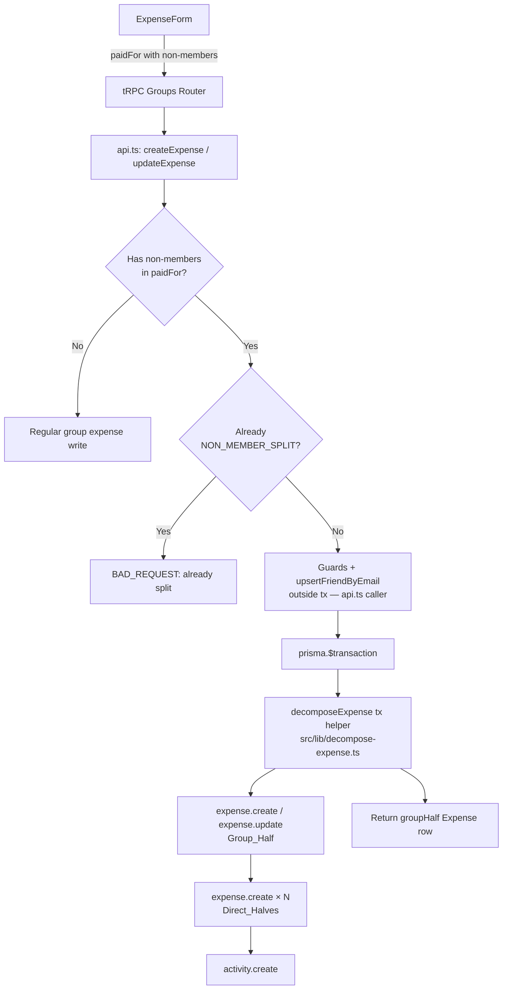
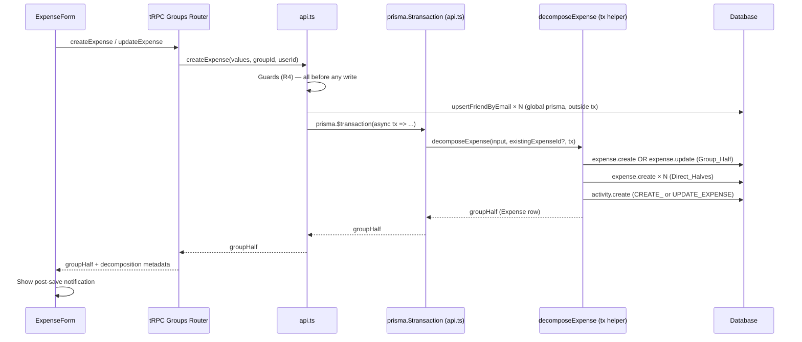

# Design Document: Non-Member Expense Decomposition

## Overview

When a group expense's `paidFor` list includes participants who are not members of the group (non-members), the system atomically decomposes the save into two independent expense records rather than rejecting the submission. The first record — the **Group_Half** — is a standard group expense covering only the member shares. The second — one **Direct_Half** per non-member — is a direct expense (`groupId = null`, `splitMode = BY_AMOUNT`) that charges the non-member their exact proportional share, credited to the single group payer.

Decomposition is a one-way promotion that occurs on the very first save (create, or update of a not-yet-decomposed expense). After that, both halves are independent: editing or deleting one does not cascade to the other. A `linkedExpenseId` column on the Direct_Half points back to the Group_Half for audit purposes, and a new `NON_MEMBER_SPLIT` `CreationMethod` value tags both records so downstream views can identify paired records without touching existing `DEBT_CONSOLIDATION` logic.

The split arithmetic is delegated to a single call of the existing `distributeEqualAmounts` / `distributeWeightedAmounts` helpers (one call over the combined member + non-member participant list), ensuring no cents are created or destroyed. A new `decomposeExpense` helper function in `src/lib/decompose-expense.ts` centralises the arithmetic and DB writes. It is called from both `createExpense` / `updateExpense` in `api.ts` and `createGlobalExpense` in `src/trpc/routers/friends/index.ts`, replacing the latter's current inline `share * 2 + EVENLY` calculation.

`randomId` is extracted to `src/lib/random-id.ts` to break the would-be circular dependency (`api.ts` → `decompose-expense.ts` → `api.ts`).

## Architecture





### Design Decisions

1. **Single distributor call for all non-BY_AMOUNT modes** — `distributeEqualAmounts` or `distributeWeightedAmounts` is called once over the combined list (members in input order, then non-members in input order). Member slot amounts are summed for the Group_Half; each non-member slot becomes that non-member's Direct_Half amount. This guarantees `sum(halves) === total` and deterministic remainder placement.
2. **BY_AMOUNT bypasses the distributor entirely** — `pf.shares` values are already exact minor-unit amounts. They are used directly as `combinedMinorSlots` without any major/minor conversion. Steps 2–4 of the algorithm are skipped for this mode.
3. **Group_Half `splitMode = BY_AMOUNT`** — The Group_Half stores exact per-member share integers so that `sum(paidFor.shares) === amount` (R3.6). EVENLY would force `balances.ts` to use equal weights, diverging from the distributor output.
4. **`decomposeExpense` receives `existingExpenseId?`** — On create, the helper calls `tx.expense.create` for the Group_Half. On update (first-time promotion), it calls `tx.expense.update` on the existing row (same id, group currency, documents preserved). Direct_Halves are always created fresh.
5. **Caller opens the transaction; helper only writes** — `api.ts` runs guards, calls `upsertFriendByEmail` (global `prisma`), then wraps everything in `prisma.$transaction`. The helper signature receives `tx` — it never calls `prisma.$transaction` itself. This avoids nested transactions and the ambiguous sequence diagram from v1.
6. **`randomId` extracted to `src/lib/random-id.ts`** — Prevents a circular import: `api.ts` → `decompose-expense.ts` → `api.ts`.
7. **`decimalDigits` derived from group currency** — `getCurrency(group.currencyCode ?? group.currency).decimal_digits` (from the existing `getCurrency` helper). Hardcoded `2` would break JPY/KRW.
8. **`createExpense` return type unchanged** — Returns `Expense` (the Group_Half) as today. tRPC callers and tests are unaffected. Decomposition metadata (Direct_Half ids and amounts) is returned in a separate `decompositionResult` field on the tRPC response envelope, consumed only by the toast notification.
9. **`originalTotalAtDecomposition` on Group_Half** — Stored at promotion time. UI reads this field directly; no live `sum(Direct_Halves.amount)` query needed. On update-path promotion this field reflects the pre-decomposition `amount` of the existing expense row.
10. **Zero-slot non-members vanish** — No Direct_Half created; not added to Group_Half `paidFor`. If all non-member slots are zero the expense saves as a regular group expense with `creationMethod` left unchanged.
11. **`deleteExpense` clears `linkedExpenseId` in-transaction** — `updateMany` runs inside the same `$transaction` as the `expense.delete`, so there are no orphaned back-references.
12. **Group_Half amount = 0 is rejected** — If all `paidFor` participants are non-members (zero member slots), the decomposition path returns `BAD_REQUEST`: "A group expense must include at least one group member." The server never persists a Group_Half with `amount = 0`.
13. **`createGlobalExpense` mapping** — Before calling `decomposeExpense`, `createGlobalExpense` maps `input.amount` (major units) to minor units via `amountAsMinorUnits`, maps Friend.id to User.id via `friendIdToUserIdMap`, sets `paidById` from the resolved `paidByUserId`, and constructs `ExpenseFormValues` with `splitMode: 'BY_AMOUNT'` (sharesMap values are already resolved minor-unit amounts) and `paidBy: [{ participant: paidByUserId, amount: totalAmountMinor }]`. The FAB (`floating-create-expense.tsx`) is updated to handle the new `{ groupHalf, directHalves }` return shape instead of the legacy `{ success, expenseIds }`.
14. **Banner uses same major-unit form values** — `DecompositionBanner` calls `computeDecompositionSlots` directly (the exported pure function) with the form's major-unit `amount`. The currency's `decimal_digits` is derived from the group's currency. This guarantees banner === server output.
15. **`computeDecompositionSlots` is a pure exported function** — The arithmetic is extracted from `decomposeExpense` into a standalone, DB-free function. It returns `null` when all non-member slots are zero. The caller (`createExpense`, `updateExpense`) uses this `null` to fall through to the regular group-expense path without ever tagging the expense `NON_MEMBER_SPLIT`. The `DecompositionBanner` also calls this function, ensuring a single source of truth for the split arithmetic.

## Components and Interfaces

### New file: `src/lib/random-id.ts`

```typescript
import { nanoid } from 'nanoid'
export function randomId(): string {
  return nanoid()
}
```

`api.ts` imports `randomId` from here instead of defining it locally. `decompose-expense.ts` also imports from here, breaking the cycle.

### New file: `src/lib/decompose-expense.ts`

```typescript
import type { Prisma } from '@prisma/client'
import type { ExpenseFormValues } from '@/lib/schemas'
import {
  distributeEqualAmounts,
  distributeWeightedAmounts,
} from '@/lib/distribute-amount'
import { getCurrency } from '@/lib/currency'
import { randomId } from '@/lib/random-id'
import { ActivityType } from '@prisma/client'

export type DecomposeInput = {
  values: ExpenseFormValues // amount in minor units; paidBy[0] is the single payer
  group: {
    id: string
    currency: string // symbol fallback (Group.currency)
    currencyCode: string | null // Group.currencyCode
    participants: Array<{ id: string }>
  }
  actorUserId: string
}

/**
 * Pure arithmetic — no DB, no side effects. Exported for unit tests and for
 * the client-side DecompositionBanner (which mirrors the server calculation).
 *
 * Returns null when every non-member slot is 0 (e.g. total too small to split):
 * the caller must fall back to the regular group-expense path in that case.
 */
export function computeDecompositionSlots(
  values: Pick<ExpenseFormValues, 'amount' | 'splitMode' | 'paidFor'>,
  group: {
    participants: Array<{ id: string }>
    currencyCode: string | null
    currency: string
  },
): {
  memberEntries: Array<{ userId: string; shares: number }> // minor units
  directHalfEntries: Array<{ userId: string; amount: number }> // minor units
  groupHalfAmount: number
} | null {
  // … partition, run distributor, filter zeros, return null if directHalfEntries empty
}

export type DecomposeResult = {
  groupHalf: Expense // full row (fetched after write with standard expenseInclude)
  directHalves: Array<{ id: string; nonMemberId: string; amount: number }>
}

/**
 * Writes Group_Half + Direct_Halves inside an already-open Prisma transaction.
 * Calls computeDecompositionSlots internally.
 *
 * Create path: pass existingExpenseId = undefined → expense.create for Group_Half.
 * Update path: pass existingExpenseId = string   → expense.update for Group_Half,
 *              preserving documents, notes, originalAmount, originalCurrency,
 *              conversionRate, and recurringExpenseLink from the existing row.
 *
 * Returns null (falls back to regular group path) when computeDecompositionSlots
 * returns null — i.e. when all non-member slots are zero.
 *
 * Preconditions (enforced by caller):
 *   - values.paidFor has ≥ 1 non-member AND ≥ 1 member
 *   - values.paidBy.length === 1
 *   - values.isReimbursement === false
 *   - values.recurrenceRule === 'NONE'
 *   - values.amount > 0
 */
export async function decomposeExpense(
  input: DecomposeInput,
  existingExpenseId: string | undefined,
  tx: Prisma.TransactionClient,
): Promise<DecomposeResult | null>
```

#### Internal algorithm

```typescript
const { values, group, actorUserId } = input
const memberIdSet = new Set(group.participants.map((p) => p.id))
const payerId = values.paidBy[0].participant

// 0. If update path, capture the existing amount BEFORE any write (needed for activity log)
const previousAmount = existingExpenseId
  ? ((
      await tx.expense.findUnique({
        where: { id: existingExpenseId },
        select: { amount: true },
      })
    )?.amount ?? null)
  : null

// 1. Compute slots (pure arithmetic, no DB). Returns null if all non-member slots = 0.
const slots = computeDecompositionSlots(values, group)
if (!slots || slots.directHalfEntries.length === 0) return null
const { memberEntries, directHalfEntries, groupHalfAmount } = slots

// 2. Currency for Direct_Halves
const expenseCurrencyCode = group.currencyCode ?? group.currency

// 3. Build shared Group_Half data
const groupHalfData = {
  groupId: group.id,
  title: values.title,
  expenseDate: values.expenseDate,
  categoryId: values.category,
  amount: groupHalfAmount,
  paidById: payerId,
  splitMode: 'BY_AMOUNT' as const,
  creationMethod: 'NON_MEMBER_SPLIT' as const,
  isReimbursement: false,
  recurrenceRule: 'NONE' as const,
  linkedExpenseId: null,
  expenseCurrencyCode: null,
  originalTotalAtDecomposition: values.amount,
  originalAmount: values.originalAmount ?? null,
  originalCurrency: values.originalCurrency ?? null,
  conversionRate: values.conversionRate ?? null,
  notes: values.notes ?? null,
}

// 4. Write Group_Half; fetch full row afterwards (tRPC callers expect the complete Expense shape)
const expenseInclude = {
  paidBy: { select: { id: true, name: true, email: true } },
  paidFor: {
    include: { user: { select: { id: true, name: true, email: true } } },
  },
  payers: {
    select: {
      userId: true,
      amount: true,
      user: { select: { id: true, name: true } },
    },
  },
  category: true,
  documents: true,
  recurringExpenseLink: true,
} as const

let groupHalfRow: Expense

if (existingExpenseId) {
  // Update path: promote existing row in place (documents + recurringExpenseLink untouched)
  await tx.expense.update({
    where: { id: existingExpenseId },
    data: {
      ...groupHalfData,
      paidFor: {
        deleteMany: {},
        createMany: {
          data: memberEntries.map((e) => ({
            userId: e.userId,
            shares: e.shares,
          })),
        },
      },
      payers: {
        deleteMany: {},
        createMany: { data: [{ userId: payerId, amount: groupHalfAmount }] },
      },
    },
  })
  groupHalfRow = (await tx.expense.findUniqueOrThrow({
    where: { id: existingExpenseId },
    include: expenseInclude,
  })) as Expense
} else {
  // Create path
  const groupHalfId = randomId()
  groupHalfRow = (await tx.expense.create({
    data: {
      id: groupHalfId,
      ...groupHalfData,
      paidFor: {
        createMany: {
          data: memberEntries.map((e) => ({
            userId: e.userId,
            shares: e.shares,
          })),
        },
      },
      payers: {
        createMany: { data: [{ userId: payerId, amount: groupHalfAmount }] },
      },
      documents: values.documents?.length
        ? {
            createMany: {
              data: values.documents.map((d) => ({
                id: randomId(),
                url: d.url,
                width: d.width,
                height: d.height,
              })),
            },
          }
        : undefined,
    },
    include: expenseInclude,
  })) as Expense
}

// 5. Write Direct_Halves
const createdDirectHalves: Array<{
  id: string
  nonMemberId: string
  amount: number
}> = []

for (const entry of directHalfEntries) {
  const dhId = randomId()
  await tx.expense.create({
    data: {
      id: dhId,
      groupId: null,
      title: values.title,
      expenseDate: values.expenseDate,
      categoryId: values.category,
      amount: entry.amount,
      paidById: payerId,
      splitMode: 'BY_AMOUNT' as const,
      creationMethod: 'NON_MEMBER_SPLIT' as const,
      isReimbursement: false,
      recurrenceRule: 'NONE' as const,
      linkedExpenseId: groupHalfRow.id,
      expenseCurrencyCode: expenseCurrencyCode,
      originalTotalAtDecomposition: null,
      originalAmount: null,
      originalCurrency: null,
      conversionRate: null,
      notes: null,
      paidFor: {
        createMany: { data: [{ userId: entry.userId, shares: entry.amount }] },
      },
      payers: {
        createMany: { data: [{ userId: payerId, amount: entry.amount }] },
      },
    },
    select: { id: true },
  })
  createdDirectHalves.push({
    id: dhId,
    nonMemberId: entry.userId,
    amount: entry.amount,
  })
}

// 6. Log activity
const activityType = existingExpenseId
  ? ActivityType.UPDATE_EXPENSE
  : ActivityType.CREATE_EXPENSE
// (previousAmount was captured before the write — see step 0)
await tx.activity.create({
  data: {
    id: randomId(),
    groupId: group.id,
    time: new Date(),
    activityType,
    participantId: actorUserId,
    expenseId: groupHalfRow.id,
    data: values.title,
    changes: {
      createMany: {
        data: [
          {
            field: 'amount',
            oldValue: previousAmount !== null ? String(previousAmount) : null,
            newValue: String(groupHalfAmount),
          },
          { field: 'paidBy', oldValue: null, newValue: payerId },
          {
            field: 'paidFor',
            oldValue: null,
            newValue: JSON.stringify(memberEntries),
          },
        ],
      },
    },
  },
})

return { groupHalf: groupHalfRow, directHalves: createdDirectHalves }
```

### Modified: `src/lib/api.ts`

#### `createExpense` — guard and decomposition path

Return type stays `Promise<Expense>` — returns the Group_Half row as today. Decomposition metadata is carried in the tRPC response alongside the expense (see tRPC section below).

```typescript
// New guards inserted after existing payer dedup / sum validation:
const memberIds = new Set(group.participants.map((p) => p.id))
const nonMemberPaidFor = expenseFormValues.paidFor.filter(
  (pf) => !memberIds.has(pf.participant),
)
const hasNonMembers = nonMemberPaidFor.length > 0

// Guard: non-member payers
for (const payer of expenseFormValues.paidBy) {
  if (!memberIds.has(payer.participant))
    throw new TRPCError({
      code: 'BAD_REQUEST',
      message: 'Non-members cannot be payers of a group expense.',
    })
}
// Guard: single payer with non-members
if (hasNonMembers && expenseFormValues.paidBy.length > 1)
  throw new TRPCError({
    code: 'BAD_REQUEST',
    message: 'Expenses with non-members must have a single payer.',
  })
// Guard: reimbursements
if (expenseFormValues.isReimbursement && hasNonMembers)
  throw new TRPCError({
    code: 'BAD_REQUEST',
    message: 'Reimbursements cannot include non-members.',
  })
// Guard: recurring
if (expenseFormValues.recurrenceRule !== 'NONE' && hasNonMembers)
  throw new TRPCError({
    code: 'BAD_REQUEST',
    message: 'Recurring expenses cannot include non-members.',
  })

// REMOVE the old "is not a group member" BAD_REQUEST for paidFor

if (hasNonMembers) {
  // Verify Group_Half would not be empty
  const memberPaidFor = expenseFormValues.paidFor.filter((pf) =>
    memberIds.has(pf.participant),
  )
  if (memberPaidFor.length === 0)
    throw new TRPCError({
      code: 'BAD_REQUEST',
      message: 'A group expense must include at least one group member.',
    })

  // upsertFriendByEmail outside the transaction (global prisma)
  for (const pf of nonMemberPaidFor) {
    const u = await prisma.user.findUnique({
      where: { id: pf.participant },
      select: { email: true, name: true },
    })
    if (u)
      await upsertFriendByEmail({
        userId: userId!,
        email: u.email,
        name: u.name ?? undefined,
      })
  }

  const result = await prisma.$transaction(async (tx) =>
    decomposeExpense(
      { values: expenseFormValues, group, actorUserId: userId! },
      undefined, // create path
      tx,
    ),
  )
  // null return = all non-member slots were zero → fall through to regular group path
  if (result) return result.groupHalf as Expense
}

// Regular path (unchanged)
```

#### `updateExpense` — first-save promotion guard

```typescript
// After existing guards, before the regular prisma.expense.update:
const nonMemberPaidFor = expenseFormValues.paidFor.filter(
  (pf) => !memberIds.has(pf.participant),
)
const hasNonMembers = nonMemberPaidFor.length > 0

if (existingExpense.creationMethod === 'NON_MEMBER_SPLIT' && hasNonMembers)
  throw new TRPCError({
    code: 'BAD_REQUEST',
    message:
      'This expense has already been split. Edit the direct expense separately.',
  })

// Same single-payer, reimbursement, and recurring guards as in createExpense
// ...

if (hasNonMembers) {
  const memberPaidFor = expenseFormValues.paidFor.filter((pf) =>
    memberIds.has(pf.participant),
  )
  if (memberPaidFor.length === 0)
    throw new TRPCError({
      code: 'BAD_REQUEST',
      message: 'A group expense must include at least one group member.',
    })

  for (const pf of nonMemberPaidFor) {
    const u = await prisma.user.findUnique({
      where: { id: pf.participant },
      select: { email: true, name: true },
    })
    if (u)
      await upsertFriendByEmail({
        userId: userId!,
        email: u.email,
        name: u.name ?? undefined,
      })
  }

  const result = await prisma.$transaction(async (tx) =>
    decomposeExpense(
      { values: expenseFormValues, group, actorUserId: userId! },
      expenseId, // update path — promotes existing row in place
      tx,
    ),
  )
  if (result) return result.groupHalf as Expense
}

// Regular path (unchanged)
```

#### `deleteExpense` — clear `linkedExpenseId` in same transaction

```typescript
await prisma.$transaction(async (tx) => {
  await tx.expense.updateMany({
    where: { linkedExpenseId: expenseId },
    data: { linkedExpenseId: null },
  })
  await tx.expense.delete({ where: { id: expenseId } })
})
```

### Modified: `src/trpc/routers/friends/index.ts` — `createGlobalExpense` alignment

Before calling `decomposeExpense`, build `mappedFormValues` from the existing resolved data:

```typescript
// After all Friend.id → User.id resolution and sharesMap construction
// (sharesMap values are already in minor units):
const mappedFormValues: ExpenseFormValues = {
  title: input.title, // input, not values
  expenseDate: input.expenseDate ?? new Date(),
  category: input.category ?? 0,
  amount: totalAmountMinor, // minor units
  splitMode: 'BY_AMOUNT' as const, // sharesMap already resolved amounts
  paidBy: [{ participant: paidByUserId, amount: totalAmountMinor }],
  paidFor: Array.from(sharesMap.entries()).map(([userId, shares]) => ({
    participant: userId,
    shares, // minor-unit amounts (BY_AMOUNT: shares === amount)
  })),
  isReimbursement: false,
  recurrenceRule: input.recurrenceRule ?? 'NONE',
  originalAmount: null,
  originalCurrency: null,
  conversionRate: null,
  notes: input.notes ?? null,
  documents: [],
}

// When groupId present and non-members exist, call decomposeExpense:
if (input.groupId && nonMemberIds.size > 0) {
  for (const nonMemberId of nonMemberIds) {
    const u = await prisma.user.findUnique({
      where: { id: nonMemberId },
      select: { email: true, name: true },
    })
    if (u)
      await upsertFriendByEmail({
        userId: ctx.user.id,
        email: u.email,
        name: u.name ?? undefined,
      })
  }
  const result = await prisma.$transaction(async (tx) =>
    decomposeExpense(
      {
        values: mappedFormValues,
        group: resolvedGroup,
        actorUserId: ctx.user.id,
      },
      undefined,
      tx,
    ),
  )
  // result is null if all non-member slots = 0; fall through to existing direct-expense path
  if (result) {
    // Return shape that FAB/floating-create-expense.tsx expects.
    // FAB must be updated to handle { groupHalf, directHalves } instead of legacy { success, expenseIds }.
    return { groupHalf: result.groupHalf, directHalves: result.directHalves }
  }
}
// Otherwise: existing direct-expense creation path (EVENLY, two parties)
```

### Modified: `src/trpc/routers/groups/` — tRPC response envelope

The groups tRPC `createExpense` and `updateExpense` procedures wrap the `api.ts` result and include decomposition metadata:

```typescript
type CreateExpenseResponse = {
  expense: Expense
  decomposition?: {
    groupHalfAmount: number // minor units
    directHalves: Array<{ nonMemberName: string; amount: number }>
  }
}
```

The procedure runs `decomposeExpense` at the `api.ts` level and reconstructs `directHalves` names from the resolved non-member user records before returning.

### Modified: `src/lib/friend-balances-db.ts`

```typescript
// Add expenseCurrencyCode to the select in getDirectExpensesBetweenUsers:
expenseCurrencyCode: true,
```

### New utility: `buildDirectBuckets` (in `src/trpc/routers/friends/index.ts` or `src/lib/friend-balances.ts`)

```typescript
function buildDirectBuckets(
  directExpenses: Array<{ expenseCurrencyCode: string | null; [key: string]: unknown }>,
  fallbackCurrency: Currency,
): Array<{ currency: Currency; expenses: typeof directExpenses }> {
  const bucketMap = new Map<string, { currency: Currency; expenses: typeof directExpenses }>()

  for (const exp of directExpenses) {
    const currency = exp.expenseCurrencyCode
      ? getCurrency(exp.expenseCurrencyCode)
      : fallbackCurrency
    const key = currency.code || currency.symbol
    const existing = bucketMap.get(key)
    if (existing) existing.expenses.push(exp)
    else bucketMap.set(key, { currency, expenses: [exp] })
  }

  return Array.from(bucketMap.values()).filter(b => b.expenses.length > 0)
}

// Replaces current single-bucket construction in listWithBalances, getBalanceDetail, getTimeline:
const directBuckets = buildDirectBuckets(directExpenses, directCurrency)
computeFriendBalance(..., directBuckets.length > 0 ? directBuckets : undefined)
```

### New React component: `DecompositionBanner`

```typescript
type DecompositionBannerProps = {
  // Derived from form state (major units, same units the form uses)
  nonMembers: Array<{
    userId: string
    name: string
    amountMajor: number // major units (e.g. 33.33 for 33.33 €)
  }>
  groupHalfAmountMajor: number // major units
  currency: Currency
}

function DecompositionBanner(
  props: DecompositionBannerProps,
): JSX.Element | null
```

The parent `ExpenseForm` computes `nonMembers` and `groupHalfAmountMajor` by calling the exported `computeDecompositionSlots` with minor-unit values, then converting the results back to major units for display:

```typescript
// In ExpenseForm — derive banner values on every form state change:
const currency = getCurrency(group.currencyCode ?? group.currency)
const factor = 10 ** currency.decimal_digits

// Convert form major-unit amount to minor units before calling the helper
const totalMinor = Math.round(formValues.amount * factor)

const paidForMinor = formValues.paidFor.map((pf) => ({
  ...pf,
  // BY_AMOUNT shares are already in major units in the form; convert to minor
  shares:
    formValues.splitMode === 'BY_AMOUNT'
      ? Math.round(pf.shares * factor)
      : pf.shares, // EVENLY/BY_SHARES/BY_PERCENTAGE: shares are weights, pass through
}))

const slots = computeDecompositionSlots(
  {
    amount: totalMinor,
    splitMode: formValues.splitMode,
    paidFor: paidForMinor,
  },
  group,
)

// Convert minor-unit slots back to major units for the banner display
const groupHalfAmountMajor = slots
  ? slots.groupHalfAmount / factor
  : formValues.amount
const bannerNonMembers = slots
  ? slots.directHalfEntries
      .map((e) => ({
        userId: e.userId,
        name: resolveParticipantName(e.userId),
        amountMajor: e.amount / factor,
      }))
      .filter((e) => e.amountMajor > 0)
  : []
```

This guarantees the banner amounts are numerically identical to the server computation.

## Data Models

### Schema additions to `prisma/schema.prisma`

```prisma
enum CreationMethod {
  PAYMENT
  DEBT_CONSOLIDATION
  NON_MEMBER_SPLIT   // ← new
}

model Expense {
  // ... existing fields ...
  linkedExpenseId              String?   // Direct_Half only: Group_Half id; null elsewhere
  expenseCurrencyCode          String?   // Direct_Half only: originating group currency; null elsewhere
  originalTotalAtDecomposition Int?      // Group_Half only: original total at decomposition time (minor units)

  @@index([linkedExpenseId])             // ← new: efficient reverse lookup
}
```

`originalTotalAtDecomposition` is also added to `requirements.md` R1 alongside `linkedExpenseId` and `expenseCurrencyCode`.

### Migration

```sql
-- Idempotent enum addition
DO $$ BEGIN
  ALTER TYPE "CreationMethod" ADD VALUE 'NON_MEMBER_SPLIT';
EXCEPTION WHEN duplicate_object THEN null;
END $$;

-- Nullable columns (no row backfill required)
ALTER TABLE "Expense"
  ADD COLUMN IF NOT EXISTS "linkedExpenseId"              TEXT,
  ADD COLUMN IF NOT EXISTS "expenseCurrencyCode"          TEXT,
  ADD COLUMN IF NOT EXISTS "originalTotalAtDecomposition" INTEGER;

-- Index for reverse lookup
CREATE INDEX IF NOT EXISTS "Expense_linkedExpenseId_idx" ON "Expense"("linkedExpenseId");
```

### Group_Half record shape

```typescript
{
  id:    existingExpenseId ?? randomId(),
  groupId: group.id,
  title, expenseDate, categoryId,
  amount: groupHalfAmount,               // sum of non-zero member slots (minor units)
  paidById: values.paidBy[0].participant,
  splitMode: 'BY_AMOUNT',
  creationMethod: 'NON_MEMBER_SPLIT',
  isReimbursement: false,
  recurrenceRule:  'NONE',
  linkedExpenseId:              null,
  expenseCurrencyCode:          null,
  originalTotalAtDecomposition: values.amount,   // original total (minor units)
  originalAmount:   values.originalAmount ?? null,
  originalCurrency: values.originalCurrency ?? null,
  conversionRate:   values.conversionRate ?? null,
  notes:            values.notes ?? null,
  paidFor:  [{ userId: memberId, shares: memberSlot }...],  // exact minor-unit amounts
  payers:   [{ userId: payerId,  amount: groupHalfAmount }],
  documents: <copied from values on create; untouched on update>,
}
```

### Direct_Half record shape

```typescript
{
  id:    randomId(),
  groupId: null,
  title, expenseDate, categoryId,
  amount: nonMemberSlot,                 // minor units
  paidById: values.paidBy[0].participant,
  splitMode: 'BY_AMOUNT',
  creationMethod: 'NON_MEMBER_SPLIT',
  isReimbursement: false,
  recurrenceRule:  'NONE',
  linkedExpenseId:              groupHalfId,
  expenseCurrencyCode:          group.currencyCode ?? group.currency,
  originalTotalAtDecomposition: null,
  originalAmount: null, originalCurrency: null, conversionRate: null,
  notes: null,
  paidFor: [{ userId: nonMemberId, shares: nonMemberSlot }],  // shares === amount
  payers:  [{ userId: payerId,     amount: nonMemberSlot }],
}
```

### `distributeEqualAmounts` usage pattern

```typescript
// Input: total in minor units (e.g. 10000 for 100.00 €)
// Step 1: minor → major
const totalMajor = totalMinor / factor // 10000 / 100 = 100.00
// Step 2: call distributor (returns major-unit array)
const majorSlots = distributeEqualAmounts(totalMajor, count, decimalDigits)
// Step 3: major → minor
const minorSlots = majorSlots.map((m) => Math.round(m * factor))
// Invariant: sum(minorSlots) === totalMinor  (guaranteed by helper)

// BY_AMOUNT: skip steps 1-3 entirely; pf.shares already in minor units
```

## Correctness Properties

### Property 1: Amount Conservation

For all valid inputs, any split mode, any member/non-member count, any total ≥ 1 minor unit:

```
groupHalf.amount + sum(directHalves[i].amount) === originalTotal
```

Zero-slot non-members are excluded without affecting the invariant (their zero amounts do not alter the sum).

**Validates: Requirements 2.9, 3.7, 12.2**

### Property 2: Group_Half Internal Consistency

```
sum(groupHalf.paidFor[j].shares) === groupHalf.amount
```

Enforced by construction: each `shares` value equals the corresponding minor-unit slot from the distributor.

**Validates: Requirements 3.6, 12.3**

### Property 3: Non-Negative Amounts

```
∀ directHalf: directHalf.amount > 0   (zero-slot entries are excluded, not persisted)
```

**Validates: Requirements 12.4**

### Property 4: Payer Net-Position Invariant

The payer's net position is verified by running the actual `getBalances` helper against synthetic Group_Half and Direct_Half records:

```typescript
// In the property test:
const groupBalances = getBalances([syntheticGroupHalf])
const directBalances = directHalves.map((dh) => getBalances([dh]))

const payerGroupNet =
  groupBalances[payerId]?.paid - groupBalances[payerId]?.paidFor
const payerDirectCredits = directBalances.reduce(
  (s, b) => s + (b[payerId]?.total ?? 0),
  0,
)

// payerShare = member slot of the payer in the combined distribution
expect(payerGroupNet + payerDirectCredits).toBe(originalTotal - payerShare)
```

This exercises `balances.ts` for real rather than reasoning about the math tautologically.

**Validates: Requirements 10.3, 12.5**

### Property 5: `expenseCurrencyCode` Bucketing

For any Direct_Half with `expenseCurrencyCode = C`, `buildDirectBuckets` places it in a bucket where `currency.code === C` (or `currency.symbol === C` when code is null). Direct expenses with `expenseCurrencyCode = null` fall into the `preferredCurrency` bucket.

**Validates: Requirements 1.6, 14.4**

### Property 6: Decomposition Guard Idempotency

If `expense.creationMethod === 'NON_MEMBER_SPLIT'` and the update payload has a non-member in `paidFor`, the API returns `BAD_REQUEST` and zero DB writes occur.

**Validates: Requirements 2.3**

### Property 7: Stable Remainder Ordering

For EVENLY splits, the combined list is always [members in paidFor input order, non-members in paidFor input order]. Remainder minor units land on the first indices of this combined list. This ordering is identical in the server helper and in the client banner computation, so the banner always matches the DB amounts.

**Validates: Requirements 3.2, 6.4**

## Error Handling

| Scenario                                                                     | Behavior                                                                                                                                                                                                      |
| ---------------------------------------------------------------------------- | ------------------------------------------------------------------------------------------------------------------------------------------------------------------------------------------------------------- |
| Non-member in `paidBy`                                                       | `BAD_REQUEST` before any write                                                                                                                                                                                |
| Multiple payers + non-member in `paidFor`                                    | `BAD_REQUEST` before any write                                                                                                                                                                                |
| `isReimbursement + non-member`                                               | `BAD_REQUEST` before any write                                                                                                                                                                                |
| `recurrenceRule ≠ NONE` + non-member                                         | `BAD_REQUEST` before any write                                                                                                                                                                                |
| All `paidFor` entries are non-members (zero member slots)                    | `BAD_REQUEST`: "A group expense must include at least one group member."                                                                                                                                      |
| Update of already-`NON_MEMBER_SPLIT` expense with non-members                | `BAD_REQUEST`: "This expense has already been split."                                                                                                                                                         |
| Prisma transaction failure                                                   | Roll back all writes; `INTERNAL_SERVER_ERROR`; no partial records                                                                                                                                             |
| `upsertFriendByEmail` failure (before tx)                                    | Error propagated; transaction never opened                                                                                                                                                                    |
| FX conversion failure                                                        | `BAD_REQUEST` from FX step before `decomposeExpense` is invoked                                                                                                                                               |
| All non-member slots zero (e.g. total = 1 minor unit, 3 participants EVENLY) | `computeDecompositionSlots` returns `null`; caller falls through to regular group-expense path; `creationMethod` NOT set to `NON_MEMBER_SPLIT`; subsequent edits that add non-members will decompose normally |
| `linkedExpenseId` references a deleted Group_Half                            | Direct_Half detail view shows no audit note (graceful degradation)                                                                                                                                            |
| Unrecognised `expenseCurrencyCode`                                           | `getCurrency` returns the raw string as symbol; bucketing still functions                                                                                                                                     |

## Testing Strategy

### Property-Based Tests (fast-check, Jest — `pnpm test`)

File: `src/lib/__tests__/decompose-expense.property.test.ts`. Minimum 100 runs per suite.

#### Suite 1 — Amount conservation, internal consistency, non-negative amounts

```typescript
// Feature: non-member-expense-decomposition, Properties 1+2+3
fc.assert(
  fc.property(
    fc.integer({ min: 1, max: 1_000_000 }), // total minor units
    fc.integer({ min: 1, max: 10 }), // member count
    fc.integer({ min: 1, max: 5 }), // non-member count
    fc.constantFrom('EVENLY', 'BY_SHARES', 'BY_PERCENTAGE', 'BY_AMOUNT'),
    (total, memberCount, nonMemberCount, splitMode) => {
      const { groupHalf, directHalves } = runDecomposeArithmetic(
        total,
        memberCount,
        nonMemberCount,
        splitMode,
      )
      // P1
      expect(
        groupHalf.amount + directHalves.reduce((s, d) => s + d.amount, 0),
      ).toBe(total)
      // P2
      expect(groupHalf.paidFor.reduce((s, pf) => s + pf.shares, 0)).toBe(
        groupHalf.amount,
      )
      // P3
      directHalves.forEach((d) => expect(d.amount).toBeGreaterThan(0))
    },
  ),
  { numRuns: 100 },
)
```

#### Suite 2 — Payer net-position via `getBalances`

```typescript
// Feature: non-member-expense-decomposition, Property 4
fc.assert(
  fc.property(
    fc.integer({ min: 2, max: 1_000_000 }),
    fc.integer({ min: 1, max: 10 }),
    fc.integer({ min: 1, max: 5 }),
    (total, memberCount, nonMemberCount) => {
      const { groupHalf, directHalves, payerShare } = runDecomposeArithmetic(
        total,
        memberCount,
        nonMemberCount,
        'EVENLY',
      )

      const groupB = getBalances([toSyntheticExpense(groupHalf)])
      const directsB = directHalves.map((dh) =>
        getBalances([toSyntheticExpense(dh)]),
      )

      const payerId = groupHalf.paidById
      const groupNet =
        (groupB[payerId]?.paid ?? 0) - (groupB[payerId]?.paidFor ?? 0)
      const directCredit = directsB.reduce(
        (s, b) => s + (b[payerId]?.total ?? 0),
        0,
      )

      expect(groupNet + directCredit).toBe(total - payerShare)
    },
  ),
  { numRuns: 100 },
)
```

### Unit Tests (Jest)

File: `src/lib/__tests__/decompose-expense.test.ts`

**`decomposeExpense` arithmetic (pure function, no DB):**

- EVENLY 3 members + 1 non-member, total 10000 (100.00 €) → groupHalf 6667, direct 3333
- EVENLY remainder: total 1 minor unit, 2 members + 1 non-member → slot[0]=1, slot[1]=0, slot[2]=0; only 1 member slot retained; no Direct_Half
- BY_SHARES: weighted, assert P1+P2
- BY_PERCENTAGE: weighted, assert P1+P2
- BY_AMOUNT: explicit amounts, verify no factor multiplication (shares passed through as-is)
- JPY (decimalDigits=0): total 10000 JPY, 3 participants → slots are whole numbers, sum = 10000
- `originalTotalAtDecomposition` = `values.amount` on Group_Half
- `linkedExpenseId` on each Direct_Half = Group_Half id
- `expenseCurrencyCode` = group.currencyCode ?? group.currency

**Validation guards (`api.ts`):**

- Non-member in paidBy → BAD_REQUEST
- Multi-payer + non-member → BAD_REQUEST
- Reimbursement + non-member → BAD_REQUEST
- Recurring + non-member → BAD_REQUEST
- All non-members, no members → BAD_REQUEST "must include at least one group member"
- Already NON_MEMBER_SPLIT + non-member in update payload → BAD_REQUEST
- All-member expense → regular path, no decomposition

**Update path (promote in-place):**

- `decomposeExpense` called with `existingExpenseId` → `expense.update` not `expense.create` for Group_Half
- Existing expense id is preserved in returned `groupHalf.id`
- Direct_Halves get new ids

**`deleteExpense`:**

- Deleting a Group_Half sets `linkedExpenseId = null` on linked Direct_Halves (verified in same tx)
- Deleting a Direct_Half does not affect the Group_Half

**`buildDirectBuckets`:**

- Mixed `expenseCurrencyCode` values produce separate per-currency buckets
- `null` entries land in the fallback-currency bucket

**`DecompositionBanner`:**

- Hidden when `nonMembers.length === 0`
- Shows each non-member name and `amountMajor` formatted in group currency
- Shows `groupHalfAmountMajor` when > 0
- Updates synchronously on form state change

### Integration Tests

- Create group expense with 1 non-member → DB has Group_Half (`creationMethod = NON_MEMBER_SPLIT`, `splitMode = BY_AMOUNT`) + 1 Direct_Half (`linkedExpenseId = groupHalf.id`, `expenseCurrencyCode` set)
- Update of not-yet-decomposed expense to include non-member → existing row promoted in place (same id)
- Update of `NON_MEMBER_SPLIT` expense with non-member → `BAD_REQUEST`
- Delete Group_Half → `linkedExpenseId = null` on Direct_Halves; Direct_Halves still queryable
- `listWithBalances` / `getBalanceDetail` / `getTimeline` return per-currency buckets for Direct_Halves with `expenseCurrencyCode`
- Balance invariant: after decomposition, payer's group net + friend-ledger net = `originalTotal − payerShare`
- Existing tests that encode non-member rejection (`api-multi-payer-validation.test.ts`, user-profile-and-participants Property 2) are rewritten to expect decomposition instead of BAD_REQUEST

### Test file locations

```
src/lib/__tests__/decompose-expense.property.test.ts   ← property suites 1 + 2
src/lib/__tests__/decompose-expense.test.ts            ← unit tests
src/lib/__tests__/api-non-member-decomposition.test.ts ← guards + integration
```
