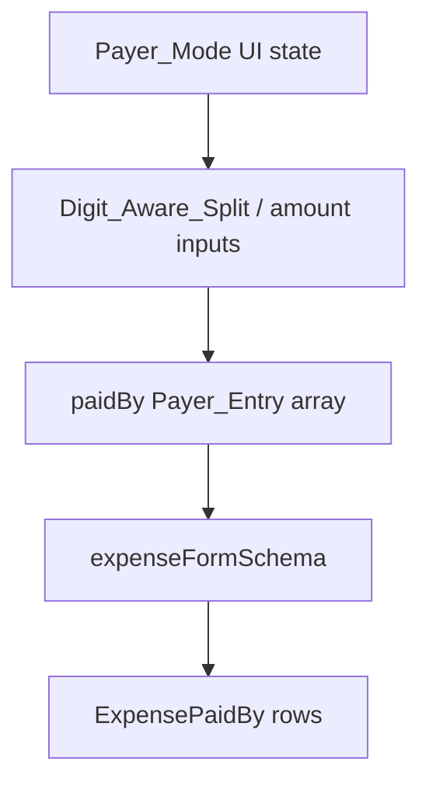

# Design Document: paid-by-split-modes

## Overview

Replace the current "add payer row" Paid by UX with Spliit-style Choice Cards: Single payer vs Multiple payers (Evenly / By shares / By percentage / By amount). Modes are UI-only; the form and API continue to use `paidBy: Array<{ participant, amount }>`. Builds on `multi-payer-expenses` and shadcn `Field` + `RadioGroup` Choice Cards.

## Architecture



### Design Decisions

1. **No `paidBySplitMode` column** — Absolute amounts are the source of truth. Edit of multi-payer expenses opens as `by_amount` to avoid re-deriving an ambiguous mode.
2. **shadcn Choice Cards** — `FieldLabel` wrapping `Field` + `RadioGroupItem` for the selectable cards; nested Select / Checkbox / CurrencyAmountInput inside the selected card.
3. **Shared digit-aware helper** — Extract `distributeEqualAmountShares`-style math to `src/lib/distribute-amount.ts` for payer (and reuse-ready) splits.
4. **`singlePayerOnly` prop** — Friend/hybrid floating create and reimbursements force Single mode (already partially wired).

## Components and Interfaces

### `distribute-amount.ts`

```typescript
export function distributeEqualAmounts(
  totalMajor: number,
  count: number,
  decimalDigits: number,
): number[]

export function distributeWeightedAmounts(
  totalMajor: number,
  weights: number[],
  decimalDigits: number,
): number[]
```

### `PayerSelector` modes

| Mode            | Controls                | Amount emission                           |
| --------------- | ----------------------- | ----------------------------------------- |
| `single`        | One Select              | `[{ participant, amount: expenseTotal }]` |
| `evenly`        | Participant checkboxes  | Equal Digit_Aware_Split among checked     |
| `by_shares`     | Checkbox + share input  | Weights → `distributeWeightedAmounts`     |
| `by_percentage` | Checkbox + % input      | Must sum 100 → weighted amounts           |
| `by_amount`     | Checkbox + amount input | Absolute amounts; mismatch badge          |

### Props

```typescript
interface PayerSelectorProps {
  participants: Array<{ id: string; name: string }>
  value: PayerEntry[]
  onChange: (payers: PayerEntry[]) => void
  expenseTotal: number
  currency: Currency
  locale: Locale
  disabled?: boolean
  isReimbursement?: boolean
  singlePayerOnly?: boolean
}
```

## Error Handling

- By amount mismatch: existing Zod `paidByAmountSum` + UI badge with `formatCurrency(..., minor)`.
- By percentage not summing to 100: keep amounts at last valid distribution or zero-fill until valid; form validation still enforces amount sum on submit.
- Duplicate participants: schema `paidByDuplicateParticipants` + UI prevents selecting the same id twice.

## Testing

- Unit tests for `distributeEqualAmounts` and `distributeWeightedAmounts`.
- PayerSelector behavior: single mode emits one entry with full total (tested via helper + mode transition logic where practical).
