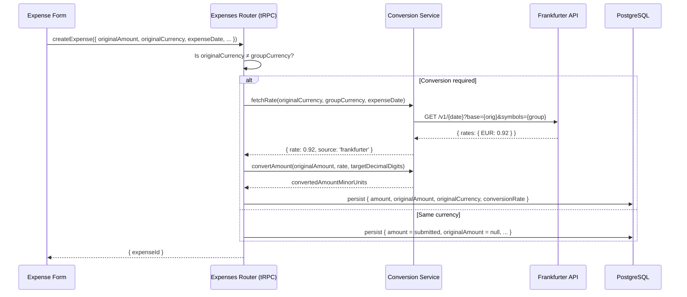

# Design Document: Server-Authoritative Currency Conversion

## Overview

This feature moves exchange-rate resolution from the client to the server. When a user saves an expense in a currency different from the group's currency, the tRPC mutation fetches the rate from the Frankfurter API, computes the converted amount, and persists all conversion metadata (`originalAmount`, `originalCurrency`, `conversionRate`, `amount`). The client retains a preview-only SWR fetch for UX, but never supplies the authoritative `amount` for foreign-currency expenses.

Key design goals:

- **Correctness**: Integer minor-unit arithmetic throughout; no floating-point money.
- **Resilience**: Manual-rate fallback when the FX provider is down.
- **Transparency**: Conversion details visible in expense detail and exports.
- **Minimal blast radius**: Balance computation already uses `amount` (converted); no changes needed there.

## Architecture



The client-side preview uses the existing `useCurrencyRate` SWR hook (unchanged). The form sends `originalAmount` (minor units) and `originalCurrency` — the server re-derives `amount` and ignores any client-sent `amount` when conversion is required.

## Components and Interfaces

### 1. Conversion Service Module — `src/lib/currency-conversion.ts`

A pure, standalone module with no side effects beyond the HTTP call to Frankfurter.

```typescript
// --- Public API ---

export interface FetchRateResult {
  ok: true
  rate: number // e.g. 0.92 (units of target per 1 unit of base)
  date: string // actual date returned by Frankfurter (may differ on weekends)
}

export interface FetchRateError {
  ok: false
  reason: 'network' | 'not_found' | 'invalid_response'
  message: string
}

export type FetchRateOutcome = FetchRateResult | FetchRateError

/**
 * Fetch the exchange rate for a given date from Frankfurter API.
 * Returns a discriminated union so callers handle failures explicitly.
 */
export async function fetchRate(
  base: string,
  target: string,
  date: string, // YYYY-MM-DD
): Promise<FetchRateOutcome>

/**
 * Convert an amount from one currency to another using a given rate.
 * All values are in minor units (cents). Uses banker's rounding.
 *
 * @param originalAmountMinorUnits - integer cents in the source currency
 * @param rate - units of target per 1 unit of source (e.g. 0.92)
 * @param sourceDecimalDigits - ISO 4217 decimal digits of source currency
 * @param targetDecimalDigits - ISO 4217 decimal digits of target currency
 * @returns integer minor units in the target currency
 */
export function convertAmount(
  originalAmountMinorUnits: number,
  rate: number,
  sourceDecimalDigits: number,
  targetDecimalDigits: number,
): number

/**
 * Lookup ISO 4217 decimal digits for a currency code.
 * Defaults to 2 for unknown codes.
 */
export function getDecimalDigits(currencyCode: string): number
```

**Implementation notes:**

- `convertAmount` converts source minor units → major units → applies rate → converts to target minor units → rounds to integer.
- Formula: `Math.round((originalAmountMinorUnits / 10^sourceDecimalDigits) * rate * 10^targetDecimalDigits)`
- Zero-decimal currencies (JPY, KRW): `sourceDecimalDigits = 0`, so no division by 100 occurs.
- The `fetchRate` function has a 5-second timeout to avoid blocking expense saves.

### 2. Expenses Router Changes — `src/trpc/routers/groups/expenses/create.procedure.ts` & `update.procedure.ts`

Both procedures gain conversion orchestration logic inserted **before** calling `createExpense` / `updateExpense`:

```typescript
// Pseudo-code for the conversion orchestration (shared helper)
async function resolveConversion(input: {
  originalAmount: number | undefined
  originalCurrency: string | undefined | null
  groupCurrencyCode: string | null
  expenseDate: Date
  clientConversionRate?: number // fallback from client
}): Promise<{
  amount: number // final converted amount in group minor units
  originalAmount: number | null
  originalCurrency: string | null
  conversionRate: Decimal | null
}>
```

**Decision logic:**

1. If `originalCurrency` is null/empty or equals `groupCurrencyCode` → passthrough (null conversion fields, use submitted amount).
2. Otherwise, call `fetchRate(originalCurrency, groupCurrencyCode, dateStr)`.
3. If `fetchRate` succeeds → use returned rate.
4. If `fetchRate` fails and `clientConversionRate` is provided → use it.
5. If `fetchRate` fails and no client rate → throw `TRPCError({ code: 'PRECONDITION_FAILED', message: 'Exchange rate unavailable. Please provide a manual rate.' })`.

**Update-specific logic** (Requirement 5):

- Compare incoming `originalAmount`, `originalCurrency`, and `expenseDate` against the existing expense.
- If none of these changed → skip conversion, retain existing `conversionRate` and `amount`.
- If any changed → re-run `resolveConversion`.

### 3. Expense Form Client Changes — `expense-form.tsx`

Minimal changes to the existing form:

| Current behavior                                                                          | New behavior                                                                                   |
| ----------------------------------------------------------------------------------------- | ---------------------------------------------------------------------------------------------- |
| Form computes `amount = originalAmount * rate` on the client and sends `amount` to server | Form still computes preview `amount` for UX, but server ignores it when conversion is required |
| `useCurrencyRate` fetches Frankfurter client-side                                         | Unchanged — stays as preview                                                                   |
| Form sends `conversionRate` field                                                         | Form sends `conversionRate` only as fallback for manual-rate mode                              |

**Key change in `proceedWithSubmit`:**

- When `conversionRequired`, the form sends `originalAmount` (converted to minor units using `originalCurrency` decimal digits) and `originalCurrency`.
- The `amount` field is still sent (schema requires it) but the server overrides it.
- The `conversionRate` is sent only when the user toggled custom rate mode (fallback signal for the server).

**New `originalAmount` minor-unit conversion:**

```typescript
if (conversionRequired) {
  values.originalAmount = amountAsMinorUnits(
    Number(values.originalAmount),
    originalCurrency, // use original currency's decimal digits
  )
}
```

### 4. Export Route Changes

**CSV** (`src/app/groups/[groupId]/expenses/export/csv/route.ts`):

- Already includes "Original cost", "Original currency", "Conversion rate" columns ✓
- Fix: format `originalAmount` using `getCurrency(expense.originalCurrency).decimal_digits` (already done in current code via `formatAmountAsDecimal`).

**JSON** (`src/app/groups/[groupId]/expenses/export/json/route.ts`):

- Already selects `originalAmount`, `originalCurrency`, `conversionRate` ✓
- No changes required.

### 5. Expense Detail Display

Add a conversion info section to the expense detail view when `originalCurrency` is non-null:

```
Original: $150.00 USD
Rate: 1 USD = 0.92 EUR
Converted: €138.00 EUR
```

This uses the existing `formatCurrency` utility and the stored `conversionRate`.

### 6. Balance/Settlement Modules

**No changes required.** The `getBalances` function in `src/lib/balances.ts` already operates exclusively on `expense.amount`, which is the converted amount in group currency. The `originalAmount` and `conversionRate` fields are not referenced.

## Data Models

### Existing Prisma Schema (no migration needed)

```prisma
model Expense {
  amount           Int          // Converted amount in group currency (minor units)
  originalAmount   Int?         // Original amount in foreign currency (minor units)
  originalCurrency String?      // ISO 4217 code (e.g., "USD")
  conversionRate   Decimal?     // Rate: 1 unit of originalCurrency = X units of groupCurrency
}
```

### Conversion Service Internal Types

```typescript
// ISO 4217 decimal digits mapping (subset matching Frankfurter-supported currencies)
const ZERO_DECIMAL_CURRENCIES = ['JPY', 'KRW', 'ISK', 'HUF'] as const
// All others default to 2; some have 3 (BHD, KWD) but are not Frankfurter-supported.
```

### ExpenseFormValues Schema Changes

The Zod schema (`src/lib/schemas.ts`) already supports `originalAmount`, `originalCurrency`, and `conversionRate` as optional fields. No schema changes needed.

## Correctness Properties

_A property is a characteristic or behavior that should hold true across all valid executions of a system — essentially, a formal statement about what the system should do. Properties serve as the bridge between human-readable specifications and machine-verifiable correctness guarantees._

### Property 1: convertAmount produces correct integer result

_For any_ valid `originalAmountMinorUnits` (integer in range [-10_000_000_00, 10_000_000_00]), any positive `rate` (in range (0, 1000]), and any valid `sourceDecimalDigits` ∈ {0, 2, 3} and `targetDecimalDigits` ∈ {0, 2, 3}, the `convertAmount` function SHALL return an integer equal to `Math.round((originalAmountMinorUnits / 10^sourceDecimalDigits) * rate * 10^targetDecimalDigits)`.

**Validates: Requirements 1.2, 2.3, 9.2**

### Property 2: Round-trip tolerance within one minor unit

_For any_ valid `originalAmountMinorUnits` (non-zero integer) and any positive `rate`, converting the amount and then reverse-converting (dividing the result by the rate, adjusting for decimal digits) SHALL produce a value within ±1 minor unit of the original: `|reverseConvert(convertAmount(original, rate, sd, td), 1/rate, td, sd) - original| <= 1`.

**Validates: Requirements 9.3**

### Property 3: Same-currency passthrough nullifies conversion fields

_For any_ expense where `originalCurrency` equals the group's `currencyCode`, the persisted expense SHALL have `originalAmount = null`, `originalCurrency = null`, `conversionRate = null`, and `amount` equal to the submitted amount (unchanged).

**Validates: Requirements 1.4**

### Property 4: Server-authoritative conversion overrides client amount

_For any_ expense creation/update where `originalCurrency ≠ groupCurrency` and the Frankfurter API returns a valid rate, the persisted `amount` SHALL equal `convertAmount(originalAmount, fetchedRate, sourceDigits, targetDigits)` regardless of what `amount` value the client submitted.

**Validates: Requirements 4.4, 1.2, 1.3**

### Property 5: Non-conversion field updates preserve conversion data

_For any_ expense update that modifies only fields unrelated to conversion (title, category, paidBy, paidFor, splitMode, notes, documents, isReimbursement) while leaving `originalAmount`, `originalCurrency`, and `expenseDate` unchanged, the resulting expense SHALL retain the same `conversionRate` and `amount` as before the update.

**Validates: Requirements 5.2**

### Property 6: Export formatting respects currency decimal digits

_For any_ expense with non-null `originalAmount` and `originalCurrency`, the CSV export SHALL format the "Original cost" column as `(originalAmount / 10^decimalDigits).toFixed(decimalDigits)` where `decimalDigits` is the ISO 4217 decimal digits of the `originalCurrency`.

**Validates: Requirements 6.4**

## Error Handling

| Scenario                                                         | Behavior                                                                                                                                                       |
| ---------------------------------------------------------------- | -------------------------------------------------------------------------------------------------------------------------------------------------------------- |
| Frankfurter API timeout (>5s)                                    | `fetchRate` returns `{ ok: false, reason: 'network' }`. Router checks for client-supplied `conversionRate` fallback.                                           |
| Frankfurter returns non-200                                      | `fetchRate` returns `{ ok: false, reason: 'not_found' }` or `'invalid_response'`. Same fallback logic.                                                         |
| Frankfurter returns date different from requested                | Rate is still used (weekends/holidays return nearest business day). The actual date is logged but not blocking.                                                |
| Client supplies invalid `conversionRate` (≤0)                    | Zod schema rejects it (`ratePositive` refinement already exists).                                                                                              |
| No rate available and no client fallback                         | Mutation throws `TRPCError({ code: 'PRECONDITION_FAILED' })` with i18n-friendly message.                                                                       |
| `originalAmount` missing when `originalCurrency ≠ groupCurrency` | Router treats as validation error (amount required for conversion).                                                                                            |
| Network failure during rate fetch on client preview              | Existing `useCurrencyRate` hook surfaces `error` state → form shows refresh button + custom rate toggle (already implemented in `ExpenseConversionRateField`). |

## Testing Strategy

### Unit Tests (example-based)

- `fetchRate` returns success structure for known currency pairs.
- `fetchRate` returns failure on network error/timeout (mocked).
- Router rejects mutation when no rate and no fallback provided.
- Router accepts client-supplied rate as fallback.
- Same-currency expense nullifies conversion fields.
- Export routes format conversion data correctly.

### Property-Based Tests (fast-check, 100+ iterations)

Library: **fast-check** (already standard for TypeScript PBT).

Configuration: minimum 100 iterations per property test.

Each test references its design property with a tag comment:

```
// Feature: server-authoritative-currency-conversion, Property 1: convertAmount produces correct integer result
```

Tests to implement:

1. **Property 1** — `convertAmount` correctness across random amounts, rates, and decimal digit configurations.
2. **Property 2** — Round-trip tolerance: convert then reverse-convert stays within ±1 unit.
3. **Property 3** — Same-currency passthrough (generate random currencies, when they match → null fields).
4. **Property 4** — Server-authoritative override (mock Frankfurter, verify amount is server-computed regardless of client input).
5. **Property 5** — Non-conversion update stability (mock DB with existing conversion data, update non-conversion fields, verify preservation).
6. **Property 6** — Export formatting (generate random originalAmount + currency pairs, verify decimal formatting).

### Integration Tests

- End-to-end expense create with real Frankfurter API call (dev/CI with network access).
- Update expense date → re-fetch triggered.
- Update originalAmount → re-fetch triggered.

## File Change Summary

| File                                                                  | Change                                                                                                                                       |
| --------------------------------------------------------------------- | -------------------------------------------------------------------------------------------------------------------------------------------- |
| `src/lib/currency-conversion.ts`                                      | **New** — `fetchRate`, `convertAmount`, `getDecimalDigits`                                                                                   |
| `src/lib/currency-conversion.test.ts`                                 | **New** — unit + property tests                                                                                                              |
| `src/trpc/routers/groups/expenses/create.procedure.ts`                | Add conversion orchestration before `createExpense` call                                                                                     |
| `src/trpc/routers/groups/expenses/update.procedure.ts`                | Add conversion orchestration with change-detection before `updateExpense` call                                                               |
| `src/lib/api.ts` (`createExpense`, `updateExpense`)                   | Accept pre-computed conversion fields (no logic change, fields already pass through)                                                         |
| `src/app/groups/[groupId]/expenses/expense-form.tsx`                  | Convert `originalAmount` to minor units using original currency before submit; remove client-side `amount` override when conversion required |
| `src/app/groups/[groupId]/expenses/expense-conversion-rate-field.tsx` | Minor: add "preview only" label text                                                                                                         |
| `src/app/groups/[groupId]/expenses/export/csv/route.ts`               | Already correct ✓ (no changes)                                                                                                               |
| `src/app/groups/[groupId]/expenses/export/json/route.ts`              | Already correct ✓ (no changes)                                                                                                               |
| `src/app/groups/[groupId]/expenses/[expenseId]/expense-detail.tsx`    | Add conversion info display section                                                                                                          |
| `messages/en-US.json` (and other locales)                             | Add i18n keys for conversion display, error messages, preview label                                                                          |
| `src/lib/schemas.ts`                                                  | No changes (schema already supports conversion fields)                                                                                       |
| `src/lib/balances.ts`                                                 | No changes (already uses `amount` only)                                                                                                      |
