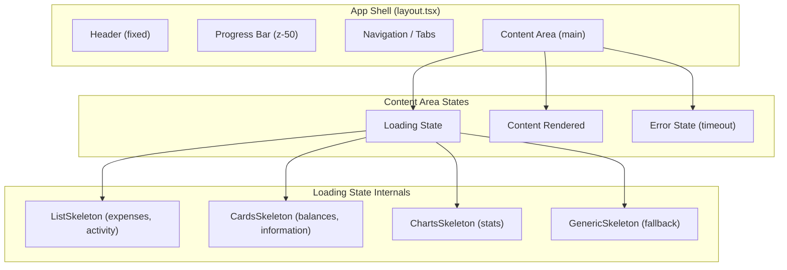
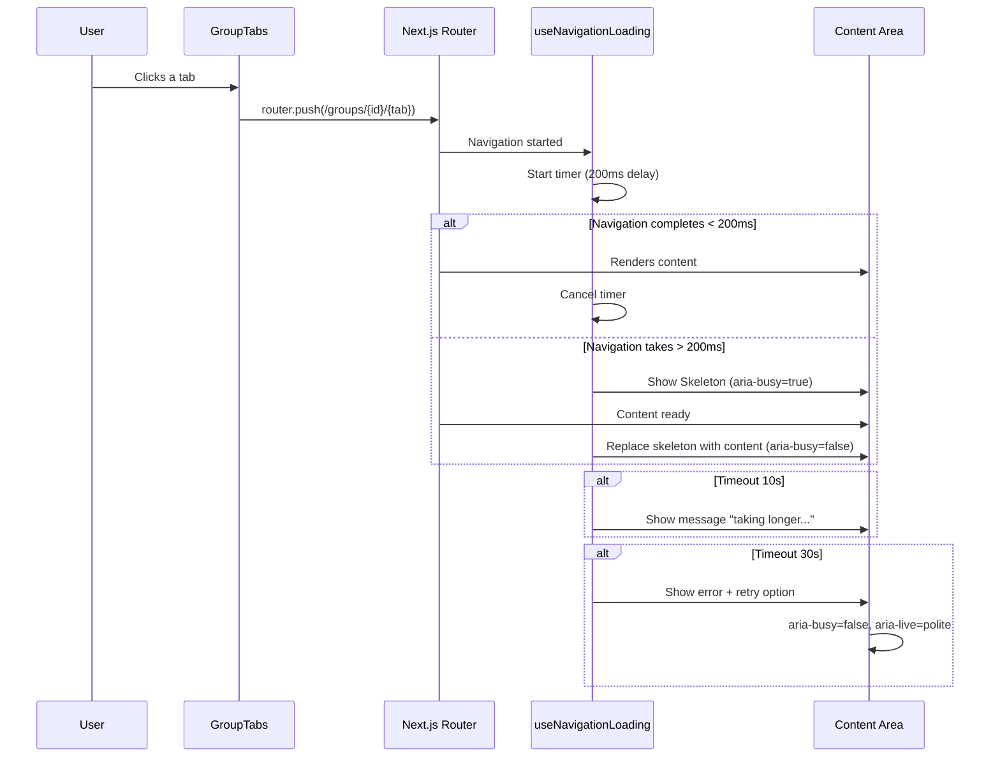

# Design Document

## Overview

This feature introduces visual loading states (skeleton placeholders) in the Knots application's main content area during navigation between pages and tabs. The goal is to complement the existing progress bar (2px, `next13-progressbar`) with more prominent feedback in the page body, eliminating the perception of "freezing" during transitions.

The solution uses the existing `Skeleton` component from the project's UI library (`src/components/ui/skeleton.tsx`) and integrates with the Next.js App Router routing pattern, leveraging the `loading.tsx` mechanism and the `spin-delay` library already present in the project to avoid flashes on fast navigations.

### Key Design Decisions

1. **Use Next.js App Router `loading.tsx`** — Each tab route will have a `loading.tsx` file exporting the corresponding contextual skeleton. This is native to the framework and does not require manual navigation state management.
2. **Reusable skeleton components** — Create skeleton components by content type (list, cards, charts) composed from the existing `Skeleton` component.
3. **`useNavigationLoading` hook** — For scenarios where `loading.tsx` is not sufficient (client-side navigation via `router.push`), a custom hook manages loading state with timeouts and cancellation.
4. **`spin-delay` for debounce** — Reuse the already installed library to avoid showing skeletons on navigations that complete in less than 200ms.

## Architecture



### Navigation Flow



## Components and Interfaces

### New Components

#### 1. `TabLoadingContainer`

Wrapper component that manages loading state in the content area.

```typescript
// src/components/tab-loading-container.tsx
interface TabLoadingContainerProps {
  children: React.ReactNode
  tabName?: string
  isLoading: boolean
}
```

**Responsibilities:**

- Applies `aria-busy="true"` when loading
- Removes `aria-busy` when content is ready
- Manages timeouts (10s warning, 30s error)
- Renders contextual skeleton or content

#### 2. `ListSkeleton`

Skeleton for tabs with list content (expenses, activity).

```typescript
// src/components/skeletons/list-skeleton.tsx
interface ListSkeletonProps {
  itemCount?: number // default: 5
}
```

Renders N items in vertically stacked horizontal line format, each composed of `Skeleton` instances.

#### 3. `CardsSkeleton`

Skeleton for tabs with card content (balances, information).

```typescript
// src/components/skeletons/cards-skeleton.tsx
interface CardsSkeletonProps {
  cardCount?: number // default: 3
}
```

Renders N rectangular blocks representing summary cards.

#### 4. `ChartsSkeleton`

Skeleton for the stats tab.

```typescript
// src/components/skeletons/charts-skeleton.tsx
```

Renders blocks representing charts (wide rectangle) and totals (smaller blocks).

#### 5. `GenericSkeleton`

Fallback skeleton for pages without a specific skeleton.

```typescript
// src/components/skeletons/generic-skeleton.tsx
```

Renders 3 line skeletons + 1 block skeleton.

#### 6. `LoadingError`

Error component for timeouts.

```typescript
// src/components/loading-error.tsx
interface LoadingErrorProps {
  onRetry: () => void
  variant: 'warning' | 'error' // 10s = warning, 30s = error
}
```

### New Hook

#### `useNavigationLoading`

```typescript
// src/lib/use-navigation-loading.ts
interface NavigationLoadingState {
  isLoading: boolean
  isTimeout: boolean // true after 10s
  isError: boolean // true after 30s
  targetTab: string | null
  cancel: () => void
  retry: () => void
}

function useNavigationLoading(options?: {
  delay?: number // default: 200ms (spin-delay)
  timeoutWarning?: number // default: 10000ms
  timeoutError?: number // default: 30000ms
}): NavigationLoadingState
```

**Behavior:**

- Listens to Next.js router navigation events
- Applies `spin-delay` to avoid showing loading on fast navigations (<200ms)
- Manages timers for warning (10s) and error (30s)
- Cancels previous navigation when a new one starts
- Exposes `cancel()` and `retry()` for user interaction

### Utility Function

#### `getSkeletonForTab`

```typescript
// src/components/skeletons/get-skeleton-for-tab.ts
type TabName =
  | 'expenses'
  | 'activity'
  | 'balances'
  | 'information'
  | 'stats'
  | string

function getSkeletonForTab(tabName: TabName): React.ComponentType
```

Maps tab name to the corresponding skeleton component. Returns `GenericSkeleton` for unmapped tabs.

### `loading.tsx` Files (Next.js App Router)

Each tab directory will receive a `loading.tsx` file:

- `src/app/groups/[groupId]/expenses/loading.tsx` → `ListSkeleton`
- `src/app/groups/[groupId]/activity/loading.tsx` → `ListSkeleton`
- `src/app/groups/[groupId]/balances/loading.tsx` → `CardsSkeleton`
- `src/app/groups/[groupId]/information/loading.tsx` → `CardsSkeleton`
- `src/app/groups/[groupId]/stats/loading.tsx` → `ChartsSkeleton`

### Modifications to Existing Components

#### `GroupLayoutClient` (layout.client.tsx)

- Integrate `TabLoadingContainer` around `{children}`
- Pass loading state and active tab

#### `GroupTabs` (group-tabs.tsx)

- No visual changes — tabs remain clickable with the same style during loading

## Data Models

This feature does not introduce new persistent data models. States are managed exclusively in memory (React state).

### `useNavigationLoading` Hook State

```typescript
interface NavigationState {
  status: 'idle' | 'loading' | 'timeout-warning' | 'timeout-error'
  targetTab: string | null
  startTime: number | null
  timers: {
    warning: NodeJS.Timeout | null
    error: NodeJS.Timeout | null
  }
}
```

### Tab → Skeleton Mapping

```typescript
const TAB_SKELETON_MAP: Record<string, React.ComponentType> = {
  expenses: ListSkeleton,
  activity: ListSkeleton,
  balances: CardsSkeleton,
  information: CardsSkeleton,
  stats: ChartsSkeleton,
}
```

## Correctness Properties

_A property is a characteristic or behavior that should hold true across all valid executions of a system — essentially, a formal statement about what the system should do. Properties serve as the bridge between human-readable specifications and machine-verifiable correctness guarantees._

### Property 1: Skeleton composition uses only Skeleton component

_For any_ tab skeleton variant (expenses, activity, balances, information, stats, or generic), all rendered placeholder elements within the loading state SHALL be instances of the `Skeleton` component (identifiable by `data-slot="skeleton"` attribute), with no other visual placeholder elements present.

**Validates: Requirements 3.1**

### Property 2: Navigation superseding shows only latest skeleton

_For any_ sequence of rapid tab navigations (where each navigation starts before the previous completes), the content area SHALL display only the skeleton corresponding to the last navigation target, with all previous navigation loading states cancelled.

**Validates: Requirements 4.2**

### Property 3: Accessibility attributes on skeleton variants

_For any_ skeleton variant rendered in loading state, the skeleton container SHALL have a non-empty `aria-label` describing the content being loaded, and all decorative skeleton child elements SHALL have `aria-hidden="true"` to be hidden from assistive technologies.

**Validates: Requirements 5.2**

## Error Handling

### Error Scenarios

| Scenario             | Trigger                                      | Behavior                                                       |
| -------------------- | -------------------------------------------- | -------------------------------------------------------------- |
| Timeout warning      | Transition_Period > 10s                      | Show informative message below skeleton                        |
| Timeout error        | Transition_Period > 30s                      | Remove skeleton, show error with retry option                  |
| Cancelled navigation | User navigates to another tab during loading | Cancel previous timers, start new loading                      |
| Network failure      | Fetch fails during navigation                | Next.js error boundary catches; loading state clears aria-busy |

### Cleanup Strategy

- All timers (`setTimeout`) are cleared in `useEffect` cleanup
- Cancelled navigation clears previous state immediately
- The `TabLoadingContainer` component ensures `aria-busy` is always removed on unmount (via `useEffect` cleanup)

### Error Messages

- **10s timeout:** Informative message (non-blocking) — "Loading is taking longer than expected..."
- **30s timeout:** Error message with actions — "Could not load content. [Try again] [Cancel]"
- Both messages are announced via `aria-live="polite"` for assistive technologies

## Testing Strategy

### Approach

The feature combines unit tests (specific examples and edge cases) with property-based tests (universal properties). The project already uses **Jest** with **React Testing Library** and **fast-check** for property-based testing.

### Unit Tests (Jest + React Testing Library)

1. **Skeleton variants rendering** — Verify each tab renders the correct skeleton (2.1, 2.2, 2.3)
2. **Generic fallback** — Verify tabs without a specific skeleton use the generic one (2.6)
3. **Spin-delay behavior** — Verify navigations <200ms do not show skeleton (1.3)
4. **Timeout warning at 10s** — Verify informative message (6.2)
5. **Timeout error at 30s** — Verify retry/cancel option (6.3)
6. **aria-busy lifecycle** — Verify it is added at start and removed at end (5.1, 5.3)
7. **Navigation remains interactive** — Verify tabs are not disabled during loading (4.1, 4.3)
8. **Header/nav stability** — Verify header and navigation remain visible during loading (3.3)
9. **Error state accessibility** — Verify aria-live region on timeout (5.4)

### Property-Based Tests (Jest + fast-check)

Configuration: minimum 100 iterations per property.

1. **Property 1: Skeleton composition** — Generate random tab variants, render, verify all placeholder elements have `data-slot="skeleton"`
   - Tag: `Feature: tab-loading-states, Property 1: Skeleton composition uses only Skeleton component`

2. **Property 2: Navigation superseding** — Generate random sequences of rapid navigations, verify only the last skeleton is visible
   - Tag: `Feature: tab-loading-states, Property 2: Navigation superseding shows only latest skeleton`

3. **Property 3: Accessibility attributes** — Generate random tab variants, verify non-empty aria-label and aria-hidden on decorative children
   - Tag: `Feature: tab-loading-states, Property 3: Accessibility attributes on skeleton variants`

### Integration Tests

- **CLS measurement** — Verify skeleton → content transition does not cause layout shift (2.5, 3.4)
- **Progress bar coexistence** — Verify loading state does not interfere with existing progress bar (6.4)
- **Theme switching** — Verify skeletons adapt colors when theme changes (3.2)

### Test File Structure

```
src/components/skeletons/__tests__/
  skeleton-composition.property.test.tsx    # Property 1
  skeleton-accessibility.property.test.tsx  # Property 3
src/lib/__tests__/
  use-navigation-loading.test.ts           # Unit tests for the hook
  navigation-superseding.property.test.ts  # Property 2
src/app/groups/[groupId]/__tests__/
  tab-loading-states.test.tsx              # Integration tests
```
