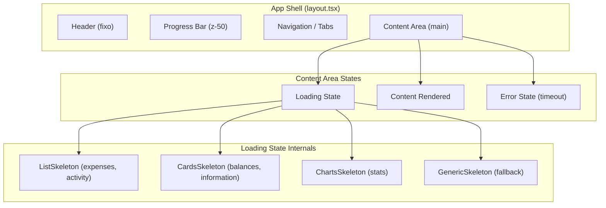
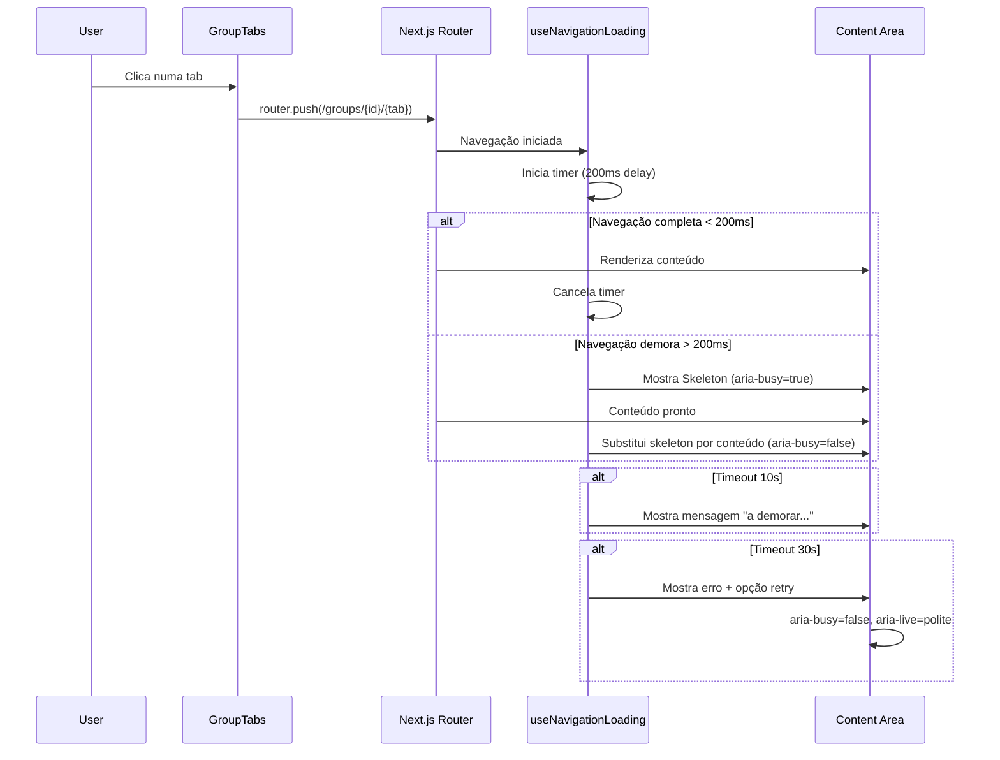

# Design Document

## Overview

Esta feature introduz estados de carregamento visuais (skeleton placeholders) na área de conteúdo principal da aplicação Knots durante navegações entre páginas e tabs. O objetivo é complementar a barra de progresso existente (2px, `next13-progressbar`) com feedback mais evidente no corpo da página, eliminando a perceção de "congelamento" durante transições.

A solução utiliza o componente `Skeleton` já existente na biblioteca UI do projeto (`src/components/ui/skeleton.tsx`) e integra-se com o padrão de routing do Next.js App Router, aproveitando o mecanismo de `loading.tsx` e a biblioteca `spin-delay` já presente no projeto para evitar flashes em navegações rápidas.

### Decisões de Design Principais

1. **Utilizar `loading.tsx` do Next.js App Router** — Cada rota de tab terá um ficheiro `loading.tsx` que exporta o skeleton contextual correspondente. Isto é nativo ao framework e não requer gestão manual de estado de navegação.
2. **Componentes de skeleton reutilizáveis** — Criar componentes de skeleton por tipo de conteúdo (lista, cards, gráficos) que são compostos a partir do `Skeleton` existente.
3. **Hook `useNavigationLoading`** — Para cenários onde `loading.tsx` não é suficiente (navegação client-side via `router.push`), um hook custom gere o estado de loading com timeouts e cancelamento.
4. **`spin-delay` para debounce** — Reutilizar a biblioteca já instalada para evitar mostrar skeletons em navegações que completam em menos de 200ms.

## Architecture



### Fluxo de Navegação



## Components and Interfaces

### Novos Componentes

#### 1. `TabLoadingContainer`

Componente wrapper que gere o estado de loading na área de conteúdo.

```typescript
// src/components/tab-loading-container.tsx
interface TabLoadingContainerProps {
  children: React.ReactNode
  tabName?: string
  isLoading: boolean
}
```

**Responsabilidades:**

- Aplica `aria-busy="true"` quando em loading
- Remove `aria-busy` quando conteúdo está pronto
- Gere timeouts (10s warning, 30s error)
- Renderiza o skeleton contextual ou o conteúdo

#### 2. `ListSkeleton`

Skeleton para tabs com conteúdo em lista (expenses, activity).

```typescript
// src/components/skeletons/list-skeleton.tsx
interface ListSkeletonProps {
  itemCount?: number // default: 5
}
```

Renderiza N items com formato de linha horizontal empilhada, cada um composto por instâncias de `Skeleton`.

#### 3. `CardsSkeleton`

Skeleton para tabs com conteúdo em cards (balances, information).

```typescript
// src/components/skeletons/cards-skeleton.tsx
interface CardsSkeletonProps {
  cardCount?: number // default: 3
}
```

Renderiza N blocos retangulares representando cards de resumo.

#### 4. `ChartsSkeleton`

Skeleton para a tab stats.

```typescript
// src/components/skeletons/charts-skeleton.tsx
```

Renderiza blocos representando gráficos (retângulo largo) e totais (blocos menores).

#### 5. `GenericSkeleton`

Skeleton fallback para páginas sem skeleton específico.

```typescript
// src/components/skeletons/generic-skeleton.tsx
```

Renderiza 3 skeletons de linha + 1 skeleton de bloco.

#### 6. `LoadingError`

Componente de erro para timeouts.

```typescript
// src/components/loading-error.tsx
interface LoadingErrorProps {
  onRetry: () => void
  variant: 'warning' | 'error' // 10s = warning, 30s = error
}
```

### Novo Hook

#### `useNavigationLoading`

```typescript
// src/lib/use-navigation-loading.ts
interface NavigationLoadingState {
  isLoading: boolean
  isTimeout: boolean // true após 10s
  isError: boolean // true após 30s
  targetTab: string | null
  cancel: () => void
  retry: () => void
}

function useNavigationLoading(options?: {
  delay?: number // default: 200ms (spin-delay)
  timeoutWarning?: number // default: 10000ms
  timeoutError?: number // default: 30000ms
}): NavigationLoadingState
```

**Comportamento:**

- Escuta eventos de navegação do Next.js router
- Aplica `spin-delay` para não mostrar loading em navegações rápidas (<200ms)
- Gere timers para warning (10s) e error (30s)
- Cancela navegação anterior quando uma nova é iniciada
- Expõe `cancel()` e `retry()` para interação do utilizador

### Função Utilitária

#### `getSkeletonForTab`

```typescript
// src/components/skeletons/get-skeleton-for-tab.ts
type TabName =
  | 'expenses'
  | 'activity'
  | 'balances'
  | 'information'
  | 'stats'
  | string

function getSkeletonForTab(tabName: TabName): React.ComponentType
```

Mapeia o nome da tab para o componente de skeleton correspondente. Retorna `GenericSkeleton` para tabs não mapeadas.

### Ficheiros `loading.tsx` (Next.js App Router)

Cada diretório de tab receberá um ficheiro `loading.tsx`:

- `src/app/groups/[groupId]/expenses/loading.tsx` → `ListSkeleton`
- `src/app/groups/[groupId]/activity/loading.tsx` → `ListSkeleton`
- `src/app/groups/[groupId]/balances/loading.tsx` → `CardsSkeleton`
- `src/app/groups/[groupId]/information/loading.tsx` → `CardsSkeleton`
- `src/app/groups/[groupId]/stats/loading.tsx` → `ChartsSkeleton`

### Modificações a Componentes Existentes

#### `GroupLayoutClient` (layout.client.tsx)

- Integrar `TabLoadingContainer` à volta do `{children}`
- Passar estado de loading e tab ativa

#### `GroupTabs` (group-tabs.tsx)

- Sem alterações visuais — os tabs permanecem clicáveis e com o mesmo estilo durante loading

## Data Models

Esta feature não introduz novos modelos de dados persistentes. Os estados são geridos exclusivamente em memória (React state).

### Estado do Hook `useNavigationLoading`

```typescript
interface NavigationState {
  status: 'idle' | 'loading' | 'timeout-warning' | 'timeout-error'
  targetTab: string | null
  startTime: number | null
  timers: {
    warning: NodeJS.Timeout | null
    error: NodeJS.Timeout | null
  }
}
```

### Mapeamento Tab → Skeleton

```typescript
const TAB_SKELETON_MAP: Record<string, React.ComponentType> = {
  expenses: ListSkeleton,
  activity: ListSkeleton,
  balances: CardsSkeleton,
  information: CardsSkeleton,
  stats: ChartsSkeleton,
}
```

## Correctness Properties

_A property is a characteristic or behavior that should hold true across all valid executions of a system — essentially, a formal statement about what the system should do. Properties serve as the bridge between human-readable specifications and machine-verifiable correctness guarantees._

### Property 1: Skeleton composition uses only Skeleton component

_For any_ tab skeleton variant (expenses, activity, balances, information, stats, or generic), all rendered placeholder elements within the loading state SHALL be instances of the `Skeleton` component (identifiable by `data-slot="skeleton"` attribute), with no other visual placeholder elements present.

**Validates: Requirements 3.1**

### Property 2: Navigation superseding shows only latest skeleton

_For any_ sequence of rapid tab navigations (where each navigation starts before the previous completes), the content area SHALL display only the skeleton corresponding to the last navigation target, with all previous navigation loading states cancelled.

**Validates: Requirements 4.2**

### Property 3: Accessibility attributes on skeleton variants

_For any_ skeleton variant rendered in loading state, the skeleton container SHALL have a non-empty `aria-label` describing the content being loaded, and all decorative skeleton child elements SHALL have `aria-hidden="true"` to be hidden from assistive technologies.

**Validates: Requirements 5.2**

## Error Handling

### Cenários de Erro

| Cenário             | Trigger                                          | Comportamento                                                 |
| ------------------- | ------------------------------------------------ | ------------------------------------------------------------- |
| Timeout warning     | Transition_Period > 10s                          | Mostra mensagem informativa abaixo do skeleton                |
| Timeout error       | Transition_Period > 30s                          | Remove skeleton, mostra erro com opção retry                  |
| Navegação cancelada | Utilizador navega para outra tab durante loading | Cancela timers anteriores, inicia novo loading                |
| Falha de rede       | Fetch falha durante navegação                    | Next.js error boundary captura; loading state limpa aria-busy |

### Estratégia de Cleanup

- Todos os timers (`setTimeout`) são limpos no `useEffect` cleanup
- Navegação cancelada limpa o estado anterior imediatamente
- O componente `TabLoadingContainer` garante que `aria-busy` é sempre removido em unmount (via `useEffect` cleanup)

### Mensagens de Erro

- **10s timeout:** Mensagem informativa (não bloqueante) — "O carregamento está a demorar mais do que o esperado..."
- **30s timeout:** Mensagem de erro com ações — "Não foi possível carregar o conteúdo. [Tentar novamente] [Cancelar]"
- Ambas as mensagens são anunciadas via `aria-live="polite"` para tecnologias assistivas

## Testing Strategy

### Abordagem

A feature combina testes unitários (exemplos específicos e edge cases) com testes property-based (propriedades universais). O projeto já utiliza **Jest** com **React Testing Library** e **fast-check** para property-based testing.

### Testes Unitários (Jest + React Testing Library)

1. **Skeleton variants rendering** — Verificar que cada tab renderiza o skeleton correto (2.1, 2.2, 2.3)
2. **Generic fallback** — Verificar que tabs sem skeleton específico usam o genérico (2.6)
3. **Spin-delay behavior** — Verificar que navegações <200ms não mostram skeleton (1.3)
4. **Timeout warning at 10s** — Verificar mensagem informativa (6.2)
5. **Timeout error at 30s** — Verificar opção retry/cancel (6.3)
6. **aria-busy lifecycle** — Verificar que é adicionado no início e removido no fim (5.1, 5.3)
7. **Navigation remains interactive** — Verificar que tabs não ficam disabled durante loading (4.1, 4.3)
8. **Header/nav stability** — Verificar que header e navegação permanecem visíveis durante loading (3.3)
9. **Error state accessibility** — Verificar aria-live region no timeout (5.4)

### Testes Property-Based (Jest + fast-check)

Configuração: mínimo 100 iterações por propriedade.

1. **Property 1: Skeleton composition** — Gerar variantes de tab aleatórias, renderizar, verificar que todos os elementos placeholder têm `data-slot="skeleton"`

   - Tag: `Feature: tab-loading-states, Property 1: Skeleton composition uses only Skeleton component`

2. **Property 2: Navigation superseding** — Gerar sequências aleatórias de navegações rápidas, verificar que apenas o último skeleton é visível

   - Tag: `Feature: tab-loading-states, Property 2: Navigation superseding shows only latest skeleton`

3. **Property 3: Accessibility attributes** — Gerar variantes de tab aleatórias, verificar aria-label não vazio e aria-hidden nos filhos decorativos
   - Tag: `Feature: tab-loading-states, Property 3: Accessibility attributes on skeleton variants`

### Testes de Integração

- **CLS measurement** — Verificar que a transição skeleton → conteúdo não causa layout shift (2.5, 3.4)
- **Progress bar coexistence** — Verificar que o loading state não interfere com a progress bar existente (6.4)
- **Theme switching** — Verificar que skeletons adaptam cores ao mudar tema (3.2)

### Estrutura de Ficheiros de Teste

```
src/components/skeletons/__tests__/
  skeleton-composition.property.test.tsx    # Property 1
  skeleton-accessibility.property.test.tsx  # Property 3
src/lib/__tests__/
  use-navigation-loading.test.ts           # Unit tests para o hook
  navigation-superseding.property.test.ts  # Property 2
src/app/groups/[groupId]/__tests__/
  tab-loading-states.test.tsx              # Integration tests
```
