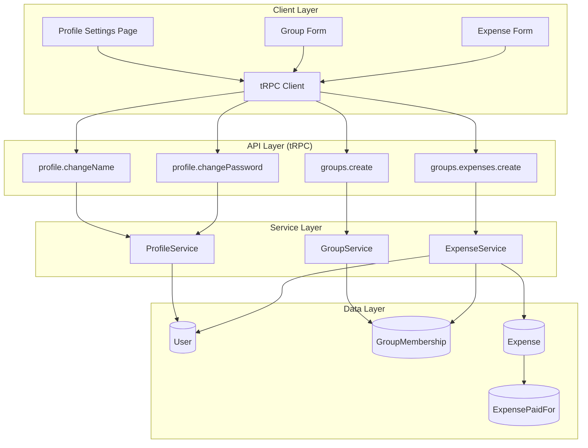
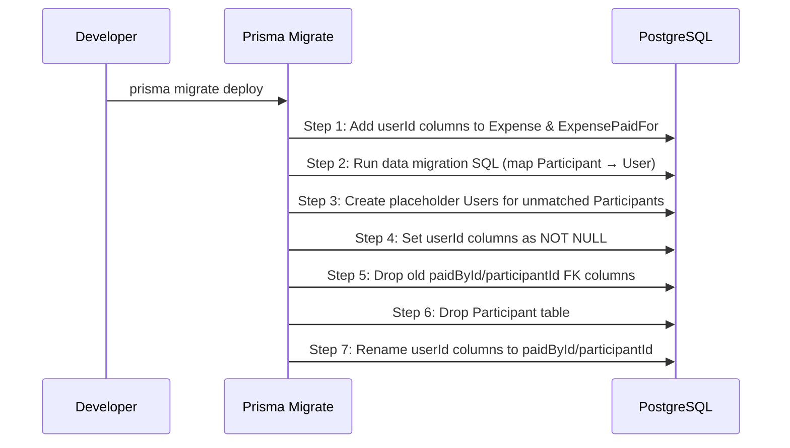

# Design Document: User Profile and Participants

## Overview

This feature eliminates the standalone `Participant` model and makes authenticated `User` records the direct participants in expenses. It also introduces user profile management (password change, display name update) via a new settings page.

The core challenge is a data migration that re-points `Expense.paidById` and `ExpensePaidFor.participantId` from the `Participant` table to the `User` table, while preserving all historical expense data. The profile features are straightforward tRPC mutations backed by the existing auth infrastructure.

### Key Design Decisions

1. **Single-step schema migration with data backfill** — Rather than maintaining dual FK columns long-term, we perform a multi-step Prisma migration: add new columns, backfill data, drop old columns, remove Participant model.
2. **Leverage existing GroupMembership** — The `GroupMembership` model already links Users to Groups. We use this as the source of truth for "who participates in a group."
3. **Profile service as a new tRPC router** — Password and name changes are exposed as `protectedProcedure` mutations in a new `profile` router.
4. **Placeholder users for unmatched participants** — During migration, any Participant that can't be matched to a User gets a placeholder User record created to maintain referential integrity.

## Architecture



### Migration Flow



## Components and Interfaces

### New tRPC Router: `profile`

```typescript
// src/trpc/routers/profile/index.ts
export const profileRouter = createTRPCRouter({
  getProfile: protectedProcedure.query(/* ... */),
  changeName: protectedProcedure.input(changeNameSchema).mutation(/* ... */),
  changePassword: protectedProcedure
    .input(changePasswordSchema)
    .mutation(/* ... */),
})
```

### Profile Service

```typescript
// src/lib/profile/profile-service.ts
export interface ProfileService {
  changeName(
    userId: string,
    newName: string,
  ): Promise<Result<void, ProfileError>>
  changePassword(
    userId: string,
    currentPassword: string,
    newPassword: string,
  ): Promise<Result<void, ProfileError>>
}

export type ProfileError =
  | { code: 'INVALID_NAME'; message: string }
  | { code: 'CURRENT_PASSWORD_MISMATCH'; message: string }
  | { code: 'SAME_PASSWORD'; message: string }
  | { code: 'INVALID_PASSWORD'; message: string; errors: string[] }
```

### Updated Group Queries

```typescript
// Updated getGroup to return members instead of participants
export async function getGroupMembers(groupId: string) {
  return prisma.groupMembership.findMany({
    where: { groupId },
    include: { user: { select: { id: true, name: true, email: true } } },
  })
}
```

### Updated Expense Creation

```typescript
// Validation now checks GroupMembership instead of Participant existence
export async function createExpense(
  expenseFormValues: ExpenseFormValues,
  groupId: string,
  userId: string, // authenticated user performing the action
): Promise<Expense> {
  const members = await getGroupMembers(groupId)
  const memberIds = new Set(members.map((m) => m.user.id))

  // Validate paidBy and all paidFor users are group members
  if (!memberIds.has(expenseFormValues.paidBy)) {
    throw new TRPCError({
      code: 'BAD_REQUEST',
      message: 'paidBy user is not a group member',
    })
  }
  for (const pf of expenseFormValues.paidFor) {
    if (!memberIds.has(pf.participant)) {
      throw new TRPCError({
        code: 'BAD_REQUEST',
        message: `User ${pf.participant} is not a group member`,
      })
    }
  }
  // ... create expense with User references
}
```

### Updated Schema (groupFormSchema)

```typescript
// The participants array is removed from groupFormSchema
export const groupFormSchema = z.object({
  name: z.string().min(2, 'min2').max(50, 'max50'),
  information: z.string().optional(),
  currency: z.string().min(1, 'min1').max(5, 'max5'),
  currencyCode: z.union([z.string().length(3).nullish(), z.literal('')]),
  // participants field removed — members come from GroupMembership
})
```

### Profile Settings Page

```
/groups/settings (or /settings)
├── ProfileSettingsPage (Server Component)
│   ├── NameChangeForm (Client Component)
│   │   └── Uses profile.changeName mutation
│   └── PasswordChangeForm (Client Component)
│       └── Uses profile.changePassword mutation
```

## Data Models

### Schema Changes (Post-Migration)

```prisma
// Participant model is REMOVED entirely

model Expense {
  id               String            @id
  group            Group             @relation(fields: [groupId], references: [id], onDelete: Cascade)
  groupId          String
  paidBy           User              @relation("ExpensesPaidBy", fields: [paidById], references: [id])
  paidById         String
  // ... other fields unchanged
  paidFor          ExpensePaidFor[]
}

model ExpensePaidFor {
  expense       Expense  @relation(fields: [expenseId], references: [id], onDelete: Cascade)
  user          User     @relation("ExpensesPaidFor", fields: [userId], references: [id], onDelete: Cascade)
  expenseId     String
  userId        String
  shares        Int      @default(1)

  @@id([expenseId, userId])
}

model User {
  id              String            @id @default(cuid())
  name            String
  email           String            @unique
  emailVerified   DateTime?
  passwordHash    String
  createdAt       DateTime          @default(now())
  updatedAt       DateTime          @updatedAt

  sessions        Session[]
  accounts        Account[]
  tokens          Token[]
  memberships     GroupMembership[]
  invitationsSent Invitation[]      @relation("InvitedBy")
  expensesPaidBy  Expense[]         @relation("ExpensesPaidBy")
  expensesPaidFor ExpensePaidFor[]  @relation("ExpensesPaidFor")
}

model Group {
  id                String                    @id
  name              String
  information       String?                   @db.Text
  currency          String                    @default("$")
  currencyCode      String?
  // participants field REMOVED
  expenses          Expense[]
  activities        Activity[]
  pushSubscriptions PushSubscription[]
  categoryMappings  ExpenseCategoryMapping[]
  memberships       GroupMembership[]
  invitations       Invitation[]
  createdAt         DateTime                  @default(now())
}
```

### Migration SQL Strategy

```sql
-- Step 1: Add nullable userId columns
ALTER TABLE "Expense" ADD COLUMN "paidByUserId" TEXT;
ALTER TABLE "ExpensePaidFor" ADD COLUMN "userId" TEXT;

-- Step 2: Backfill from Participant → User via GroupMembership + name match
UPDATE "Expense" e
SET "paidByUserId" = u.id
FROM "Participant" p
JOIN "GroupMembership" gm ON gm."groupId" = p."groupId"
JOIN "User" u ON u.id = gm."userId" AND u.name = p.name
WHERE e."paidById" = p.id;

UPDATE "ExpensePaidFor" epf
SET "userId" = u.id
FROM "Participant" p
JOIN "GroupMembership" gm ON gm."groupId" = p."groupId"
JOIN "User" u ON u.id = gm."userId" AND u.name = p.name
WHERE epf."participantId" = p.id;

-- Step 3: Create placeholder users for unmatched participants
-- (handled in a TypeScript migration script for complex logic)

-- Step 4: Make columns NOT NULL, add FK constraints
-- Step 5: Drop old columns and Participant table
```

## Correctness Properties

_A property is a characteristic or behavior that should hold true across all valid executions of a system — essentially, a formal statement about what the system should do. Properties serve as the bridge between human-readable specifications and machine-verifiable correctness guarantees._

### Property 1: Group participants query returns exactly membership users

_For any_ group with any set of GroupMembership records, querying the group's participants SHALL return exactly the set of Users who hold a GroupMembership for that group — no more, no fewer.

**Validates: Requirements 1.3**

### Property 2: Expense creation rejects non-members

_For any_ expense creation attempt where the paidBy user or any paidFor user does NOT hold an active GroupMembership in the target group, the system SHALL reject the creation with a validation error.

**Validates: Requirements 1.5**

### Property 3: Migration correctly maps participants to users and updates all references

_For any_ Participant record that has a corresponding User with a GroupMembership in the same group (matched by name), the migration SHALL update all Expense.paidById and ExpensePaidFor.participantId references from that Participant's ID to the matched User's ID.

**Validates: Requirements 2.1, 2.2**

### Property 4: Migration preserves expense data integrity

_For any_ expense in the database, after migration completes, the expense's amount, expenseDate, title, splitMode, isReimbursement, and all ExpensePaidFor.shares values SHALL be identical to their pre-migration values.

**Validates: Requirements 2.4**

### Property 5: Migration round-trip preserves state

_For any_ database state, applying the up-migration followed by the down-migration SHALL restore the Participant model and all original Expense/ExpensePaidFor references to their pre-migration values.

**Validates: Requirements 2.5**

### Property 6: Group creator automatic membership

_For any_ authenticated user creating a new group, the system SHALL create a GroupMembership record linking that user to the new group, making them the first member.

**Validates: Requirements 3.3**

### Property 7: Password change updates hash correctly

_For any_ valid current password and any valid new password (different from current), after a successful password change, verifying the new password against the stored hash SHALL succeed, and verifying the old password SHALL fail.

**Validates: Requirements 4.1**

### Property 8: Incorrect current password rejection

_For any_ password that does not match the user's current passwordHash, a password change request SHALL be rejected with a `CURRENT_PASSWORD_MISMATCH` error.

**Validates: Requirements 4.2**

### Property 9: Password validation correctness

_For any_ string, the password validator SHALL accept it if and only if it has at least 8 characters, at most 128 characters, contains at least one uppercase letter, at least one lowercase letter, and at least one digit.

**Validates: Requirements 4.3**

### Property 10: Same-password rejection

_For any_ valid password, attempting to change the password to the same value SHALL be rejected with a `SAME_PASSWORD` error.

**Validates: Requirements 4.4**

### Property 11: Session invalidation on password change

_For any_ user with N active sessions (N ≥ 1), after a successful password change, all sessions except the current one SHALL be invalidated (deleted).

**Validates: Requirements 4.5**

### Property 12: Name update persistence with trimming

_For any_ valid name string (1–100 characters after trimming), after a name update, the stored user name SHALL equal the trimmed version of the submitted name.

**Validates: Requirements 5.1, 5.3**

### Property 13: Name length validation

_For any_ string that, after trimming, has length 0 or greater than 100, the name change request SHALL be rejected with an `INVALID_NAME` error.

**Validates: Requirements 5.2**

## Error Handling

### Profile Service Errors

| Error Code                  | Condition                                           | HTTP-equivalent |
| --------------------------- | --------------------------------------------------- | --------------- |
| `CURRENT_PASSWORD_MISMATCH` | Supplied current password doesn't match stored hash | 400             |
| `SAME_PASSWORD`             | New password identical to current                   | 400             |
| `INVALID_PASSWORD`          | New password fails validation rules                 | 400             |
| `INVALID_NAME`              | Name empty or exceeds 100 chars after trim          | 400             |

### Expense Validation Errors

| Error Code    | Condition                                    | HTTP-equivalent |
| ------------- | -------------------------------------------- | --------------- |
| `BAD_REQUEST` | paidBy or paidFor user is not a group member | 400             |
| `NOT_FOUND`   | Group does not exist                         | 404             |

### Migration Error Handling

- If a Participant cannot be matched to a User, a placeholder User is created (never fails silently).
- The migration runs inside a transaction — if any step fails, the entire migration rolls back.
- The down-migration is provided for rollback scenarios but is expected to be used only in development/staging.

### General Error Strategy

- All tRPC mutations use the existing `TRPCError` pattern with appropriate codes.
- Client-side forms display field-level validation errors from Zod schemas.
- Toast notifications show success/failure messages for profile operations.
- Rate limiting on password change follows the existing `rateLimiter` pattern.

## Testing Strategy

### Property-Based Tests (fast-check)

The project uses Jest as its test runner. Property-based tests will use **fast-check** with a minimum of 100 iterations per property.

Each property test will be tagged with a comment referencing the design property:

```
// Feature: user-profile-and-participants, Property N: <property text>
```

**Properties to implement:**

- Properties 7–13 (profile service logic) — pure function tests against the ProfileService
- Property 9 (password validation) — already partially covered, extend with PBT
- Properties 1–2 (membership queries and expense validation) — test against in-memory or mocked Prisma
- Properties 3–5 (migration) — test the migration logic functions in isolation

### Unit Tests (Example-Based)

- Profile settings page renders correctly with user data (6.1, 6.2, 6.3, 6.4)
- Success/error toast messages display (6.5, 6.6)
- Group form no longer has participant name input (3.2)
- Expense form shows only group members as options (3.4)
- Placeholder user creation for unmatched participants (2.3)
- Name update reflects across all groups (5.4)

### Integration Tests

- End-to-end password change flow (submit form → verify new password works)
- End-to-end name change flow (submit form → verify name appears in groups)
- Expense creation with the new User-based references
- Migration script against a test database with representative data

### Test Configuration

```typescript
// jest.config.ts already exists — add fast-check as a dependency
// Property tests: minimum 100 iterations
// Tag format: Feature: user-profile-and-participants, Property {N}: {text}
```
